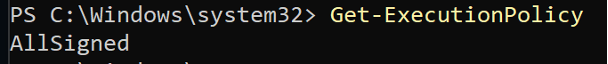
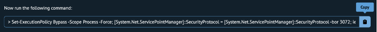

# BAB 1 - Pengenalan dan Installasi React Native

## 1.1 Tujuan Pembelajaran :

1. Mahasiswa dapat mengetahui konsep react native
2. Mahasiswa dapat menginstall react native
3. Mahasiswa dapat menjalankan aplikasi react native

## 1.2 Software yang dibutuhkan :

1. Java JDK
2. Node.Js
3. Visual Studio Code
4. Chocolatey
5. Android Studio
6. Android SDK

## 1.3 React Native

React native merupakan _framework_ _front-end_ untuk membuat native apps pada iOS dan android menggunakan javascript. React native sendiri pertama kali diluncurkan pada tahun 2015 oleh Facebook dan bersifat _open source_. Aplikasi ini benar benar native atau asli bukan aplikasi webview. React native disebut juga _cross-platform_ network karena bisa membuat satu aplikasi yang bisa digunakan diberbagai platform yaitu iOS dan Android, dengan begitu tidak perlu mengetahui iOS atau Android _programming_.


Hampir semua kode dari aplikasi react native menggunakan javascript dan membagikannya di iOS dan Android. Maka dari itu banyak perusahaan akhir-akhir ini lebih memilih untuk membangun aplikasi mereka menggunakan react native karena perusahaan tidak perlu merekrut dua tim pengembang terpisah untuk memelihara dua basis kode, satu untuk iOS yang ditulis dalam bahasa Swift atau Objective-C dan lainnya untuk Android ditulis menggunakan Java atau Kotlin.


Aplikasi mobile yang dibuat dengan menggunakan react native relatif smooth karena mampu menghasilkan 60 fps (_frame per second_). Selain itu react native juga menghasilkan aplikasi dengan UI/UX yang mengesankan. Aplikasi bisa berfungsi dengan smooth dan komponennya mampu merespon dengan baik layaknya dibuat dengan kode native. React native banyak digunakan oleh perusahaan-perusahaan besar yang aplikasinya sering kali ditemui dan digunakan, contohnya yaitu aplikasi Facebook, Instagram, Oculus, Tesla, Discord, Pinterest, dan masih banyak lagi.


Dalam prosesnya, React Native menggunakan fitur yang dinamanakan Bridging, Bridging itu sendiri layaknya perantara yang menghubungkan smartphone atau mobile device dengan Javascript. Pada gambar diatas Native Code menggunakan Bridge sebagai media komunikasi dengan Code React Native pada Javascript Runtime Environment. Selain itu, Bridge juga berfungsi untuk menghubungkan Native Code pada Tombol yang ada pada aplikasi dengan React Native Code.


React Native itu di katakan native karena kode javascript akan memanggil native code yang ada di OS smartphone. Jadi ketika user menggunakan react native button, yang terjadi adalah react native button tersebut memanggil native button pada smartphone nya. Selain Bride / Bridging, React Native memiliki Arsitektur tersendiri dalam proses membangun aplikasi. Sama hal nya seperti pada website yang memanggil HTML beserta Javascript. Namun bedanya pada React Native bukan HTML yang dipanggil melainkan React.

Sama dengan React.js, React Native juga menggunakan Javascript XML (JSX), yaitu sebuah sintaks yang memungkinkan kita menulis elemen di dalam JavaScript. Karena JSX adalah JavaScript, kita dapat menggunakan variabel di dalamnya. Pada dasarnya, JSX hanya menyediakan _syntactic sugar_ untuk fungsi React.createElement(component, props, ...children). Karena JSX disertakan dalam _library_ React, JSX tidak akan berfungsi jika tidak memiliki import React from 'react' di bagian atas file.

Contoh kode JSX :
```js
<Text>Hello, I am your cat!</Text>
```

Dikompilasi menjadi :
```js
React.createElement(
  Text,
  'Hello, I am your cat!'
)
```

Kelebihan dari menggunakan react native yaitu :

1. Installasi lebih mudah dengan package installer.
2. Desain UI yang modular.
3. Menyediakan komponen siap pakai.
4. Menghemat waktu pengembangan.
5. Mendukung penggunaan library dari pihak ketiga.
6. Bisa melakukan fast refresh.
7. Dapat meningkatkan performa aplikasi.

Sedangkan kekurangan dari react native yaitu :

1. Debugging dan kompatibilitas.
2. Membutuhkan basic knowledge yang cukup matang.
3. Tetap membutuhkan kemampuan native.
4. Kualitas lebih rendah dari native app.

## 1.4 Langkah – langkah praktikum

### 1. Buka windows powershell dengan buka sebagai administrator, lalu ketikkan perintah berikut


```bash
Get-ExecutionPolicy
```

### 2. Jika status execution policy masih restricted seperti dibawah ini


Maka masukkan perintah berikut untuk merubah status policy

```bash
Set-ExecutionPolicy AllSigned
```

### 3. Jika tampil pesan seperti berikut maka ketik Y untuk Yes


### 4. Lalu cek kembali status execution policy nya, pastikan sudah "AllSigned"



### 5. Buka halaman [https://chocolatey.org/install](https://chocolatey.org/install) pada web browser lalu copy pada bagian berikut dan paste pada windows powershell



### 6. Tunggu proses sampai selesai lalu ketik perintah "exit" seperti berikut


### 7. Buka kembali windows powershell lalu ketik perintah "choco" untuk mengetahui apakah chocolatey sudah terinstall atau belum dan untuk mengetahui versi dari chocolatey.


### 8. Lalu install node.js versi terbaru dan _Java Development Kit_ (jdk) ketik perintah sebagai berikut, tunggu proses installnya sampai selesai.

```bash
choco install -y nodejs-lts microsoft-openjdk11
```

### 9. Selanjutnya buka android studio.


### 10. Lalu kita harus menginstall _Software Development Kit_ (SDK) dengan cara klik titik tiga pada pojok kanan atas android studio dan pilih SDK Manager.


### 11. Pilih tab "SDK Platforms" dari dalam SDK Manager, lalu centang pada "Show Package Details" di pojok kanan bawah. Pastikan download dan install "Android SDK Platform 33" dan "Intel x86 Atom\_64 System Image" atau "Google APIs Intel x86 Atom System Image". Dan copy alamat penyimpanan Sdk tersebut.


### 12. Konfigurasi ANDROID\_HOME environment variable dengan cara buka _Windows Control Panel \> User Accounts_ \> _User Accounts \> Change my environment variable \> New…_ buat variable baru dengan nama ANDROID\_HOME, lalu paste alamat penyimpan yang sudah dicopy tadi.


Untuk alamat default penginstallan Sdk yaitu :

```bash
%LOCALAPPDATA%\Android\Sdk 
```

### 13. Untuk mengecek apakah environment variable ANDROID\_HOME sudah tersimpan bisa mengetikkan perintah berikut pada _Windows Powershell._ Pastikan sudah ada ANDROID HOME sudah ditambahkan.

```bash
Get-ChildItem -Path Env:\
```

### 14. Selanjutnya tambahkan path platform-tools dengan cara buka _Windows Control Panel \> User Accounts_ \> _User Accounts \> Change my environment variable._ Lalupilih variable _Path \> Edit \> New._ Tambahkan alamat platform tools biasanya hanya menambahkan platform-tools pada alamat sdk yang sudah dicopy tadi. Untuk alamat default dari platform-tools seperti berikut.

```bash
%LOCALAPPDATA%\Android\Sdk\platform-tools
```

### 15. Untuk membuat project baru ketik perintah berikut, **pastikan untuk menyimpan project tersebut pada folder yang diinginkan** , dengan cara tahan tombol 'Shift' pada keyboard, lalu klik kanan dan pilih "Open PowerShell window here" untuk menentukan dimana project akan disimpan.

```bash
npx react-native@latest init Woco
```

Jika membuat project baru sudah berhasil maka akan tampil seperti gambar berikut.


### 16. Untuk melakukan running project harus menjalankan metro terlebih dahulu dengan masuk ke folder project yang sudah dibuat lalu ketik perintah berikut.

```bash
npx react-native start
```

Jika metro sudah dijalankan akan tampil seperti berikut.


### 17. Biarkan PowerShell yang melakukan running jangan sampai di close. Selanjutnya untuk melakukan running project pada device atau _Android Virtual Device_ (AVD) perlu membuka PowerShell lagi lalu ketik perintah berikut

```bash
npx react-native run-android
```

Tunggu prosesnya hingga selesai, mungkin akan memakan waktu karena harus melakukan build pada gradle.


### 18. Jika sudah berhasil maka akan muncul tampilan awal aplikasi react native.


## 1.5 Tugas Praktikum

Silahkan buat Langkah-langkah menginstall react native seperti yang sudah dicontohkan pada saat praktikum!
