# BAB 10 - Authentication

## 10.1	Tujuan Pembelajaran 

1.	Mahasiswa dapat memahami konsep dasar dari authentication
2.	Mahasiswa dapat memahami konsep Firebase Authentication dan AsyncStorage
3.	Mahasiswa dapat mengetahui cara mengintegrasikan AyncStorage dan Firebase Authentication

## 10.2	Software yang dibutuhkan : 

1.	Java JDK
2.	Node.Js
3.	Visual Studio Code
4.	Chocolatey
5.	Android Studio
6.	Android SDK

## 10.3	Authentication
Autentikasi (Authentication) adalah proses verifikasi identitas pengguna untuk memastikan bahwa mereka adalah orang yang sebenarnya yang memiliki hak akses ke sistem atau aplikasi tertentu. Data yang perlu dimasukan ketika autentikasi biasanya hanya diketahui oleh pengguna atau bersifat pribadi. Sehingga apabila pada proses autentikasi terjadi ketidakcocokan maka autentikasi tidak akan berhasil. Tujuan utama dari autentikasi adalah menjaga keamanan data yang berada pada akun. Jenis – jenis autentikasi yaitu :
1.	Email dan Kata Sandi (Email and Password) : Pengguna memasukkan alamat email dan kata sandi untuk mengakses akun mereka.
2.	Autentikasi Sosial (Social Authentication): Menggunakan akun media sosial seperti Google, Facebook, atau Twitter untuk login.
3.	Biometrik : Menggunakan identitas biologi seseorang seperti sidik jari, pengenalan wajah atau retina, serta pengenalan suara
4.	OTP (one-time password) : Adalah password sementara atau password satu kali pakai. Kode OTP merupakan kode atau karakter khusus yang akan dihasilkan secara otomatis untuk pengguna yang hendak login.
5.	Autentikasi Multi-Faktor (Multi-Factor Authentication) : Menggabungkan dua atau lebih metode autentikasi untuk tingkat keamanan yang lebih tinggi.

## 10.4	Firebase Auth
Firebase Authentication adalah layanan yang disediakan oleh Firebase, yang merupakan platform pengembangan dari Google, untuk mengelola authentication dalam aplikasi. Firebase Authentication mendukung beberapa metode autentikasi, termasuk email dan kata sandi, autentikasi sosial yang populer seperti Google, Facebook, Twitter, dan banyak lagi. Firebase Authentication juga menyediakan alat untuk mengelola pengguna, mengelola sesi login, dan lainnya.

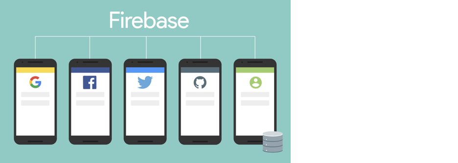

## 10.5	AsyncStorage
AsyncStorage adalah library React Native yang digunakan untuk menyimpan data secara lokal di perangkat pengguna. Ini sering digunakan untuk menyimpan token atau data lain yang perlu diakses dan dikelola secara lokal dalam aplikasi. Setelah pengguna berhasil login, token autentikasi biasanya dikeluarkan oleh server. AsyncStorage berguna untuk menyimpan token ini secara lokal pada perangkat pengguna. Ini memungkinkan untuk menyimpan token dengan aman dan menggunakannya pada permintaan berikutnya ke server untuk otentikasi. Selain token, AsyncStorage juga dapat digunakan untuk menyimpan data pengguna lainnya, seperti ID pengguna, nama pengguna, atau preferensi pengguna yang perlu dipertahankan di antara sesi aplikasi. AsyncStorage dapat digunakan untuk melacak apakah pengguna masih masuk atau sudah keluar dari aplikasi. Ini memungkinkan untuk menjaga sesi pengguna, sehingga jika pengguna menutup aplikasi dan membukanya kembali, tidak perlu melakukan login lagi.

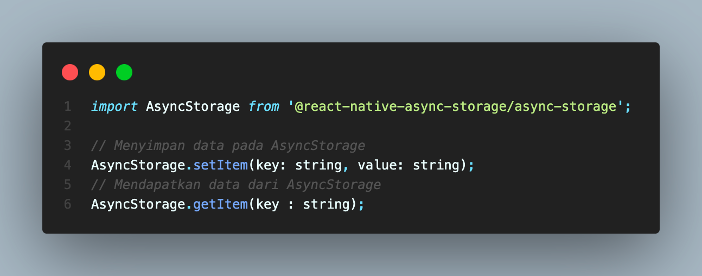

## 10.6	Langkah – langkah praktikum

### 1.	Buka project sebelumnya lalu install package yang dibutuhkan seperti kode berikut
```bash
npm i @react-native-firebase/auth @react-native-async-storage/async-storage
```

### 2.	Lalu buka website firebase console pada browser dan buka project firebase pada pertemuan sebelumnya, dan buka bagian Authentication.

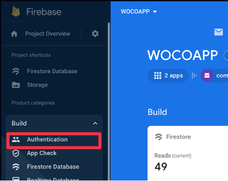

### 3.	Selanjutnya klik Get Started

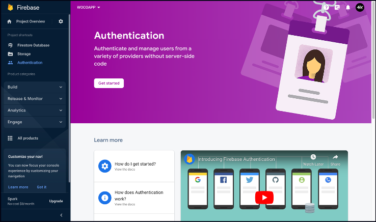

### 4.	Maka akan tampil seperti dibawah ini, lalu pilih Email/Password

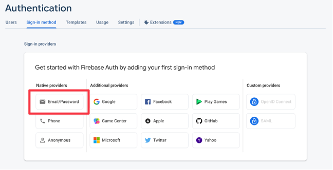

### 5.	Lalu pilih Enable dan klik Save.

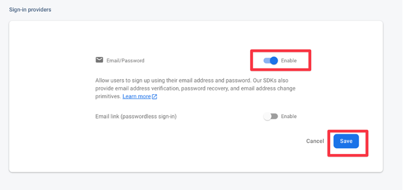

### 6.	Buat 3 folder baru di dalam folder screens dengan nama SplashScreen, Login, Register, dan buat file index.js di dalamnya

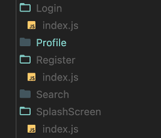

### 7.	Jangan lupa untuk melakukan export import pada file index.js yang berada pada folder screens

```jsx
import Home from "./Home";
import BlogDetail from "./BlogDetail";
import Discover from "./Discover";
import Bookmark from "./Bookmark";
import Profile from "./Profile";
import Search from "./Search";
import AddBlogForm from "./AddBlogForm";
import EditBlogForm from "./EditBlogForm";
import Login from "./Login";
import Register from "./Register";
import SplashScreen from "./SplashScreen";
export {Home, BlogDetail, Discover, Bookmark, Profile, Search, AddBlogForm, EditBlogForm, Login, Register, SplashScreen}
```

### 8.	Buka file Router.js yang berada pada folder navigation, dan tambahkan Stack screens baru seperti kode berikut, pastikan halaman screens sudah ter-import

```jsx
<Stack.Screen
        name="SplashScreen"
        component={SplashScreen}
        options={{headerShown: false}}
      />
<Stack.Screen
        name="Register"
        component={Register}
        options={{headerShown: false}}
      />
      <Stack.Screen
        name="Login"
        component={Login}
        options={{headerShown: false}}
      />
```

### 9.	Tambahkan kode berikut pada Stack Navigator untuk mengatur screens mana yang pertama kali tampil saat aplikasi dijalankan.
```jsx
<Stack.Navigator initialRouteName="SplashScreen">
      {/* isi stack screen */}
    </Stack.Navigator>
```

### 10.	Buka file index.js yang berada pada folder screens/SplashScreen masukkan kode berikut

```jsx
import {StyleSheet, Text, View} from 'react-native';
import React, {useEffect} from 'react';
import {colors, fontType} from '../../theme';
import {useNavigation} from '@react-navigation/native';
import AsyncStorage from '@react-native-async-storage/async-storage';

const SplashScreen = () => {

  return (
    <View style={styles.container}>
      <Text style={styles.logo}>WOCO.</Text>
      <View style={styles.infoContainer}>
        <Text style={[styles.info, {fontFamily: fontType['Pjs-Regular']}]}>
          Presented By
        </Text>
        <Text
          style={[
            styles.info,
            {fontFamily: fontType['Pjs-SemiBold'], textAlign: 'center'},
          ]}>
          Mobile Programming
        </Text>
        <Text
          style={[
            styles.info,
            {fontFamily: fontType['Pjs-SemiBold'], textAlign: 'center'},
          ]}>
          Laboratory
        </Text>
      </View>
    </View>
  );
};

export default SplashScreen;

const styles = StyleSheet.create({
  container: {
    flex: 1,
    backgroundColor: colors.white(),
    justifyContent: 'center',
  },
  logo: {
    fontSize: 48,
    fontFamily: fontType['Pjs-ExtraBold'],
    color: colors.black(),
    alignSelf: 'center',
  },
  infoContainer: {
    alignItems: 'center',
    position: 'absolute',
    bottom: 24,
    left: 0,
    right: 0,
  },
  info: {
    fontSize: 12,
    color: colors.grey(0.6),
  },
});
```

### 11.	Tambahkan kode berikut agar screens berganti setelah Splash Screen, dengan pengecekan apakah sudah ada user yang sudah melakukan login tau belum.

```jsx
const navigation = useNavigation();
  useEffect(() => {
    checkToken();
  }, []);
  const checkToken = async () => {
    try {
      const userDataJSON = await AsyncStorage.getItem('userData');

      if (userDataJSON) {
        const userData = JSON.parse(userDataJSON);
        const {userToken, expirationTime} = userData;

        if (userToken && expirationTime) {
          const currentTime = new Date().getTime();

          if (currentTime <= expirationTime) {
            setTimeout(() => {
              navigation.replace('MainApp');
            }, 1500);
          } else {
            setTimeout(() => {
              navigation.replace('Login');
            }, 1500);
          }
        } else {
          setTimeout(() => {
            navigation.replace('Login');
          }, 1500);
        }
      } else {
        setTimeout(() => {
          navigation.replace('Login');
        }, 1500);
      }
    } catch (error) {
      console.error('Error retrieving token data:', error);
      setTimeout(() => {
        navigation.replace('Login');
      }, 1500);
    }
  };
```

### 12.	Buka file index.js yang berada pada folder screens/Register, dan masukkan kode berikut

```jsx
import React, {useState, useEffect} from 'react';
import {View, Text, TextInput, StyleSheet, TouchableHighlight, TouchableOpacity, ActivityIndicator, Alert, KeyboardAvoidingView, Platform, Keyboard, TouchableWithoutFeedback} from 'react-native';
import auth from '@react-native-firebase/auth';
import {useNavigation} from '@react-navigation/native';
import firestore from '@react-native-firebase/firestore';
import {colors, fontType} from '../../theme';
import {Eye, EyeSlash} from 'iconsax-react-native';

const Register = () => {
  const [fullName, setFullName] = useState('');
  const [email, setEmail] = useState('');
  const [password, setPassword] = useState('');
  const [confirmPassword, setConfirmPassword] = useState('');
  const [passwordVisible, setPasswordVisible] = useState(false);
  const [confirmPasswordVisible, setConfirmPasswordVisible] = useState(false);
  const [isSignupDisabled, setSignupDisabled] = useState(true);
  const [loading, setLoading] = useState(false);
  const [paddingVertical, setPaddingVertical] = useState(60);
  const navigation = useNavigation();

  const handleRegister = async () => {
    let errorMessage = '';

    if (password !== confirmPassword) {
      errorMessage = 'Password dan konfirmasi password tidak cocok.';
    } else if (password.length < 8) {
      errorMessage = 'Panjang kata sandi harus minimal 8 karakter.';
    } else {
      const passwordRegex = /^(?=.*[A-Za-z])(?=.*\d).+$/;
      if (!passwordRegex.test(password)) {
        errorMessage = 'Password harus mengandung kombinasi huruf dan angka.';
      }
    }

    if (errorMessage) {
      Alert.alert('Error', errorMessage);
      return;
    }

    setLoading(true);
    try {
      await auth().createUserWithEmailAndPassword(email, password);
      await firestore()
        .collection('users')
        .doc(auth().currentUser.uid)
        .set({
          fullName,
          email,
          photoUrl: `https://images.unsplash.com/photo-1522075469751-3a6694fb2f61?ixlib=rb-4.0.3&ixid=M3wxMjA3fDB8MHxwaG90by1wYWdlfHx8fGVufDB8fHx8fA%3D%3D&auto=format&fit=crop&w=2680&q=80`,
          followersCount: 0,
          followingCount: 0,
          totalPost: 0,
          createdAt: new Date(),
        })
        .then(() => {
          console.log('User added!');
        });
      setLoading(false);
      navigation.navigate('Login');
    } catch (error) {
      setLoading(false);
      console.log('Registration Error:', error);
      if (error.code === 'auth/email-already-in-use') {
        errorMessage = 'Email sudah terdaftar!';
      } else if (error.code === 'auth/invalid-email') {
        errorMessage = 'Email tidak valid';
      } else if (error.code === 'auth/weak-password') {
        errorMessage = 'Password lemah';
      }
      Alert.alert('Error', errorMessage);
    }
  };

  const togglePasswordVisibility = () => {
    setPasswordVisible(!passwordVisible);
  };

  const toggleConfirmPasswordVisibility = () => {
    setConfirmPasswordVisible(!confirmPasswordVisible);
  };
  const updateSignupButtonStatus = () => {
    if (
      fullName.trim() &&
      email.trim() &&
      password.trim() &&
      confirmPassword.trim()
    ) {
      setSignupDisabled(false);
    } else {
      setSignupDisabled(true);
    }
  };

  useEffect(() => {
    updateSignupButtonStatus();
    const keyboardDidShowListener = Keyboard.addListener(
      'keyboardDidShow',
      () => {
        setPaddingVertical(0);
      },
    );
    const keyboardDidHideListener = Keyboard.addListener(
      'keyboardDidHide',
      () => {
        setPaddingVertical(60);
      },
    );
    return () => {
      keyboardDidShowListener.remove();
      keyboardDidHideListener.remove();
    };
  }, [fullName, email, password, confirmPassword]);
  return (
    <KeyboardAvoidingView
      style={{flex: 1}}
      behavior={Platform.OS === 'ios' ? 'padding' : 'height'}
      enabled>
      <TouchableWithoutFeedback onPress={Keyboard.dismiss}>
        <View style={[styles.container, {paddingVertical}]}>
          <View>
            <Text style={styles.header}>Sign up</Text>
            <Text style={styles.caption}>
              It’s never too late to join Woco, we welcome you!
            </Text>
            <View style={styles.form}>
              <View>
                <Text style={textinput.label}>Full Name</Text>
                <View style={textinput.container}>
                  <TextInput
                    placeholder="Enter full name"
                    placeholderTextColor={colors.grey(0.6)}
                    value={fullName}
                    onChangeText={text => {
                      setFullName(text);
                      updateSignupButtonStatus();
                    }}
                    style={textinput.text}
                  />
                </View>
              </View>
              <View>
                <Text style={textinput.label}>Email</Text>
                <View style={textinput.container}>
                  <TextInput
                    placeholder="Enter your email address"
                    placeholderTextColor={colors.grey(0.6)}
                    value={email}
                    onChangeText={text => {
                      setEmail(text);
                      updateSignupButtonStatus();
                    }}
                    inputMode="email"
                    keyboardType="email-address"
                    style={textinput.text}
                  />
                </View>
              </View>
              <View>
                <Text style={textinput.label}>Password</Text>
                <View
                  style={[
                    textinput.container,
                    {
                      flexDirection: 'row',
                      justifyContent: 'flex-start',
                      alignItems: 'center',
                      gap: 10,
                    },
                  ]}>
                  <TextInput
                    placeholder="Enter password"
                    placeholderTextColor={colors.grey(0.6)}
                    value={password}
                    onChangeText={text => {
                      setPassword(text);
                      updateSignupButtonStatus();
                    }}
                    secureTextEntry={!passwordVisible}
                    style={[textinput.text, {flex: 1}]}
                  />
                  <TouchableOpacity onPress={togglePasswordVisibility}>
                    {passwordVisible ? (
                      <EyeSlash
                        variant="Linear"
                        color={colors.grey(0.6)}
                        size={20}
                      />
                    ) : (
                      <Eye
                        variant="Linear"
                        color={colors.grey(0.6)}
                        size={20}
                      />
                    )}
                  </TouchableOpacity>
                </View>
              </View>
              <View>
                <Text style={textinput.label}>Confirm Password</Text>
                <View
                  style={[
                    textinput.container,
                    {
                      flexDirection: 'row',
                      justifyContent: 'flex-start',
                      alignItems: 'center',
                      gap: 10,
                    },
                  ]}>
                  <TextInput
                    placeholder="Re-type password"
                    placeholderTextColor={colors.grey(0.6)}
                    value={confirmPassword}
                    onChangeText={text => {
                      setConfirmPassword(text);
                      updateSignupButtonStatus();
                    }}
                    secureTextEntry={!confirmPasswordVisible}
                    style={[textinput.text, {flex: 1}]}
                  />
                  <TouchableOpacity onPress={toggleConfirmPasswordVisibility}>
                    {confirmPasswordVisible ? (
                      <EyeSlash
                        variant="Linear"
                        color={colors.grey(0.6)}
                        size={20}
                      />
                    ) : (
                      <Eye
                        variant="Linear"
                        color={colors.grey(0.6)}
                        size={20}
                      />
                    )}
                  </TouchableOpacity>
                </View>
              </View>
            </View>
          </View>
          <View style={{gap: 10}}>
            <TouchableHighlight
              style={[
                button.container,
                {
                  backgroundColor: isSignupDisabled
                    ? colors.blue(0.5)
                    : colors.blue(),
                },
              ]}
              underlayColor={colors.blue(0.9)}
              onPress={handleRegister}
              disabled={isSignupDisabled}>
              {loading ? (
                <ActivityIndicator color={colors.white()} />
              ) : (
                <Text style={button.label}>SIGN UP</Text>
              )}
            </TouchableHighlight>
            <View style={{flexDirection: 'row', gap: 5, alignSelf: 'center'}}>
              <Text style={[button.label, {color: colors.black()}]}>
                Already have an account?
              </Text>
              <TouchableOpacity onPress={() => navigation.navigate('Login')}>
                <Text style={[button.label, {color: colors.blue()}]}>
                  Log in
                </Text>
              </TouchableOpacity>
            </View>
          </View>
        </View>
      </TouchableWithoutFeedback>
    </KeyboardAvoidingView>
  );
};

export default Register;

const styles = StyleSheet.create({
  container: {
    flex: 1,
    backgroundColor: colors.white(),
    justifyContent: 'space-between',
    paddingHorizontal: 24,
  },
  header: {
    fontSize: 32,
    fontFamily: fontType['Pjs-ExtraBold'],
    color: colors.black(),
  },
  caption: {
    fontFamily: fontType['Pjs-Regular'],
    color: colors.grey(0.6),
    fontSize: 14,
    marginTop: 5,
    marginBottom: 40,
  },
  form: {
    gap: 20,
  },
});
const textinput = StyleSheet.create({
  label: {
    fontFamily: fontType['Pjs-Medium'],
    fontSize: 14,
    color: colors.grey(0.6),
    marginBottom: 5,
  },
  container: {
    backgroundColor: colors.grey(0.05),
    height: 52,
    justifyContent: 'center',
    paddingHorizontal: 10,
    borderRadius: 10,
  },
  text: {
    paddingVertical: 0,
    color: colors.black(),
    fontFamily: fontType['Pjs-Regular'],
  },
});
const button = StyleSheet.create({
  container: {
    borderRadius: 10,
    paddingHorizontal: 10,
    paddingVertical: 16,
    alignItems: 'center',
  },
  label: {
    color: colors.white(),
    fontSize: 14,
    fontFamily: fontType['Pjs-SemiBold'],
  },
});
```

### 13.	Maka tampilannya seperti gambar berikut

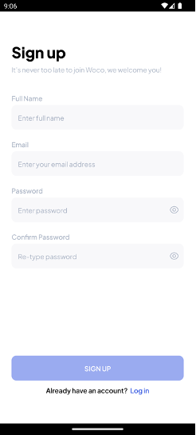

### 14.	Selanjutnya buka file index.js yang berada pada folder screens/Login dan masukkan kode berikut

```jsx
import React, {useState, useEffect} from 'react';
import {View, Text, TextInput, TouchableHighlight, TouchableOpacity, StyleSheet, Alert, ActivityIndicator, Keyboard, TouchableWithoutFeedback} from 'react-native';
import auth from '@react-native-firebase/auth';
import {useNavigation} from '@react-navigation/native';
import AsyncStorage from '@react-native-async-storage/async-storage';
import {colors, fontType} from '../../theme';
import {Eye, EyeSlash} from 'iconsax-react-native';

const Login = () => {
  const [email, setEmail] = useState('');
  const [password, setPassword] = useState('');
  const navigation = useNavigation();
  const [passwordVisible, setPasswordVisible] = useState(false);
  const [isLoginDisabled, setLoginDisabled] = useState(true);
  const [loading, setLoading] = useState(false);
  const handleLogin = async () => {
    let errorMessage = '';
    setLoading(true);
    try {
      await auth().signInWithEmailAndPassword(email, password);
      const userToken = await auth().currentUser.getIdToken();
      const expirationInMilliseconds = 30 * 24 * 60 * 60 * 1000; //hari * jam * menit * detik * milidetik
      const expirationTime = new Date().getTime() + expirationInMilliseconds;
      const dataToStore = {
        userToken,
        expirationTime,
      };
      await AsyncStorage.setItem('userData', JSON.stringify(dataToStore));
      setLoading(false);
      navigation.navigate('MainApp');
    } catch (error) {
      setLoading(false);
      console.log('Login Error:', error.message);
      if (error.code === 'auth/invalid-email') {
        errorMessage = 'Email tidak valid.';
      } else if (error.code === 'auth/wrong-password') {
        errorMessage = 'Password salah.';
      } else if (error.code === 'auth/invalid-login') {
        errorMessage = 'Email atau password salah, silahkan periksa kembali.';
      } else {
        errorMessage = 'Terjadi kesalahan saat login.';
      }
      Alert.alert('Error', errorMessage);
    }
  };

  const togglePasswordVisibility = () => {
    setPasswordVisible(!passwordVisible);
  };

  const updateLoginButtonStatus = () => {
    if (email.trim() && password.trim()) {
      setLoginDisabled(false);
    } else {
      setLoginDisabled(true);
    }
  };
  useEffect(() => {
    updateLoginButtonStatus();
  }, [email, password]);
  return (
    <TouchableWithoutFeedback onPress={Keyboard.dismiss}>
      <View style={styles.container}>
        <View>
          <Text style={styles.header}>Log in</Text>
          <Text style={styles.caption}>
            Let’s log in to your account and roll in to Woco!
          </Text>
          <View style={styles.form}>
            <View>
              <Text style={textinput.label}>Email</Text>
              <View style={textinput.container}>
                <TextInput
                  placeholder="Enter your email address"
                  placeholderTextColor={colors.grey(0.6)}
                  value={email}
                  onChangeText={text => {
                    setEmail(text);
                    updateLoginButtonStatus();
                  }}
                  inputMode="email"
                  keyboardType="email-address"
                  style={textinput.text}
                />
              </View>
            </View>
            <View>
              <Text style={textinput.label}>Password</Text>
              <View
                style={[
                  textinput.container,
                  {
                    flexDirection: 'row',
                    justifyContent: 'flex-start',
                    alignItems: 'center',
                    gap: 10,
                  },
                ]}>
                <TextInput
                  placeholder="Enter password"
                  placeholderTextColor={colors.grey(0.6)}
                  value={password}
                  onChangeText={text => {
                    setPassword(text);
                    updateLoginButtonStatus();
                  }}
                  secureTextEntry={!passwordVisible}
                  style={[textinput.text, {flex: 1}]}
                />
                <TouchableOpacity onPress={togglePasswordVisibility}>
                  {passwordVisible ? (
                    <Eye variant="Linear" color={colors.grey(0.6)} size={20} />
                  ) : (
                    <EyeSlash
                      variant="Linear"
                      color={colors.grey(0.6)}
                      size={20}
                    />
                  )}
                </TouchableOpacity>
              </View>
            </View>
          </View>
        </View>
        <View style={{gap: 10}}>
          <TouchableHighlight
            style={[
              button.container,
              {
                backgroundColor: isLoginDisabled
                  ? colors.blue(0.5)
                  : colors.blue(),
              },
            ]}
            underlayColor={colors.blue(0.9)}
            onPress={handleLogin}
            disabled={isLoginDisabled}>
            {loading ? (
              <ActivityIndicator color={colors.white()} />
            ) : (
              <Text style={button.label}>LOG IN</Text>
            )}
          </TouchableHighlight>
          <View style={{flexDirection: 'row', gap: 5, alignSelf: 'center'}}>
            <Text style={[button.label, {color: colors.black()}]}>
              Don't have an account?
            </Text>
            <TouchableOpacity onPress={() => navigation.navigate('Register')}>
              <Text style={[button.label, {color: colors.blue()}]}>
                Sign up
              </Text>
            </TouchableOpacity>
          </View>
        </View>
      </View>
    </TouchableWithoutFeedback>
  );
};

export default Login;

const styles = StyleSheet.create({
  container: {
    flex: 1,
    backgroundColor: colors.white(),
    paddingHorizontal: 24,
    paddingVertical: 60,
    justifyContent: 'space-between',
  },
  header: {
    fontSize: 32,
    fontFamily: fontType['Pjs-ExtraBold'],
    color: colors.black(),
  },
  caption: {
    fontFamily: fontType['Pjs-Regular'],
    color: colors.grey(0.6),
    fontSize: 14,
    marginTop: 5,
    marginBottom: 40,
  },
  form: {
    gap: 20,
  },
});
const textinput = StyleSheet.create({
  label: {
    fontFamily: fontType['Pjs-Medium'],
    fontSize: 14,
    color: colors.grey(0.6),
    marginBottom: 5,
  },
  container: {
    backgroundColor: colors.grey(0.05),
    height: 52,
    justifyContent: 'center',
    paddingHorizontal: 10,
    borderRadius: 10,
  },
  text: {
    paddingVertical: 0,
    color: colors.black(),
    fontFamily: fontType['Pjs-Regular'],
  },
});
const button = StyleSheet.create({
  container: {
    borderRadius: 10,
    paddingHorizontal: 10,
    paddingVertical: 16,
    alignItems: 'center',
  },
  label: {
    color: colors.white(),
    fontSize: 14,
    fontFamily: fontType['Pjs-SemiBold'],
  },
});
```

### 15.	Maka tampilannya akan seperti berikut

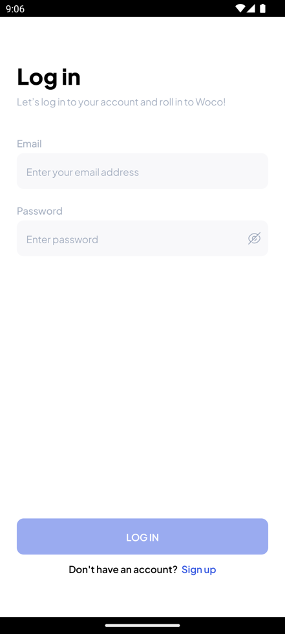

### 16.	Selanjutnya buka file index.js pada folder AddBlogForm lalu tambahkan import dari firebase authentication

```jsx
import auth from '@react-native-firebase/auth';
```

### 17.	Tambahkan variable authorId yang berisi data id dari user yang sedang login, letakkan di dalam try catch dalam fungsi handleUpload

```jsx
const authorId = auth().currentUser.uid;
```

### 18.	Tambahkan komponen KeyboardAvoidingView untuk membungkus komponen View(container) seperti kode berikut, dan import KeyboardAvoidingView dari react-native
```jsx
<KeyboardAvoidingView
      style={{flex: 1}}
      behavior={Platform.OS === 'ios' ? 'padding' : 'height'}
      enabled>
{/* komponen tetap */}
</KeyboardAvoidingView>
```

### 19.	Tambahkan data yang akan dimasukkan ke database firestore seperti berikut
```jsx
await firestore().collection('blog').add({
        title: blogData.title,
        category: blogData.category,
        image: url,
        content: blogData.content,
        totalComments: blogData.totalComments,
        totalLikes: blogData.totalLikes,
        createdAt: new Date(),
        authorId
      });
```

### 20.	Buka file index.js pada folder screens/Profile dan ubah kodenya menjadi seperti berikut

```jsx
import {ScrollView, StyleSheet, Text, View, TouchableOpacity, ActivityIndicator, RefreshControl} from 'react-native';
import {Edit, Setting2} from 'iconsax-react-native';
import React, {useEffect, useState, useCallback, useRef} from 'react';
import FastImage from 'react-native-fast-image';
import {ItemSmall} from '../../components';
import {useNavigation} from '@react-navigation/native';
import {fontType, colors} from '../../theme';
import firestore from '@react-native-firebase/firestore';
import {formatNumber} from '../../utils/formatNumber';
import auth from '@react-native-firebase/auth';
import AsyncStorage from '@react-native-async-storage/async-storage';
import {formatDate} from '../../utils/formatDate';
import ActionSheet from 'react-native-actions-sheet';

const Profile = () => {
  const navigation = useNavigation();
  const [loading, setLoading] = useState(true);
  const [blogData, setBlogData] = useState([]);
  const [refreshing, setRefreshing] = useState(false);
  const [profileData, setProfileData] = useState(null);
  const actionSheetRef = useRef(null);
  const openActionSheet = () => {
    actionSheetRef.current?.show();
  };
  const closeActionSheet = () => {
    actionSheetRef.current?.hide();
  };
  useEffect(() => {
    const user = auth().currentUser;
    const fetchBlogData = () => {
      try {
        if (user) {
          const userId = user.uid;
          const blogCollection = firestore().collection('blog');
          const query = blogCollection.where('authorId', '==', userId);
          const unsubscribeBlog = query.onSnapshot(querySnapshot => {
            const blogs = querySnapshot.docs.map(doc => ({
              ...doc.data(),
              id: doc.id,
            }));
            setBlogData(blogs);
            setLoading(false);
          });

          return () => {
            unsubscribeBlog();
          };
        }
      } catch (error) {
        console.error('Error fetching blog data:', error);
      }
    };

    const fetchProfileData = () => {
      try {
        const user = auth().currentUser;
        if (user) {
          const userId = user.uid;
          const userRef = firestore().collection('users').doc(userId);

          const unsubscribeProfile = userRef.onSnapshot(doc => {
            if (doc.exists) {
              const userData = doc.data();
              setProfileData(userData);
              fetchBlogData();
            } else {
              console.error('Dokumen pengguna tidak ditemukan.');
            }
          });

          return () => {
            unsubscribeProfile();
          };
        }
      } catch (error) {
        console.error('Error fetching profile data:', error);
      }
    };
    fetchBlogData();
    fetchProfileData();
  }, []);
  const onRefresh = useCallback(() => {
    setRefreshing(true);
    setTimeout(() => {
      firestore()
        .collection('blog')
        .onSnapshot(querySnapshot => {
          const blogs = [];
          querySnapshot.forEach(documentSnapshot => {
            blogs.push({
              ...documentSnapshot.data(),
              id: documentSnapshot.id,
            });
          });
          setBlogData(blogs);
        });
      setRefreshing(false);
    }, 1500);
  }, []);
  const handleLogout = async () => {
    try {
      closeActionSheet();
      await auth().signOut();
      await AsyncStorage.removeItem('userData');
      navigation.replace('Login');
    } catch (error) {
      console.error(error);
    }
  };
  return (
    <View style={styles.container}>
      <View style={styles.header}>
        <TouchableOpacity onPress={openActionSheet}>
          <Setting2 color={colors.black()} variant="Linear" size={24} />
        </TouchableOpacity>
      </View>
      <ScrollView
        showsVerticalScrollIndicator={false}
        contentContainerStyle={{
          paddingHorizontal: 24,
          gap: 10,
          paddingVertical: 20,
        }}
        refreshControl={
          <RefreshControl refreshing={refreshing} onRefresh={onRefresh} />
        }>
        <View style={{gap: 15, alignItems: 'center'}}>
          <FastImage
            style={profile.pic}
            source={{
              uri: profileData?.photoUrl,
              headers: {Authorization: 'someAuthToken'},
              priority: FastImage.priority.high,
            }}
            resizeMode={FastImage.resizeMode.cover}
          />
          <View style={{gap: 5, alignItems: 'center'}}>
            <Text style={profile.name}>{profileData?.fullName}</Text>
            <Text style={profile.info}>
              Member since {formatDate(profileData?.createdAt)}
            </Text>
          </View>
          <View style={{flexDirection: 'row', gap: 20}}>
            <View style={{alignItems: 'center', gap: 5}}>
              <Text style={profile.sum}>{profileData?.totalPost}</Text>
              <Text style={profile.tag}>Posted</Text>
            </View>
            <View style={{alignItems: 'center', gap: 5}}>
              <Text style={profile.sum}>
                {formatNumber(profileData?.followingCount)}
              </Text>
              <Text style={profile.tag}>Following</Text>
            </View>
            <View style={{alignItems: 'center', gap: 5}}>
              <Text style={profile.sum}>
                {formatNumber(profileData?.followersCount)}
              </Text>
              <Text style={profile.tag}>Follower</Text>
            </View>
          </View>
          <TouchableOpacity style={profile.buttonEdit}>
            <Text style={profile.buttonText}>Edit Profile</Text>
          </TouchableOpacity>
        </View>
        <View style={{paddingVertical: 10, gap: 10}}>
          {loading ? (
            <ActivityIndicator size={'large'} color={colors.blue()} />
          ) : (
            blogData.map((item, index) => <ItemSmall item={item} key={index} />)
          )}
        </View>
      </ScrollView>
      <TouchableOpacity
        style={styles.floatingButton}
        onPress={() => navigation.navigate('AddBlog')}>
        <Edit color={colors.white()} variant="Linear" size={20} />
      </TouchableOpacity>
      <ActionSheet
        ref={actionSheetRef}
        containerStyle={{
          borderTopLeftRadius: 25,
          borderTopRightRadius: 25,
        }}
        indicatorStyle={{
          width: 100,
        }}
        gestureEnabled={true}
        defaultOverlayOpacity={0.3}>
        <TouchableOpacity
          style={{
            justifyContent: 'center',
            alignItems: 'center',
            paddingVertical: 15,
          }}
          onPress={handleLogout}>
          <Text
            style={{
              fontFamily: fontType['Pjs-Medium'],
              color: colors.black(),
              fontSize: 18,
            }}>
            Log out
          </Text>
        </TouchableOpacity>
        <TouchableOpacity
          style={{
            justifyContent: 'center',
            alignItems: 'center',
            paddingVertical: 15,
          }}
          onPress={closeActionSheet}>
          <Text
            style={{
              fontFamily: fontType['Pjs-Medium'],
              color: 'red',
              fontSize: 18,
            }}>
            Cancel
          </Text>
        </TouchableOpacity>
      </ActionSheet>
    </View>
  );
};
export default Profile;
const styles = StyleSheet.create({
  container: {
    flex: 1,
    backgroundColor: colors.white(),
    position: 'absolute',
    top: 0,
    left: 0,
    right: 0,
    bottom: 0,
  },
  header: {
    paddingHorizontal: 24,
    justifyContent: 'flex-end',
    flexDirection: 'row',
    alignItems: 'center',
    height: 52,
    elevation: 8,
    paddingTop: 8,
    paddingBottom: 4,
  },
  title: {
    fontSize: 20,
    fontFamily: fontType['Pjs-ExtraBold'],
    color: colors.black(),
  },
  floatingButton: {
    backgroundColor: colors.blue(),
    padding: 15,
    position: 'absolute',
    bottom: 24,
    right: 24,
    borderRadius: 10,
    shadowColor: colors.blue(),
    shadowOffset: {
      width: 0,
      height: 4,
    },
    shadowOpacity: 0.3,
    shadowRadius: 4.65,
    elevation: 8,
  },
});
const profile = StyleSheet.create({
  pic: {width: 100, height: 100, borderRadius: 15},
  name: {
    color: colors.black(),
    fontSize: 20,
    fontFamily: fontType['Pjs-ExtraBold'],
    textTransform: 'capitalize',
  },
  info: {
    fontSize: 12,
    fontFamily: fontType['Pjs-Regular'],
    color: colors.grey(),
  },
  sum: {
    fontSize: 16,
    fontFamily: fontType['Pjs-SemiBold'],
    color: colors.black(),
  },
  tag: {
    fontSize: 14,
    fontFamily: fontType['Pjs-Regular'],
    color: colors.grey(0.5),
  },
  buttonEdit: {
    paddingHorizontal: 16,
    paddingVertical: 14,
    backgroundColor: colors.grey(0.1),
    borderRadius: 10,
  },
  buttonText: {
    fontSize: 14,
    fontFamily: fontType['Pjs-SemiBold'],
    color: colors.black(),
  },
});
```

### 21.	Maka akan tampil seperti berikut

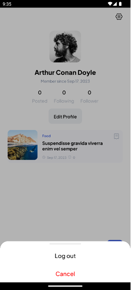

### 22.	Buka ListHorizontal.js pada folder components lalu ubah kodenya menjadi seperti berikut
```jsx
import {StyleSheet, Text, View, FlatList, TouchableOpacity} from 'react-native';
import React, {useState} from 'react';
import {Receipt21} from 'iconsax-react-native';
import FastImage from 'react-native-fast-image';
import {useNavigation} from '@react-navigation/native';
import { fontType, colors } from '../theme';
import { formatDate } from '../utils/formatDate';

const ItemHorizontal = ({item, variant, onPress}) => {
  const navigation = useNavigation();
  return (
    <TouchableOpacity style={itemHorizontal.cardItem} onPress={() => navigation.navigate('BlogDetail', {blogId: item.id})}>
      <FastImage
        style={itemHorizontal.cardImage}
        source={{
          uri: item?.image,
          headers: {Authorization: 'someAuthToken'},
          priority: FastImage.priority.high,
        }}
        resizeMode={FastImage.resizeMode.cover}>
        <View style={itemHorizontal.cardContent}>
          <View style={itemHorizontal.cardInfo}>
            <Text style={itemHorizontal.cardTitle}>{item?.title}</Text>
            <Text style={itemHorizontal.cardText}>{formatDate(item?.createdAt)}</Text>
          </View>
          <View>
            <View style={itemHorizontal.cardIcon}>
              <TouchableOpacity onPress={onPress}>
                <Receipt21 color={colors.white()} variant={variant} size={20} />
              </TouchableOpacity>
            </View>
          </View>
        </View>
      </FastImage>
    </TouchableOpacity>
  );
};
const ListHorizontal = ({data}) => {
  const [bookmark, setBookmark] = useState([]);
  const toggleBookmark = itemId => {
    if (bookmark.includes(itemId)) {
      setBookmark(bookmark.filter(id => id !== itemId));
    } else {
      setBookmark([...bookmark, itemId]);
    }
  };

  const renderItem = ({item}) => {
    variant = bookmark.includes(item.id) ? 'Bold' : 'Linear';
    return (
      <ItemHorizontal
        item={item}
        variant={variant}
        onPress={() => toggleBookmark(item.id)}
      />
    );
  };
  return (
    <FlatList
      data={data}
      keyExtractor={item => item.id}
      renderItem={item => renderItem({...item})}
      ItemSeparatorComponent={() => <View style={{width: 15}} />}
      contentContainerStyle={{paddingHorizontal: 24}}
      horizontal
      showsHorizontalScrollIndicator={false}
    />
  );
};

export default ListHorizontal;

const itemHorizontal = StyleSheet.create({
  cardItem: {
    width: 280,
  },
  cardImage: {
    width: '100%',
    height: 200,
    borderRadius: 15,
  },
  cardContent: {
    flexDirection: 'row',
    justifyContent: 'space-between',
    padding: 15,
  },
  cardInfo: {
    justifyContent: 'flex-end',
    height: '100%',
    gap: 10,
    maxWidth: '60%',
  },
  cardTitle: {
    fontFamily: fontType['Pjs-Bold'],
    fontSize: 14,
    color: colors.white(),
  },
  cardText: {
    fontSize: 10,
    color: colors.white(),
    fontFamily: fontType['Pjs-Medium'],
  },
  cardIcon: {
    backgroundColor: colors.white(0.33),
    padding: 5,
    borderColor: colors.white(),
    borderWidth: 0.5,
    borderRadius: 5,
  },
});
```

### 23.	Buka file index.js yang berada pada folder screens/Home, lalu ubah kodenya menjadi seperti berikut
```jsx
import React, {useState, useEffect} from 'react';
import {ScrollView, StyleSheet, Text, View, FlatList, TouchableOpacity, ActivityIndicator} from 'react-native';
import {Notification} from 'iconsax-react-native';
import {CategoryList} from '../../../data';
import {ItemSmall, ListHorizontal} from '../../components';
import {fontType, colors} from '../../theme';
import firestore from '@react-native-firebase/firestore';
const ItemCategory = ({item, onPress, color}) => {
  return (
    <TouchableOpacity onPress={onPress}>
      <View style={category.item}>
        <Text style={{...category.title, color}}>{item.categoryName}</Text>
      </View>
    </TouchableOpacity>
  );
};
const FlatListCategory = () => {
  const [selected, setSelected] = useState(1);
  const renderItem = ({item}) => {
    const color = item.id === selected ? colors.blue() : colors.grey();
    return (
      <ItemCategory
        item={item}
        onPress={() => setSelected(item.id)}
        color={color}
      />
    );
  };
  return (
    <FlatList
      data={CategoryList}
      keyExtractor={item => item.id}
      renderItem={item => renderItem({...item})}
      ItemSeparatorComponent={() => <View style={{width: 10}} />}
      contentContainerStyle={{paddingHorizontal: 24}}
      horizontal
      showsHorizontalScrollIndicator={false}
    />
  );
};

const Home = () => {
  const [loading, setLoading] = useState(true);
  const [blogData, setBlogData] = useState([]);
  useEffect(() => {
    const fetchBlogData = () => {
      try {
        const blogCollection = firestore().collection('blog');
        const unsubscribeBlog = blogCollection.onSnapshot(querySnapshot => {
          const blogs = querySnapshot.docs.map(doc => ({
            ...doc.data(),
            id: doc.id,
          }));
          setBlogData(blogs);
          setLoading(false);
        });

        return () => {
          unsubscribeBlog();
        };
      } catch (error) {
        console.error('Error fetching blog data:', error);
      }
    };
    fetchBlogData();
  }, []);

  const horizontalData = blogData.slice(0, 5);
  const verticalData = blogData.slice(5);
  return (
    <View style={styles.container}>
      <View style={styles.header}>
        <Text style={styles.title}>WOCO.</Text>
        <Notification color={colors.black()} variant="Linear" size={24} />
      </View>
      <View style={styles.listCategory}>
        <FlatListCategory />
        <ScrollView showsVerticalScrollIndicator={false}>
          {loading ? (
            <ActivityIndicator size={'large'} color={colors.blue()} />
          ) : (
            <View style={styles.listBlog}>
              <ListHorizontal data={horizontalData} />
              <View style={styles.listCard}>
                {verticalData.map((item, index) => (
                  <ItemSmall item={item} key={index} />
                ))}
              </View>
            </View>
          )}
        </ScrollView>
      </View>
    </View>
  );
};

export default Home;

const styles = StyleSheet.create({
  container: {
    flex: 1,
    backgroundColor: colors.white(),
  },
  header: {
    paddingHorizontal: 24,
    justifyContent: 'space-between',
    flexDirection: 'row',
    alignItems: 'center',
    height: 52,
    elevation: 8,
    paddingTop: 8,
    paddingBottom: 4,
  },
  title: {
    fontSize: 20,
    fontFamily: fontType['Pjs-ExtraBold'],
    color: colors.black(),
  },
  listCategory: {
    paddingVertical: 10,
  },
  listBlog: {
    paddingVertical: 10,
    gap: 10,
  },
  listCard: {
    paddingHorizontal: 24,
    paddingVertical: 10,
    gap: 15,
  },
});
const category = StyleSheet.create({
  item: {
    paddingHorizontal: 14,
    paddingVertical: 10,
    borderRadius: 25,
    alignItems: 'center',
    backgroundColor: colors.grey(0.08),
  },
  title: {
    fontFamily: fontType['Pjs-SemiBold'],
    fontSize: 14,
    lineHeight: 18,
  },
});
```
### 24.	Buka file index.js yang berada pada folder screens/BlogDetail, lalu ubah kodenya menjadi seperti berikut
```jsx
import {
  StyleSheet,
  Text,
  View,
  ScrollView,
  TouchableOpacity,
  Animated,
  ActivityIndicator,
} from 'react-native';
import React, {useState, useRef, useEffect} from 'react';
import {
  ArrowLeft,
  Like1,
  Receipt21,
  Message,
  Share,
  More,
} from 'iconsax-react-native';
import {useNavigation} from '@react-navigation/native';
import FastImage from 'react-native-fast-image';
import {fontType, colors} from '../../theme';
import firestore from '@react-native-firebase/firestore';
import storage from '@react-native-firebase/storage';
import {formatNumber} from '../../utils/formatNumber';
import {formatDate} from '../../utils/formatDate';
import ActionSheet from 'react-native-actions-sheet';
import auth from '@react-native-firebase/auth';

const BlogDetail = ({route}) => {
  const {blogId} = route.params;
  const navigation = useNavigation();
  const [iconStates, setIconStates] = useState({
    liked: {variant: 'Linear', color: colors.grey(0.6)},
    bookmarked: {variant: 'Linear', color: colors.grey(0.6)},
  });
  const [loading, setLoading] = useState(true);
  const [selectedBlog, setSelectedBlog] = useState(null);
  const userId = auth().currentUser.uid;
  const actionSheetRef = useRef(null);
  const openActionSheet = () => {
    actionSheetRef.current?.show();
  };
  const closeActionSheet = () => {
    actionSheetRef.current?.hide();
  };
  useEffect(() => {
    const subscriber = firestore()
      .collection('blog')
      .doc(blogId)
      .onSnapshot(documentSnapshot => {
        const blogData = documentSnapshot.data();
        if (blogData) {
          console.log('Blog data: ', blogData);
          setSelectedBlog(blogData);
        } else {
          console.log(`Blog with ID ${blogId} not found.`);
        }
      });
    setLoading(false);
    return () => subscriber();
  }, [blogId]);
  const navigateEdit = () => {
    closeActionSheet();
    navigation.navigate('EditBlog', {blogId});
  };
  const handleDelete = async () => {
    setLoading(true);
    try {
      await firestore()
        .collection('blog')
        .doc(blogId)
        .delete()
        .then(() => {
          console.log('Blog deleted!');
        });
      if (selectedBlog?.image) {
        const imageRef = storage().refFromURL(selectedBlog?.image);
        await imageRef.delete();
      }
      console.log('Blog deleted!');
      closeActionSheet();
      setSelectedBlog(null);
      setLoading(false);
      navigation.navigate('Profile');
    } catch (error) {
      console.error(error);
    }
  };
  const scrollY = useRef(new Animated.Value(0)).current;
  const diffClampY = Animated.diffClamp(scrollY, 0, 52);
  const headerY = diffClampY.interpolate({
    inputRange: [0, 52],
    outputRange: [0, -52],
  });
  const bottomBarY = diffClampY.interpolate({
    inputRange: [0, 52],
    outputRange: [0, 52],
  });

  const toggleIcon = iconName => {
    setIconStates(prevStates => ({
      ...prevStates,
      [iconName]: {
        variant: prevStates[iconName].variant === 'Linear' ? 'Bold' : 'Linear',
        color:
          prevStates[iconName].variant === 'Linear'
            ? colors.blue()
            : colors.grey(0.6),
      },
    }));
  };
  return (
    <View style={styles.container}>
      <Animated.View
        style={[styles.header, {transform: [{translateY: headerY}]}]}>
        <TouchableOpacity onPress={() => navigation.goBack()}>
          <ArrowLeft color={colors.grey(0.6)} variant="Linear" size={24} />
        </TouchableOpacity>
        <View style={{flexDirection: 'row', justifyContent: 'center', gap: 20}}>
          <Share color={colors.grey(0.6)} variant="Linear" size={24} />
          {userId === selectedBlog?.authorId && (
            <TouchableOpacity onPress={openActionSheet}>
              <More
                color={colors.grey(0.6)}
                variant="Linear"
                style={{transform: [{rotate: '90deg'}]}}
              />
            </TouchableOpacity>
          )}
        </View>
      </Animated.View>
      {loading ? (
        <View style={{justifyContent: 'center', alignItems: 'center', flex: 1}}>
          <ActivityIndicator size={'large'} color={colors.blue()} />
        </View>
      ) : (
        <Animated.ScrollView
          showsVerticalScrollIndicator={false}
          onScroll={Animated.event(
            [{nativeEvent: {contentOffset: {y: scrollY}}}],
            {useNativeDriver: true},
          )}
          contentContainerStyle={{
            paddingHorizontal: 24,
            paddingTop: 62,
            paddingBottom: 54,
          }}>
          <FastImage
            style={styles.image}
            source={{
              uri: selectedBlog?.image,
              headers: {Authorization: 'someAuthToken'},
              priority: FastImage.priority.high,
            }}
            resizeMode={FastImage.resizeMode.cover}></FastImage>
          <View
            style={{
              flexDirection: 'row',
              justifyContent: 'space-between',
              marginTop: 15,
            }}>
            <Text style={styles.category}>{selectedBlog?.category.name}</Text>
            <Text style={styles.date}>
              {formatDate(selectedBlog?.createdAt)}
            </Text>
          </View>
          <Text style={styles.title}>{selectedBlog?.title}</Text>
          <Text style={styles.content}>{selectedBlog?.content}</Text>
        </Animated.ScrollView>
      )}
      <Animated.View
        style={[styles.bottomBar, {transform: [{translateY: bottomBarY}]}]}>
        <View style={{flexDirection: 'row', gap: 5, alignItems: 'center'}}>
          <TouchableOpacity onPress={() => toggleIcon('liked')}>
            <Like1
              color={iconStates.liked.color}
              variant={iconStates.liked.variant}
              size={24}
            />
          </TouchableOpacity>
          <Text style={styles.info}>
            {formatNumber(selectedBlog?.totalLikes)}
          </Text>
        </View>
        <View style={{flexDirection: 'row', gap: 5, alignItems: 'center'}}>
          <Message color={colors.grey(0.6)} variant="Linear" size={24} />
          <Text style={styles.info}>
            {formatNumber(selectedBlog?.totalComments)}
          </Text>
        </View>
        <TouchableOpacity onPress={() => toggleIcon('bookmarked')}>
          <Receipt21
            color={iconStates.bookmarked.color}
            variant={iconStates.bookmarked.variant}
            size={24}
          />
        </TouchableOpacity>
      </Animated.View>
      <ActionSheet
        ref={actionSheetRef}
        containerStyle={{
          borderTopLeftRadius: 25,
          borderTopRightRadius: 25,
        }}
        indicatorStyle={{
          width: 100,
        }}
        gestureEnabled={true}
        defaultOverlayOpacity={0.3}>
        <TouchableOpacity
          style={{
            justifyContent: 'center',
            alignItems: 'center',
            paddingVertical: 15,
          }}
          onPress={navigateEdit}>
          <Text
            style={{
              fontFamily: fontType['Pjs-Medium'],
              color: colors.black(),
              fontSize: 18,
            }}>
            Edit
          </Text>
        </TouchableOpacity>
        <TouchableOpacity
          style={{
            justifyContent: 'center',
            alignItems: 'center',
            paddingVertical: 15,
          }}
          onPress={handleDelete}>
          <Text
            style={{
              fontFamily: fontType['Pjs-Medium'],
              color: colors.black(),
              fontSize: 18,
            }}>
            Delete
          </Text>
        </TouchableOpacity>
        <TouchableOpacity
          style={{
            justifyContent: 'center',
            alignItems: 'center',
            paddingVertical: 15,
          }}
          onPress={closeActionSheet}>
          <Text
            style={{
              fontFamily: fontType['Pjs-Medium'],
              color: 'red',
              fontSize: 18,
            }}>
            Cancel
          </Text>
        </TouchableOpacity>
      </ActionSheet>
    </View>
  );
};

export default BlogDetail;

const styles = StyleSheet.create({
  container: {
    flex: 1,
    backgroundColor: colors.white(),
  },
  header: {
    paddingHorizontal: 24,
    justifyContent: 'space-between',
    flexDirection: 'row',
    alignItems: 'center',
    height: 52,
    paddingTop: 8,
    paddingBottom: 4,
    position: 'absolute',
    zIndex: 1000,
    top: 0,
    right: 0,
    left: 0,
    backgroundColor: colors.white(),
  },
  bottomBar: {
    position: 'absolute',
    zIndex: 1000,
    backgroundColor: colors.white(),
    paddingVertical: 14,
    paddingHorizontal: 60,
    bottom: 0,
    left: 0,
    right: 0,
    flexDirection: 'row',
    justifyContent: 'space-between',
  },
  image: {
    height: 200,
    width: 'auto',
    borderRadius: 15,
  },
  info: {
    color: colors.grey(0.6),
    fontFamily: fontType['Pjs-SemiBold'],
    fontSize: 12,
  },
  category: {
    color: colors.blue(),
    fontFamily: fontType['Pjs-SemiBold'],
    fontSize: 12,
  },
  date: {
    color: colors.grey(0.6),
    fontFamily: fontType['Pjs-Medium'],
    fontSize: 10,
  },
  title: {
    fontSize: 16,
    fontFamily: fontType['Pjs-Bold'],
    color: colors.black(),
    marginTop: 10,
  },
  content: {
    color: colors.grey(),
    fontFamily: fontType['Pjs-Medium'],
    fontSize: 10,
    lineHeight: 20,
    marginTop: 15,
  },
});
```
### 25.	Berikut hasil tampilan dari halaman Home

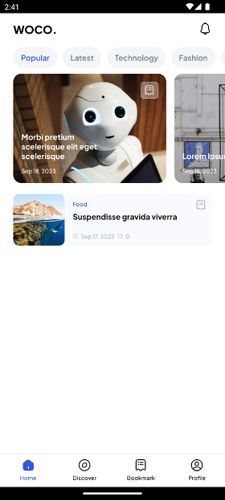
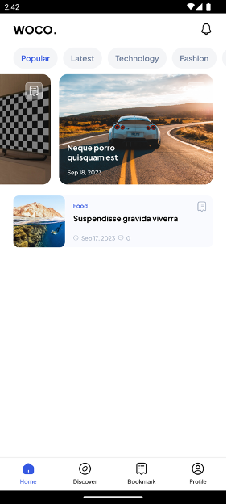

## 10.7	Tugas Praktikum
Silahkan menerapkan login dan register pada project masing masing sesuai tema yang sudah ditentukan!