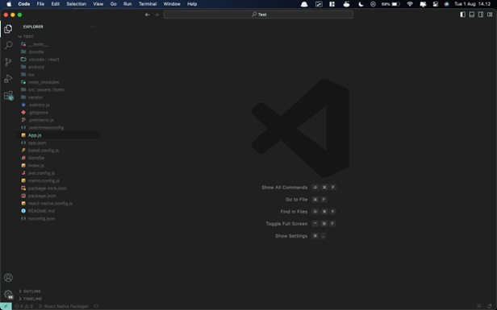
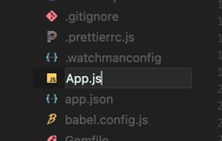
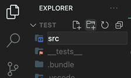
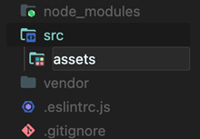
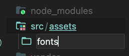
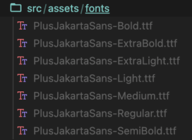
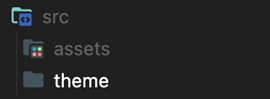
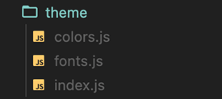
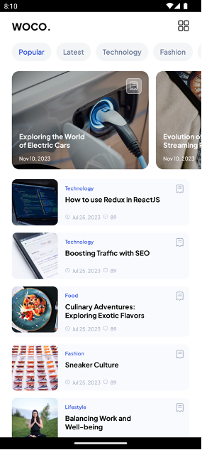

# BAB 2 - Komponen React Native

## 2.1 Tujuan Pembelajaran

1. Mahasiswa dapat mengetahui konsep dasar komponen React Native
2. Mahasiswa dapat menggunakan komponen dasar React Native
3. Mahasiswa dapat membuat komponen kustom

## 2.2 Software yang di butuhkan

1. Java JDK
2. Node.Js
3. Visual Studio Code
4. Chocolatey
5. Android Studio
6. Android SDK

## 2.3 Komponen React Native

Komponen adalah elemen dasar dalam pembangunan aplikasi React Native. Mereka mewakili bagian-bagian yang dapat digunakan ulang dari antarmuka pengguna (UI) Anda. Setiap komponen biasanya berfungsi sebagai "building block" yang dapat dipasang bersama untuk membentuk tampilan aplikasi.  Berkat adanya komponen di react native ini dapat mempercepat waktu pembuatan aplikasi karena tidak harus membuat sesuatu dari awal, misalkan kita membutuhkan komponen icon kita bisa menggunakan komponen icon yang sudah dibuat oleh orang lain pada project kita.

Dengan React, untuk membuat komponen dapat menggunakan Class Component atau Function Component. Komponen fungsional ditulis sebagai fungsi JavaScript biasa, sedangkan komponen kelas ditulis sebagai kelas JavaScript yang mewarisi fungsionalitas dari kelas "Component" yang disediakan oleh React Native. Komponen fungsional biasanya digunakan untuk komponen sederhana yang hanya perlu menerima props dan menghasilkan tampilan UI berdasarkan props tersebut. Komponen kelas digunakan untuk komponen yang memiliki state internal dan memerlukan lebih banyak logika.

**Function Component**

```jsx
import React from 'react';
import {Text, View} from 'react-native';
const HelloWorldApp = () => {
  return (
    <View
      style={{
        flex: 1,
        justifyContent: 'center',
        alignItems: 'center',
      }}>
      <Text>Hello, world!</Text>
    </View>
  );
};
export default HelloWorldApp;

```

**Class Component**

```jsx
import React, {Component} from 'react';
import {Text, View} from 'react-native';
class HelloWorldApp extends Component {
  render() {
    return (
      <View
        style={{
          flex: 1,
          justifyContent: 'center',
          alignItems: 'center',
        }}>
        <Text>Hello, world!</Text>
      </View>
    );
  }
}
export default HelloWorldApp;
```

## 2.4 Core Component

React Native mencakup beberapa komponen yang dapat digunakan secara out-of-the-box. Komponen yang lebih kompleks dapat dibangun dengan menggabungkan komponen inti dengan cara yang menarik. React Native memiliki banyak komponen inti mulai dari kontrol hingga indikator aktivitas. Berikut beberapa contoh komponen inti seperti :

### 1. View

View adalah komponen paling fundamental yang digunakan untuk membuat user interface. Layaknya div di dalam HTML. View digunakan untuk layouting pada aplikasi kita dan mendukung properti lainnya seperti style prop, touch handling dan accessibility controls. Contoh penulisan kode menggunakan komponen View adalah sebagai berikut :

```jsx
import React from 'react'
import { View, StyleSheet } from 'react-native'
export default function App() {
  return (
    <View style={styles.container}>
      <View style={styles.box} />
    </View>
  )
}
const styles = StyleSheet.create({
  container: {
    flex: 1,
    justifyContent: 'center',
    alignItems: 'center',
  },
  box: {
    width: 150,
    height: 150,
    backgroundColor: '#3B6CD4',
    borderWidth: 1,
    borderColor: 'black',
    borderRadius: 4,
  },
})
```

### 2. Text

Text adalah komponen react native yang berguna untuk menampilkan atau merender teks. Komponen text juga mendukung nesting, styling, dan touch handling. Contoh penulisan kode menggunakan komponen Text adalah sebagai berikut :

```jsx
import React from 'react'
import { StyleSheet, Text, View } from 'react-native'
export default function App() {
  return (
    <View style={styles.container}>
      <Text style={styles.text}>Hello!</Text>
    </View>
  )
}
const styles = StyleSheet.create({
  container: {
    flex: 1,
    justifyContent: 'center',
    alignItems: 'center',
  },
  text: {
    backgroundColor: 'whitesmoke',
    color: '#4A90E2',
    fontSize: 24,
    padding: 10,
  },
})
```

### 3. Image

Komponen ini berguna menampilkan berbagai jenis gambar, termasuk gambar dari internet, sumber daya statis, gambar lokal sementara, dan gambar dari disk lokal, seperti rol kamera. Layout bekerja secara berbeda untuk gambar yang diunduh dari web dan yang diimpor sebagai file.

**a. Gambar yang diimpor**

File gambar akan dipindai pada waktu pembuatan, dan dimensi gambar disertakan sebagai metadata dalam bundel aplikasi. Dimensi komponen Image kemudian diatur ke dimensi gambar secara default.

**b. Gambar dari web**

Dimensi gambar tidak diketahui pada waktu pembuatan, sehingga lebar dan tinggi Komponen Image diatur ke 0 secara default. Agar gambar muncul di layar, kita perlu mengatur lebar dan tinggi atau nilai fleksibel dalam style Image. Jika dimensi diketahui sebelumnya, maka dimensi tersebut dapat diteruskan di prop sumber bersama dengan uri.
Contoh penulisan kode menggunakan komponen Image adalah sebagai berikut :

```jsx
import React from 'react'
import { Image, StyleSheet } from 'react-native'
export default function App() {
  return (
    <Image
      style={styles.image}
      source={{ uri: 'https://images.unsplash.com/photo-1661956601030-fdfb9c7e9e2f?ixlib=rb-4.0.3&ixid=M3wxMjA3fDF8MHxwaG90by1wYWdlfHx8fGVufDB8fHx8fA%3D%3D&auto=format&fit=crop&w=884&q=80' }}
    />
  )
}
const styles = StyleSheet.create({
  image: {
    width: '100%',
    height: '70%',
  },
})
```

### 4. ScrollView

ScrollView digunakan untuk konten yang dapat digulir. Komponen ini sangat cocok untuk menggulir konten dalam jumlah kecil (kurang dari layar penuh). Komponen dapat menggulir secara horizontal atau vertikal. Cara kerjanya yaitu ScrollView akan merender semua komponen anak sekaligus. Contoh penulisan kode menggunakan komponen ScrollView adalah sebagai berikut :

```jsx
import React from 'react'
import { ScrollView, StyleSheet, View } from 'react-native'
export default function App() {
  return (
    <ScrollView style={styles.container}>
      <View style={styles.large} />
      <ScrollView horizontal>
        <View style={styles.small} />
        <View style={styles.small} />
        <View style={styles.small} />
      </ScrollView>
      <View style={styles.large} />
      <View style={styles.small} />
      <View style={styles.large} />
    </ScrollView>
  )
}
const styles = StyleSheet.create({
  container: {
    flex: 1,
  },
  small: {
    width: 200,
    height: 200,
    marginBottom: 10,
    marginRight: 10,
    backgroundColor: 'skyblue',
  },
  large: {
    width: 300,
    height: 300,
    marginBottom: 10,
    marginRight: 10,
    backgroundColor: 'steelblue',
  },
})
```

### 5. Button

Button adalah salah satu komponen inti yang disediakan oleh React Native dan membantu dalam menciptakan antarmuka pengguna yang responsif. Tombol ini dapat digunakan untuk memicu tindakan tertentu ketika pengguna mengetuknya. Tapi button yang ditampilkan menggunakan gaya default/standar untuk setiap platform. Button standar ini tidak terlalu dapat dikonfigurasi. Contoh penulisan kode menggunakan komponen button adalah sebagai berikut :

```jsx
import React from 'react'
import { Button, StyleSheet, Text, View, Alert } from 'react-native'
export default function App() {
  return (
    <View style={styles.container}>
      <View>
        <Text style={styles.title}>Simple Button</Text>
        <Button
          title="Press me"
          onPress={() => Alert.alert('Simple Button pressed')}
        />
      </View>
      <View>
        <Text style={styles.title}>Adjusted Color Button</Text>
        <Button
          title="Press me"
          color="#f194ff"
          onPress={() => Alert.alert('Button with adjusted color pressed')}
        />
      </View>
      <View>
        <Text style={styles.title}>Disabled Button</Text>
        <Button
          title="Press me"
          disabled
        />
      </View>
    </View>
  )
}
const styles = StyleSheet.create({
  container: {
    flex: 1,
    justifyContent: 'center',
    marginHorizontal: 16,
  },
  title: {
    textAlign: 'center',
    marginVertical: 8,
  },
})
```

### 6. Touchable

Pada React Native, sebagian besar "Button" sebenarnya diimplementasikan menggunakan komponen Touchable. Seperti Button, komponen ini mendukung prop onPress. Namun, tidak seperti Button, komponen ini mendukung gaya khusus. Pada dasarnya Touchable adalah View yang dapat ditekan.
Touchable memiliki beragam properti lain, seperti onPressIn dan onPressOut, yang memberi kita lebih banyak kontrol atas perilaku tombol. Jenis komponen Touchable :

#### a. TouchableOpacity

Komponen ini memudar saat ditekan, dan memudar kembali saat dilepaskan. Kita dapat menatanya sesuka kita, seperti View. Kita dapat mengonfigurasi opacity yang ditekan dengan prop activeOpacity.
Contoh penulisan kode menggunakan TouchableOpacity :

```jsx
import React from 'react'
import { StyleSheet, Text, TouchableOpacity, View } from 'react-native'
export default function App() {
  return (
    <View style={styles.container}>
      <TouchableOpacity
        style={styles.button}
        activeOpacity={0.5}
        onPress={() => {}}
      >
        <Text style={styles.text}>Press me!</Text>
      </TouchableOpacity>
    </View>
  )
}
const styles = StyleSheet.create({
  container: {
    flex: 1,
    alignItems: 'center',
    justifyContent: 'center',
  },
  button: {
    padding: 10,
    borderRadius: 4,
    borderWidth: 1,
    borderColor: 'blue',
    backgroundColor: 'lightblue',
  },
  text: {
    fontSize: 18,
    padding: 12,
  },
})
```

#### b. TouchableHighlight

Komponen ini berubah warna saat ditekan, dan berubah kembali saat dilepas. Kita dapat mengonfigurasi warna dengan prop underlayColor.

```jsx
import React from 'react'
import { StyleSheet, Text, TouchableHighlight, View } from 'react-native'
export default function App() {
  return (
    <View style={styles.container}>
      <TouchableHighlight
        style={styles.button}
        underlayColor="#DDDDDD"
        onPress={() => {
        }}
      >
        <Text style={styles.text}>Press me!</Text>
      </TouchableHighlight>
    </View>
  )
}
const styles = StyleSheet.create({
  container: {
    flex: 1,
    alignItems: 'center',
    justifyContent: 'center',
  },
  button: {
    padding: 10,
    borderRadius: 4,
    backgroundColor: '#F88',
  },
  text: {
    fontSize: 18,
    padding: 12,
  },
})
```

#### c. TouchableWithoutFeedback

Komponen ini tidak memiliki umpan balik saat ditekan.
TouchableWithoutFeedback hanya mendukung satu child. Jika ingin memiliki beberapa komponen child, gabungkan komponen tersebut dalam View.

```jsx
import React, {useState} from 'react';
import {StyleSheet, TouchableWithoutFeedback, Text, View} from 'react-native';
export default function App() {
  const [count, setCount] = useState(0);

  const onPress = () => {
    setCount(count + 1);
  };
  return (
    <View style={styles.container}>
      <View style={styles.countContainer}>
        <Text style={styles.countText}>Count: {count}</Text>
      </View>
      <TouchableWithoutFeedback onPress={onPress}>
        <View style={styles.button}>
          <Text>Touch Here</Text>
        </View>
      </TouchableWithoutFeedback>
    </View>
  );
};
const styles = StyleSheet.create({
  container: {
    flex: 1,
    justifyContent: 'center',
    paddingHorizontal: 10,
  },
  button: {
    alignItems: 'center',
    backgroundColor: '#DDDDDD',
    padding: 10,
  },
  countContainer: {
    alignItems: 'center',
    padding: 10,
  },
  countText: {
    color: '#FF00FF',
  },
});
```

### 7. List

List sama seperti ScrollView, tetapi dioptimalkan untuk mendaur ulang elemen dan mengurangi render ulang untuk kinerja yang lebih baik. Akibatnya, API sedikit lebih rumit daripada ScrollView.
List terdapat 2 jenis yaitu FlatList dan SectionList. Kedua list tersebut dibangun di atas VirtualizedList, yang merupakan implementasi list yang sangat fleksibel dan optimal, yang umumnya tidak boleh digunakan secara langsung. Ini menggantikan komponen ListView (sekarang sudah tidak digunakan lagi).

#### a. FlatList

FlatList digunakan untuk konten yang dapat digulir dalam jumlah besar. Pada dasarnya sama seperti ScrollView, tetapi ada peningkatan performa, FlatList hanya merender konten di layar (memotong konten di luar layar), dan hanya memperbarui baris yang telah berubah. Seperti ScrollView, FlatList dapat bergerak secara horizontal atau vertikal.
FlatList merender setiap item dalam data input mereka menggunakan prop renderItem. Prop renderItem adalah fungsi yang mengambil item dari data array dan memetakannya ke elemen React. Setiap item dalam data harus berupa objek dengan id unik, sehingga React dapat menentukan kapan item diatur ulang. Id unik dicari sebagai item.key secara default, tetapi bisa juga dengan cara lain untuk menemukan/membangun id yaitu dengan meneruskan prop fungsi keyExtractor.

```jsx
import React from 'react'
import { FlatList, StyleSheet, Text } from 'react-native'
const items = [
  { id: '0', text: 'View' },
  { id: '1', text: 'Text' },
  { id: '2', text: 'Image' },
  { id: '3', text: 'ScrollView' },
  { id: '4', text: 'ListView' },
]
export default function App() {
  return (
    <FlatList
      style={styles.container}
      data={items}
      renderItem={({ item }) => <Text style={styles.row}>{item.text}</Text>}
      keyExtractor={(item) => item.id}
    />
  )
}
const styles = StyleSheet.create({
  container: {
    flex: 1,
  },
  row: {
    padding: 15,
    marginBottom: 5,
    backgroundColor: 'skyblue',
  },
})
```

#### b. SectionList

SectionList mirip dengan FlatList, tetapi dapat memiliki header bagian untuk memisahkan grup baris. SectionList merender setiap item di bagian inputnya menggunakan prop renderSectionHeader dan renderItem. Setiap item di bagian harus berupa objek dengan id unik (key), dan data array dari baris data. Setiap item dalam data juga harus berupa objek dengan id unik. Prop renderSectionHeader adalah fungsi yang mengambil item dari section array dan memetakannya ke elemen React. Prop renderItem, seperti untuk FlatList, adalah fungsi yang mengambil item dari data array dan mengembalikan elemen React.

```jsx
import React from 'react'
import { SectionList, StyleSheet, Text } from 'react-native'
const sections = [
  {
    id: '0',
    title: 'Basic Components',
    data: [
      { id: '0', text: 'View' },
      { id: '1', text: 'Text' },
      { id: '2', text: 'Image' },
    ],
  },
  {
    id: '1',
    title: 'List Components',
    data: [
      { id: '3', text: 'ScrollView' },
      { id: '4', text: 'ListView' },
    ],
  },
]
export default function App() {
  return (
    <SectionList
      style={styles.container}
      sections={sections}
      renderItem={({ item }) => <Text style={styles.row}>{item.text}</Text>}
      renderSectionHeader={({ section }) => (
        <Text style={styles.header}>{section.title}</Text>
      )}
      keyExtractor={(item) => item.id}
    />
  )
}
const styles = StyleSheet.create({
  container: {
    flex: 1,
  },
  row: {
    padding: 15,
    marginBottom: 5,
    backgroundColor: 'skyblue',
  },
  header: {
    padding: 15,
    marginBottom: 5,
    backgroundColor: 'steelblue',
    color: 'white',
    fontWeight: 'bold',
  },
})
```

## 2.5 Langkah – langkah praktikum

### 1. Buka kembali project awal yang sudah dibuat pada Visual Studio Code



### 2. Ubah ekstensi dari file App.tsx menjadi App.js



### 3. Buat folder baru dengan nama src pada folder project, folder src ini berguna untuk menyimpan semua folder dan file yang diperlukan dalam project



### 4. Buat folder baru di dalam folder src tadi dengan nama assets. Folder ini akan menyimpan semua aset yang di gunakan di react-native. Kita dapat menambahkan file statis seperti font dan gambar ke dalamnya



### 5. Buat folder baru di dalam folder assets dengan nama fonts, digunakan untuk menyimpan font yang akan digunakan



### 6. Masukkan font yang akan digunakan ke dalam folder fonts



### 7. Selanjutnya buat file baru di dalam project dengan nama react-native.config.js dan masukkan kode dibawah ini, dan sesuaikan lokasi dimana menyimpan font yang digunakan

```js
module.exports = {
    project: {
        ios: {},
        android: {}
    },
    assets: ['./src/assets/fonts'],
}
```

### 8. Jika sudah hubungkan font dengan project dengan cara menjalankan perintah berikut

```bash
npx react-native-asset
```

### 9. Lalu buat lagi folder baru di dalam folder src dengan nama theme



### 10. Setelah itu buat 3 file baru di dalam folder theme tersebut dengan nama colors.js, fonts.js, dan index.js



### 11. Buka file fonts.js dan masukkan kode berikut

```js
const fontType = {
    'Pjs-ExtraLight' : 'PlusJakartaSans-ExtraLight',
    'Pjs-Light' : 'PlusJakartaSans-Light',
    'Pjs-Regular' : 'PlusJakartaSans-Regular',
    'Pjs-Medium' : 'PlusJakartaSans-Medium',
    'Pjs-SemiBold' : 'PlusJakartaSans-SemiBold',
    'Pjs-Bold' : 'PlusJakartaSans-Bold',
    'Pjs-ExtraBold' : 'PlusJakartaSans-ExtraBold',
}
export default fontType;
```

### 12. Setelah itu buka file colors.js dan masukkan kode berikut

```js
const colors = {
    grey: (opacity = 1) => `rgba(109, 125, 154, ${opacity})`,
    blue: (opacity = 1) => `rgba(53, 88, 225, ${opacity})`,
    white: (opacity = 1) => `rgba(255, 255, 255, ${opacity})`,
    black: (opacity = 1) => `rgba(0, 0, 0, ${opacity})`,
    darkModeBlack: (opacity = 1) => `rgba(27, 27, 27, ${opacity})`,
    darkModeBlue: (opacity = 1) => `rgba(146, 156, 241, ${opacity})`,
}
export default colors
```

### 13. Buka file index.js yang berada pada folder theme dan masukkan kode berikut

```js
import colors from "./colors";
import fontType from "./fonts";
export {colors, fontType} 
```

### 14. Kemudian jalankan perintah berikut untuk menginstall icon dan dapat kita gunakan pada project

```bash
npm i iconsax-react-native react-native-svg
```

### 15. Lalu jalankan project dengan perintah berikut

```bash
npx react-native run-android
```

### 16. Buka App.js lalu ubah import menjadi seperti kode dibawah ini

```jsx
import React from 'react';
import {ScrollView, StyleSheet,  Text, View, Image, ImageBackground} from 'react-native';
import {Notification, Receipt21, Clock, Message} from 'iconsax-react-native';
import { fontType, colors } from './src/theme';
```

### 17. Ubah komponen App menjadi seperti kode berikut

```jsx
export default function App() {
  return (
    <View style={styles.container}>
      <View style={styles.header}>
        <Text style={styles.title}>WOCO.</Text>
        <Notification color={colors.black()} variant="Linear" size={24} />
      </View>
      <View style={styles.listCategory}>
        <ScrollView horizontal showsHorizontalScrollIndicator={false}>
          <View style={{...category.item, marginLeft: 24}}>
            <Text style={{...category.title, color: colors.blue()}}>
              Popular
            </Text>
          </View>
          <View style={category.item}>
            <Text style={category.title}>Latest</Text>
          </View>
          <View style={category.item}>
            <Text style={category.title}>Technology</Text>
          </View>
          <View style={category.item}>
            <Text style={category.title}>Fashion</Text>
          </View>
          <View style={category.item}>
            <Text style={category.title}>Health</Text>
          </View>
          <View style={{...category.item, marginRight: 24}}>
            <Text style={category.title}>Lifestyle</Text>
          </View>
        </ScrollView>
      </View>
      <ListBlog />
    </View>
  );
}
```

### 18. Tambahkan juga stylesheet seperti kode berikut

```jsx
const styles = StyleSheet.create({
  container: {
    flex: 1,
    backgroundColor: colors.white(),
  },
  header: {
    paddingHorizontal: 24,
    justifyContent: 'space-between',
    flexDirection: 'row',
    alignItems: 'center',
    height:52,
    elevation: 8,
    paddingTop:8,
    paddingBottom:4
  },
  title: {
    fontSize: 20,
    fontFamily: fontType['Pjs-ExtraBold'],
    color: colors.black(),
  },
  listCategory: {
    paddingVertical: 10,
  },
  listBlog: {
    paddingVertical: 10,
    gap: 10,
  },
});
const category = StyleSheet.create({
  item: {
    paddingHorizontal: 14,
    paddingVertical: 10,
    borderRadius: 25,
    alignItems: 'center',
    backgroundColor: colors.grey(0.08),
    marginHorizontal:5
  },
  title: {
    fontFamily: fontType['Pjs-SemiBold'],
    fontSize: 14,
    lineHeight: 18,
    color: colors.grey(),
  },
})
```

### 19. Buat komponen baru dengan nama ListBlog seperti kode berikut

```jsx
const ListBlog = () => {
  return (
    <ScrollView>
      <View style={styles.listBlog}>
        <ScrollView
          showsHorizontalScrollIndicator={false}
          horizontal
          contentContainerStyle={{gap: 15}}>
          <View style={{...itemHorizontal.cardItem, marginLeft: 24}}>
            <ImageBackground
              style={itemHorizontal.cardImage}
              resizeMode="cover"
              imageStyle={{borderRadius: 15}}
              source={{
                uri: 'https://images.unsplash.com/photo-1593941707882-a5bba14938c7?ixlib=rb-4.0.3&ixid=M3wxMjA3fDB8MHxwaG90by1wYWdlfHx8fGVufDB8fHx8fA%3D%3D&auto=format&fit=crop&w=1744&q=80',
              }}>
              <View style={itemHorizontal.cardContent}>
                <View style={itemHorizontal.cardInfo}>
                  <Text style={itemHorizontal.cardTitle}>
                    Exploring the World of Electric Cars
                  </Text>
                  <Text style={itemHorizontal.cardText}>Nov 10, 2023</Text>
                </View>
                <View>
                  <View style={itemHorizontal.cardIcon}>
                    <Receipt21 color={colors.white()} variant="Linear" size={20} />
                  </View>
                </View>
              </View>
            </ImageBackground>
          </View>
          <View style={itemHorizontal.cardItem}>
            <ImageBackground
              style={itemHorizontal.cardImage}
              resizeMode="cover"
              imageStyle={{borderRadius: 15}}
              source={{
                uri: 'https://images.unsplash.com/photo-1574770118700-4ed7dae3310e?ixlib=rb-4.0.3&ixid=M3wxMjA3fDB8MHxwaG90by1wYWdlfHx8fGVufDB8fHx8fA%3D%3D&auto=format&fit=crop&w=774&q=80',
              }}>
              <View style={itemHorizontal.cardContent}>
                <View style={itemHorizontal.cardInfo}>
                  <Text style={itemHorizontal.cardTitle}>
                    Exploring the World of Electric Cars
                  </Text>
                  <Text style={itemHorizontal.cardText}>Nov 10, 2023</Text>
                </View>
                <View>
                  <View style={itemHorizontal.cardIcon}>
                    <Receipt21 color={colors.white()} variant="Linear" size={20} />
                  </View>
                </View>
              </View>
            </ImageBackground>
          </View>
          <View style={itemHorizontal.cardItem}>
            <ImageBackground
              style={itemHorizontal.cardImage}
              resizeMode="cover"
              imageStyle={{borderRadius: 15}}
              source={{
                uri: 'https://images.unsplash.com/photo-1591293835940-934a7c4f2d9b?ixlib=rb-4.0.3&ixid=M3wxMjA3fDB8MHxwaG90by1wYWdlfHx8fGVufDB8fHx8fA%3D%3D&auto=format&fit=crop&w=774&q=80',
              }}>
              <View style={itemHorizontal.cardContent}>
                <View style={itemHorizontal.cardInfo}>
                  <Text style={itemHorizontal.cardTitle}>
                    Exploring the World of Electric Cars
                  </Text>
                  <Text style={itemHorizontal.cardText}>Nov 10, 2023</Text>
                </View>
                <View>
                  <View style={itemHorizontal.cardIcon}>
                    <Receipt21 color={colors.white()} variant="Linear" size={20} />
                  </View>
                </View>
              </View>
            </ImageBackground>
          </View>
          <View style={itemHorizontal.cardItem}>
            <ImageBackground
              style={itemHorizontal.cardImage}
              resizeMode="cover"
              imageStyle={{borderRadius: 15}}
              source={{
                uri: 'https://images.unsplash.com/photo-1577048982768-5cb3e7ddfa23?ixlib=rb-4.0.3&ixid=M3wxMjA3fDB8MHxwaG90by1wYWdlfHx8fGVufDB8fHx8fA%3D%3D&auto=format&fit=crop&w=1738&q=80',
              }}>
              <View style={itemHorizontal.cardContent}>
                <View style={itemHorizontal.cardInfo}>
                  <Text style={itemHorizontal.cardTitle}>
                    Baking 101: Mastering the Art of Baking
                  </Text>
                  <Text style={itemHorizontal.cardText}>Nov 10, 2023</Text>
                </View>
                <View>
                  <View style={itemHorizontal.cardIcon}>
                    <Receipt21 color={colors.white()} variant="Linear" size={20} />
                  </View>
                </View>
              </View>
            </ImageBackground>
          </View>
          <View style={{...itemHorizontal.cardItem, marginRight: 24}}>
            <ImageBackground
              style={itemHorizontal.cardImage}
              resizeMode="cover"
              imageStyle={{borderRadius: 15}}
              source={{
                uri: 'https://images.unsplash.com/photo-1603048588665-791ca8aea617?ixlib=rb-4.0.3&ixid=M3wxMjA3fDB8MHxwaG90by1wYWdlfHx8fGVufDB8fHx8fA%3D%3D&auto=format&fit=crop&w=1520&q=80',
              }}>
              <View style={itemHorizontal.cardContent}>
                <View style={itemHorizontal.cardInfo}>
                  <Text style={itemHorizontal.cardTitle}>
                    Rediscovering Vinyl: The Resurgence of Analog
                  </Text>
                  <Text style={itemHorizontal.cardText}>Nov 10, 2023</Text>
                </View>
                <View>
                  <View style={itemHorizontal.cardIcon}>
                    <Receipt21 color={colors.white()} variant="Linear" size={20} />
                  </View>
                </View>
              </View>
            </ImageBackground>
          </View>
        </ScrollView>
        <View style={itemVertical.listCard}>
          <View style={itemVertical.cardItem}>
            <Image
              style={itemVertical.cardImage}
              source={{
                uri: 'https://images.unsplash.com/photo-1555066931-4365d14bab8c?ixlib=rb-4.0.3&ixid=M3wxMjA3fDB8MHxwaG90by1wYWdlfHx8fGVufDB8fHx8fA%3D%3D&auto=format&fit=crop&w=1770&q=80',
              }}
            />
            <View style={itemVertical.cardContent}>
              <View
                style={{
                  flexDirection: 'row',
                  justifyContent: 'space-between',
                }}>
                <View style={{gap: 5, width: '70%'}}>
                  <Text style={itemVertical.cardCategory}>Technology</Text>
                  <Text style={itemVertical.cardTitle}>
                    How to use Redux in ReactJS
                  </Text>
                </View>
                <Receipt21
                  color={colors.grey(0.6)}
                  variant="Linear"
                  size={20}
                />
              </View>
              <View style={itemVertical.cardInfo}>
                <Clock
                  size={10}
                  variant="Linear"
                  color={colors.grey(0.6)}
                />
                <Text style={itemVertical.cardText}>Jul 25, 2023</Text>
                <Message
                  size={10}
                  variant="Linear"
                  color={colors.grey(0.6)}
                />
                <Text style={itemVertical.cardText}>89</Text>
              </View>
            </View>
          </View>
          <View style={itemVertical.cardItem}>
            <Image
              style={itemVertical.cardImage}
              source={{
                uri: 'https://images.unsplash.com/photo-1477013743164-ffc3a5e556da?ixlib=rb-4.0.3&ixid=M3wxMjA3fDB8MHxwaG90by1wYWdlfHx8fGVufDB8fHx8fA%3D%3D&auto=format&fit=crop&w=1770&q=80',
              }}
            />
            <View style={itemVertical.cardContent}>
              <View
                style={{
                  flexDirection: 'row',
                  justifyContent: 'space-between',
                }}>
                <View style={{gap: 5, width: '70%'}}>
                  <Text style={itemVertical.cardCategory}>Technology</Text>
                  <Text style={itemVertical.cardTitle}>
                    Boosting Traffic with SEO
                  </Text>
                </View>
                <Receipt21
                  color={colors.grey(0.6)}
                  variant="Linear"
                  size={20}
                />
              </View>
              <View style={itemVertical.cardInfo}>
                <Clock
                  size={10}
                  variant="Linear"
                  color={colors.grey(0.6)}
                />
                <Text style={itemVertical.cardText}>Jul 25, 2023</Text>
                <Message
                  size={10}
                  variant="Linear"
                  color={colors.grey(0.6)}
                />
                <Text style={itemVertical.cardText}>89</Text>
              </View>
            </View>
          </View>
          <View style={itemVertical.cardItem}>
            <Image
              style={itemVertical.cardImage}
              source={{
                uri: 'https://images.unsplash.com/photo-1492683962492-deef0ec456c0?ixlib=rb-4.0.3&ixid=M3wxMjA3fDB8MHxwaG90by1wYWdlfHx8fGVufDB8fHx8fA%3D%3D&auto=format&fit=crop&w=1756&q=80',
              }}
            />
            <View style={itemVertical.cardContent}>
              <View
                style={{
                  flexDirection: 'row',
                  justifyContent: 'space-between',
                }}>
                <View style={{gap: 5, width: '70%'}}>
                  <Text style={itemVertical.cardCategory}>Food</Text>
                  <Text style={itemVertical.cardTitle}>
                    Culinary Adventures: Exploring Exotic Flavors
                  </Text>
                </View>
                <Receipt21
                  color={colors.grey(0.6)}
                  variant="Linear"
                  size={20}
                />
              </View>
              <View style={itemVertical.cardInfo}>
                <Clock
                  size={10}
                  variant="Linear"
                  color={colors.grey(0.6)}
                />
                <Text style={itemVertical.cardText}>Jul 25, 2023</Text>
                <Message
                  size={10}
                  variant="Linear"
                  color={colors.grey(0.6)}
                />
                <Text style={itemVertical.cardText}>89</Text>
              </View>
            </View>
          </View>
          <View style={itemVertical.cardItem}>
            <Image
              style={itemVertical.cardImage}
              source={{
                uri: 'https://images.unsplash.com/photo-1527090526205-beaac8dc3c62?ixlib=rb-4.0.3&ixid=M3wxMjA3fDB8MHxwaG90by1wYWdlfHx8fGVufDB8fHx8fA%3D%3D&auto=format&fit=crop&w=1770&q=80',
              }}
            />
            <View style={itemVertical.cardContent}>
              <View
                style={{
                  flexDirection: 'row',
                  justifyContent: 'space-between',
                }}>
                <View style={{gap: 5, width: '70%'}}>
                  <Text style={itemVertical.cardCategory}>Fashion</Text>
                  <Text style={itemVertical.cardTitle}>Sneaker Culture</Text>
                </View>
                <Receipt21
                  color={colors.grey(0.6)}
                  variant="Linear"
                  size={20}
                />
              </View>
              <View style={itemVertical.cardInfo}>
                <Clock
                  size={10}
                  variant="Linear"
                  color={colors.grey(0.6)}
                />
                <Text style={itemVertical.cardText}>Jul 25, 2023</Text>
                <Message
                  size={10}
                  variant="Linear"
                  color={colors.grey(0.6)}
                />
                <Text style={itemVertical.cardText}>89</Text>
              </View>
            </View>
          </View>
          <View style={itemVertical.cardItem}>
            <Image
              style={itemVertical.cardImage}
              source={{
                uri: 'https://images.unsplash.com/photo-1602192509154-0b900ee1f851?ixlib=rb-4.0.3&ixid=M3wxMjA3fDB8MHxwaG90by1wYWdlfHx8fGVufDB8fHx8fA%3D%3D&auto=format&fit=crop&w=1770&q=80',
              }}
            />
            <View style={itemVertical.cardContent}>
              <View
                style={{
                  flexDirection: 'row',
                  justifyContent: 'space-between',
                }}>
                <View style={{gap: 5, width: '70%'}}>
                  <Text style={itemVertical.cardCategory}>Lifestyle</Text>
                  <Text style={itemVertical.cardTitle}>
                    Balancing Work and Well-being
                  </Text>
                </View>
                <Receipt21
                  color={colors.grey(0.6)}
                  variant="Linear"
                  size={20}
                />
              </View>
              <View style={itemVertical.cardInfo}>
                <Clock
                  size={10}
                  variant="Linear"
                  color={colors.grey(0.6)}
                />
                <Text style={itemVertical.cardText}>Jul 25, 2023</Text>
                <Message
                  size={10}
                  variant="Linear"
                  color={colors.grey(0.6)}
                />
                <Text style={itemVertical.cardText}>89</Text>
              </View>
            </View>
          </View>
          <View style={itemVertical.cardItem}>
            <Image
              style={itemVertical.cardImage}
              source={{
                uri: 'https://images.unsplash.com/photo-1540497077202-7c8a3999166f?ixlib=rb-4.0.3&ixid=M3wxMjA3fDB8MHxwaG90by1wYWdlfHx8fGVufDB8fHx8fA%3D%3D&auto=format&fit=crop&w=1770&q=80',
              }}
            />
            <View style={itemVertical.cardContent}>
              <View
                style={{
                  flexDirection: 'row',
                  justifyContent: 'space-between',
                }}>
                <View style={{gap: 5, width: '70%'}}>
                  <Text style={itemVertical.cardCategory}>Health</Text>
                  <Text style={itemVertical.cardTitle}>
                    Home Fitness Revolution
                  </Text>
                </View>
                <Receipt21
                  color={colors.grey(0.6)}
                  variant="Linear"
                  size={20}
                />
              </View>
              <View style={itemVertical.cardInfo}>
                <Clock
                  size={10}
                  variant="Linear"
                  color={colors.grey(0.6)}
                />
                <Text style={itemVertical.cardText}>Jul 25, 2023</Text>
                <Message
                  size={10}
                  variant="Linear"
                  color={colors.grey(0.6)}
                />
                <Text style={itemVertical.cardText}>89</Text>
              </View>
            </View>
          </View>
          <View style={itemVertical.cardItem}>
            <Image
              style={itemVertical.cardImage}
              source={{
                uri: 'https://images.unsplash.com/photo-1539109136881-3be0616acf4b?ixlib=rb-4.0.3&ixid=M3wxMjA3fDB8MHxwaG90by1wYWdlfHx8fGVufDB8fHx8fA%3D%3D&auto=format&fit=crop&w=774&q=80',
              }}
            />
            <View style={itemVertical.cardContent}>
              <View
                style={{
                  flexDirection: 'row',
                  justifyContent: 'space-between',
                }}>
                <View style={{gap: 5, width: '70%'}}>
                  <Text style={itemVertical.cardCategory}>Fashion</Text>
                  <Text style={itemVertical.cardTitle}>
                    Intersection of Fashion
                  </Text>
                </View>
                <Receipt21
                  color={colors.grey(0.6)}
                  variant="Linear"
                  size={20}
                />
              </View>
              <View style={itemVertical.cardInfo}>
                <Clock
                  size={10}
                  variant="Linear"
                  color={colors.grey(0.6)}
                />
                <Text style={itemVertical.cardText}>Jul 25, 2023</Text>
                <Message
                  size={10}
                  variant="Linear"
                  color={colors.grey(0.6)}
                />
                <Text style={itemVertical.cardText}>89</Text>
              </View>
            </View>
          </View>
        </View>
      </View>
    </ScrollView>
  );
};
```

### 20. Terakhir tambahkan stylesheet untuk komponen ListBlog seperti kode berikut

```jsx
const itemVertical = StyleSheet.create({
  listCard: {
    paddingHorizontal: 24,
    paddingVertical: 10,
    gap: 15,
  },
  cardItem: {
    backgroundColor: colors.blue(0.03),
    flexDirection: 'row',
    borderRadius: 10,
  },
  cardCategory: {
    color: colors.blue(),
    fontSize: 10,
    fontFamily: fontType['Pjs-SemiBold'],
  },
  cardTitle: {
    fontSize: 14,
    fontFamily: fontType['Pjs-Bold'],
    color: colors.black(),
  },
  cardText: {
    fontSize: 10,
    fontFamily: fontType['Pjs-Medium'],
    color: colors.blue(0.6),
  },
  cardImage: {
    width: 94,
    height: 94,
    borderRadius: 10,
    resizeMode: 'cover',
  },
  cardInfo: {
    flexDirection: 'row',
    gap: 5,
    alignItems: 'center',
  },
  cardContent: {
    gap: 10,
    justifyContent: 'space-between',
    paddingRight: 10,
    paddingLeft: 15,
    flex: 1,
    paddingVertical: 10,
  },
});
const itemHorizontal = StyleSheet.create({
  cardItem: {
    width: 280,
  },
  cardImage: {
    width: '100%',
    height: 200,
    borderRadius: 5,
  },
  cardContent: {
    flexDirection: 'row',
    justifyContent: 'space-between',
    padding: 15,
  },
  cardInfo: {
    justifyContent: 'flex-end',
    height: '100%',
    gap: 10,
    maxWidth: '60%',
  },
  cardTitle: {
    fontFamily: fontType['Pjs-Bold'],
    fontSize: 14,
    color: colors.white(),
  },
  cardText: {
    fontSize: 10,
    color: colors.white(),
    fontFamily: fontType['Pjs-Medium'],
  },
  cardIcon: {
    backgroundColor: colors.white(0.33),
    padding: 5,
    borderColor: colors.white(),
    borderWidth: 0.5,
    borderRadius: 5,
  },
});
```

### 21. Jika sudah maka akan tampil hasil seperti gambar berikut



## 2.6 Tugas Praktikum

Silahkan buat halaman awal dengan menerapkan komponen pada aplikasi masing-masing sesuai tema yang sudah ditentukan!
