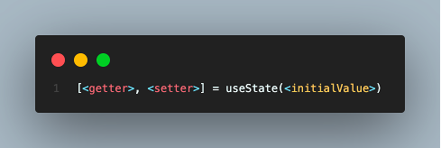
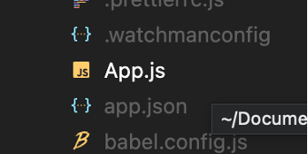
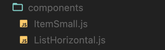
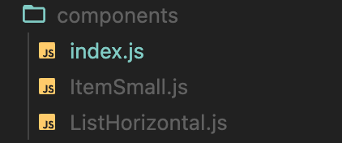
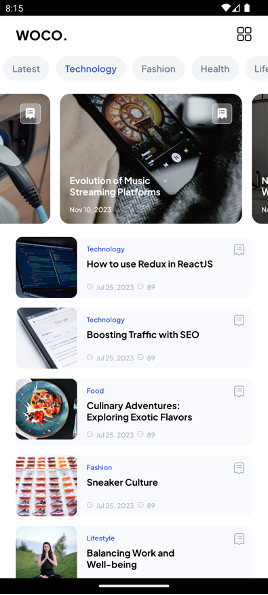

# BAB 3 - State Dan Props

## 3.1 Tujuan Pembelajaran

1.	Mahasiswa dapat memahami konsep state dan props
2.	Mahasiswa dapat mengimplementasikan state dan props
3.	Mahasiswa dapat membuat komponen dengan state dan props

## 3.2 Software yang di butuhkan

1. Java JDK
2. Node.Js
3. Visual Studio Code
4. Chocolatey
5. Android Studio
6. Android SDK

## 3.3 Props

Sebagian besar komponen dapat dikustomisasi saat dibuat, dengan parameter berbeda. Parameter yang dibuat ini disebut props, props singkatan dari properties adalah cara untuk mengirimkan data dari komponen induk (parent component) ke komponen anak (child component) dalam React Native. Props dapat digunakan untuk mengirimkan data seperti string, angka, objek, array, dan lain-lain. Komponen yang menerima props bersifat read-only, artinya tidak dapat mengubah nilai prop yang diterima. 

**Contoh :**
```jsx
import React from 'react';
import {Image} from 'react-native';

const Bananas = () => {
  let pic = {
    uri: 'https://upload.wikimedia.org/wikipedia/commons/d/de/Bananavarieties.jpg',
  };
  return (
    <Image source={pic} style={{width: 193, height: 110, marginTop: 50}} />
  );
};

export default Bananas;
```
**Penjelasan :**

Pada kode diatas kurung kurawal {pic} ini menyematkan variabel pic ke dalam JSX. Kurung kurawal pada JSX berguna untuk menempatkan ekspresi JavaScript. 
Komponen yang kita buat sendiri juga dapat menggunakan props. Ini memungkinkan untuk membuat satu komponen yang digunakan di banyak tempat berbeda di aplikasi yang kita buat, dengan properti yang sedikit berbeda di setiap tempat dengan mengacu pada props dari fungsi yang di render.

**Penggunaan Props :**

1. Membuat prop di komponen anak dengan menyertakan parameter dalam fungsi komponen tersebut. Misalnya:
```jsx
import React from 'react';
import { View, Text } from 'react-native';

const MyComponent = (props) => {
  return (
    <View>
      <Text>{props.namaProps}</Text>
    </View>
  );
};
export default MyComponent;
```

2.	Mengirim prop dari komponen induk ke komponen anak, cukup set properti dengan nilai yang sesuai saat menggunakan komponen tersebut di komponen induk. Misalnya:
```jsx
import React from 'react';
import MyComponent from './MyComponent';

const App = () => {
  return (
    <>
      <MyComponent namaProps="value props" />
    </>
  );
};
export default App;
```

## 3.4 State

State adalah cara untuk menyimpan data yang berubah di dalam komponen. State memberikan komponen kemampuan untuk "mengingat" data. Ketika state diubah, komponen akan diperbarui dan tampilan akan diperbarui sesuai dengan data yang berubah dari waktu ke waktu atau berasal dari interaksi pengguna. State digunakan untuk data yang akan berubah dan mempengaruhi tampilan komponen. 
Sebagai aturan umum, gunakan prop untuk mengkonfigurasi komponen saat merender. Gunakan state untuk melacak data komponen yang diharapkan berubah dari waktu ke waktu.

**Contoh :**
```jsx
import React, {useState} from 'react';
import {Button, Text, View} from 'react-native';

const Cat = props => {
  const [isHungry, setIsHungry] = useState(true);

  return (
    <View>
      <Text>
        I am {props.name}, and I am {isHungry ? 'hungry' : 'full'}!
      </Text>
      <Button
        onPress={() => {
          setIsHungry(false);
        }}
        disabled={!isHungry}
        title={isHungry ? 'Pour me some milk, please!' : 'Thank you!'}
      />
    </View>
  );
};

const Cafe = () => {
  return (
    <>
      <Cat name="Munkustrap" />
      <Cat name="Spot" />
    </>
  );
};

export default Cafe;
```
**Penjelasan : **

Kode di atas terdiri dari dua komponen, yaitu "Cat" dan "Cafe". Komponen "Cat" adalah komponen yang menerima prop "name" untuk menampilkan nama kucing dan menggunakan useState Hook untuk mengatur state "isHungry" yang awalnya bernilai "true" untuk menunjukkan bahwa kucing dalam keadaan lapar. Komponen ini juga memiliki tombol yang ketika ditekan akan mengubah state "isHungry" menjadi "false", menandakan bahwa kucing telah diberi makan. Tombol tersebut hanya dapat diaktifkan jika kucing sedang lapar. Di komponen "Cafe", komponen "Cat" dua instansi dari dirender dengan memberikan nama masing-masing. 

**Penggunaan State : **



## 3.5 Langkah – langkah praktikum

### 1. Buka kembali project dari bab sebelumnya pada Visual Sudio Code.


### 2. Lalu jalankan project dengan perintah berikut.

```bash
npx react-native run-android
```

### 3. Buka kembali file App.js



### 4. Buat file baru pada folder project dengan nama data.js lalu masukkan kode berikut.

```js
export const CategoryList = [
  {
    id: 1,
    categoryName: 'Popular',
  },
  {
    id: 2,
    categoryName: 'Latest',
  },
  {
    id: 3,
    categoryName: 'Technology',
  },
  {
    id: 4,
    categoryName: 'Fashion',
  },
  {
    id: 5,
    categoryName: 'Health',
  },
  {
    id: 6,
    categoryName: 'Lifestyle',
  },
];
export const BlogList = [
  {
    id: 1,
    title: 'Exploring the World of Electric Cars',
    category: 'Car',
    image:
      'https://images.unsplash.com/photo-1593941707882-a5bba14938c7?ixlib=rb-4.0.3&ixid=M3wxMjA3fDB8MHxwaG90by1wYWdlfHx8fGVufDB8fHx8fA%3D%3D&auto=format&fit=crop&w=1744&q=80',
    createdAt: 'Nov 10, 2023',
    totalComments: 89,
  },
  {
    id: 2,
    title: 'Evolution of Music Streaming Platforms',
    category: 'Music',
    image:
      'https://images.unsplash.com/photo-1574770118700-4ed7dae3310e?ixlib=rb-4.0.3&ixid=M3wxMjA3fDB8MHxwaG90by1wYWdlfHx8fGVufDB8fHx8fA%3D%3D&auto=format&fit=crop&w=774&q=80',
    createdAt: 'Nov 10, 2023',
    totalComments: 89,
  },
  {
    id: 3,
    title: 'Nostalgia on Four Wheels',
    category: 'Car',
    image:
      'https://images.unsplash.com/photo-1591293835940-934a7c4f2d9b?ixlib=rb-4.0.3&ixid=M3wxMjA3fDB8MHxwaG90by1wYWdlfHx8fGVufDB8fHx8fA%3D%3D&auto=format&fit=crop&w=774&q=80',
    createdAt: 'Nov 10, 2023',
    totalComments: 89,
  },
  {
    id: 4,
    title: 'Baking 101: Mastering the Art of Baking',
    category: 'Food',
    image:
      'https://images.unsplash.com/photo-1577048982768-5cb3e7ddfa23?ixlib=rb-4.0.3&ixid=M3wxMjA3fDB8MHxwaG90by1wYWdlfHx8fGVufDB8fHx8fA%3D%3D&auto=format&fit=crop&w=1738&q=80',
    createdAt: 'Nov 10, 2023',
    totalComments: 89,
  },
  {
    id: 5,
    title: 'Rediscovering Vinyl: The Resurgence of Analog',
    category: 'Music',
    image:
      'https://images.unsplash.com/photo-1603048588665-791ca8aea617?ixlib=rb-4.0.3&ixid=M3wxMjA3fDB8MHxwaG90by1wYWdlfHx8fGVufDB8fHx8fA%3D%3D&auto=format&fit=crop&w=1520&q=80',
    createdAt: 'Nov 10, 2023',
    totalComments: 89,
  },
  {
    id: 6,
    title: 'How to use Redux in ReactJS',
    category: 'Technology',
    image:
      'https://images.unsplash.com/photo-1555066931-4365d14bab8c?ixlib=rb-4.0.3&ixid=M3wxMjA3fDB8MHxwaG90by1wYWdlfHx8fGVufDB8fHx8fA%3D%3D&auto=format&fit=crop&w=1770&q=80',
    createdAt: 'Jul 25, 2023',
    totalComments: 89,
  },
  {
    id: 7,
    title: 'Boosting Traffic with SEO',
    category: 'Technology',
    image:
      'https://images.unsplash.com/photo-1477013743164-ffc3a5e556da?ixlib=rb-4.0.3&ixid=M3wxMjA3fDB8MHxwaG90by1wYWdlfHx8fGVufDB8fHx8fA%3D%3D&auto=format&fit=crop&w=1770&q=80',
    createdAt: 'Jul 25, 2023',
    totalComments: 89,
  },
  {
    id: 8,
    title: 'Culinary Adventures: Exploring Exotic Flavors',
    category: 'Food',
    image:
      'https://images.unsplash.com/photo-1492683962492-deef0ec456c0?ixlib=rb-4.0.3&ixid=M3wxMjA3fDB8MHxwaG90by1wYWdlfHx8fGVufDB8fHx8fA%3D%3D&auto=format&fit=crop&w=1756&q=80',
    createdAt: 'Jul 25, 2023',
    totalComments: 89,
  },
  {
    id: 9,
    title: 'Sneaker Culture',
    category: 'Fashion',
    image:
      'https://images.unsplash.com/photo-1527090526205-beaac8dc3c62?ixlib=rb-4.0.3&ixid=M3wxMjA3fDB8MHxwaG90by1wYWdlfHx8fGVufDB8fHx8fA%3D%3D&auto=format&fit=crop&w=1770&q=80',
    createdAt: 'Jul 25, 2023',
    totalComments: 89,
  },
  {
    id: 10,
    title: 'Balancing Work and Well-being',
    category: 'Lifestyle',
    image:
      'https://images.unsplash.com/photo-1602192509154-0b900ee1f851?ixlib=rb-4.0.3&ixid=M3wxMjA3fDB8MHxwaG90by1wYWdlfHx8fGVufDB8fHx8fA%3D%3D&auto=format&fit=crop&w=1770&q=80',
    createdAt: 'Jul 25, 2023',
    totalComments: 89,
  },
  {
    id: 11,
    title: 'Home Fitness Revolution',
    category: 'Health',
    image:
      'https://images.unsplash.com/photo-1540497077202-7c8a3999166f?ixlib=rb-4.0.3&ixid=M3wxMjA3fDB8MHxwaG90by1wYWdlfHx8fGVufDB8fHx8fA%3D%3D&auto=format&fit=crop&w=1770&q=80',
    createdAt: 'Jul 25, 2023',
    totalComments: 89,
  },
  {
    id: 12,
    title: 'Intersection of Fashion',
    category: 'Fashion',
    image:
      'https://images.unsplash.com/photo-1539109136881-3be0616acf4b?ixlib=rb-4.0.3&ixid=M3wxMjA3fDB8MHxwaG90by1wYWdlfHx8fGVufDB8fHx8fA%3D%3D&auto=format&fit=crop&w=774&q=80',
    createdAt: 'Jul 25, 2023',
    totalComments: 89,
  },
];
```

### 5. Untuk membuat State, perlu mengimport useState dari React. Ubah import pada App.js menjadi seperti kode dibawah ini.

```jsx
import React, {useState} from 'react';
import {ScrollView, StyleSheet, Text, View, FlatList, TouchableOpacity} from 'react-native';
import {Element3} from 'iconsax-react-native';
import {BlogList, CategoryList} from './data';
import { fontType, colors } from './src/theme';
```

### 6. Buat folder baru pada folder src dengan nama _components_ lalu buat juga file di dalamnya dengan nama ListHorizontal.js dan ItemSmall.js



### 7. Kemudian install package react-native-fast-image dengan memasukkan kode berikut ke terminal

```bash
npm i react-native-fast-image
```

### 8. Lalu buat komponen untuk ListHorizontal seperti kode berikut.

```jsx
import {StyleSheet, Text, View, FlatList, TouchableOpacity} from 'react-native';
import React, {useState} from 'react';
import {Receipt21} from 'iconsax-react-native';
import FastImage from 'react-native-fast-image';
import { fontType, colors } from '../theme';
const ItemHorizontal = ({item, variant, onPress}) => {
  return (
    <View style={itemHorizontal.cardItem}>
      <FastImage
        style={itemHorizontal.cardImage}
        source={{
            uri: item.image,
            headers: {Authorization: 'someAuthToken'},
            priority: FastImage.priority.high,
          }}
          resizeMode={FastImage.resizeMode.cover}>
        <View style={itemHorizontal.cardContent}>
          <View style={itemHorizontal.cardInfo}>
            <Text style={itemHorizontal.cardTitle}>{item.title}</Text>
            <Text style={itemHorizontal.cardText}>{item.createdAt}</Text>
          </View>
          <View>
            <View style={itemHorizontal.cardIcon}>
              <TouchableOpacity onPress={onPress}>
                <Receipt21 color={colors.white()} variant={variant} size={20} />
              </TouchableOpacity>
            </View>
          </View>
        </View>
      </FastImage>
    </View>
  );
};
const ListHorizontal = ({data}) => {
  const [bookmark, setBookmark] = useState([]);
  const toggleBookmark = itemId => {
    if (bookmark.includes(itemId)) {
      setBookmark(bookmark.filter(id => id !== itemId));
    } else {
      setBookmark([...bookmark, itemId]);
    }
  };
  const renderItem = ({item}) => {
    variant = bookmark.includes(item.id) ? 'Bold' : 'Linear';
    return (
      <ItemHorizontal
        item={item}
        variant={variant}
        onPress={() => toggleBookmark(item.id)}
      />
    );
  };
  return (
    <FlatList
      data={data}
      keyExtractor={item => item.id}
      renderItem={item => renderItem({...item})}
      ItemSeparatorComponent={() => <View style={{width: 15}} />}
      contentContainerStyle={{paddingHorizontal: 24}}
      horizontal
      showsHorizontalScrollIndicator={false}
    />
  );
};
export default ListHorizontal;
const itemHorizontal = StyleSheet.create({
  cardItem: {
    width: 280,
  },
  cardImage: {
    width: '100%',
    height: 200,
    borderRadius: 15,
  },
  cardContent: {
    flexDirection: 'row',
    justifyContent: 'space-between',
    padding: 15,
  },
  cardInfo: {
    justifyContent: 'flex-end',
    height: '100%',
    gap: 10,
    maxWidth: '60%',
  },
  cardTitle: {
    fontFamily: fontType['Pjs-Bold'],
    fontSize: 14,
    color: colors.white(),
  },
  cardText: {
    fontSize: 10,
    color: colors.white(),
    fontFamily: fontType['Pjs-Medium'],
  },
  cardIcon: {
    backgroundColor: colors.white(0.33),
    padding: 5,
    borderColor: colors.white(),
    borderWidth: 0.5,
    borderRadius: 5,
  },
});
```

### 9. Lalu buat komponen ItemSmall seperti kode berikut.

```jsx
import {StyleSheet, Text, View} from 'react-native';
import FastImage from 'react-native-fast-image';
import {Receipt21, Clock, Message} from 'iconsax-react-native';
import React from 'react';
import { fontType, colors } from '../theme';

const ItemSmall = ({item}) => {
  return (
    <View style={styles.cardItem}>
      <FastImage
        style={styles.cardImage}
        source={{
          uri: item.image,
          headers: {Authorization: 'someAuthToken'},
          priority: FastImage.priority.high,
        }}
        resizeMode={FastImage.resizeMode.cover}
      />
      <View style={styles.cardContent}>
        <View
          style={{
            flexDirection: 'row',
            gap:30
          }}>
          <View style={{gap: 5, flex:1}}>
            <Text style={styles.cardCategory}>{item.category}</Text>
            <Text style={styles.cardTitle}>{item.title}</Text>
          </View>
          <Receipt21
            color={colors.grey(0.6)}
            variant="Linear"
            size={20}
          />
        </View>
        <View style={styles.cardInfo}>
          <Clock size={10} variant="Linear" color={colors.grey(0.6)} />
          <Text style={styles.cardText}>{item.createdAt}</Text>
          <Message
            size={10}
            variant="Linear"
            color={colors.grey(0.6)}
          />
          <Text style={styles.cardText}>{item.totalComments}</Text>
        </View>
      </View>
    </View>
  );
};

export default ItemSmall;
const styles = StyleSheet.create({
  listCard: {
    paddingHorizontal: 24,
    paddingVertical: 10,
    gap: 15,
  },
  cardItem: {
    backgroundColor: colors.blue(0.03),
    flexDirection: 'row',
    borderRadius: 10,
  },
  cardCategory: {
    color: colors.blue(),
    fontSize: 10,
    fontFamily: fontType['Pjs-SemiBold'],
  },
  cardTitle: {
    fontSize: 14,
    fontFamily: fontType['Pjs-Bold'],
    color: colors.black(),
  },
  cardText: {
    fontSize: 10,
    fontFamily: fontType['Pjs-Medium'],
    color: colors.grey(0.6),
  },
  cardImage: {
    width: 94,
    height: 94,
    borderRadius: 10,
    resizeMode: 'cover',
  },
  cardInfo: {
    flexDirection: 'row',
    gap: 5,
    alignItems: 'center',
  },
  cardContent: {
    gap: 10,
    justifyContent: 'space-between',
    paddingRight: 10,
    paddingLeft: 15,
    flex: 1,
    paddingVertical: 10,
  },
});
```

### 10.	Tambahkan juga file baru dengan nama index.js di dalam folder _components_.



### 11.	Masukkan kode berikut pada index.js tersebut
```jsx
import ItemSmall from './ItemSmall'
import ListHorizontal from './ListHorizontal'
export {ItemSmall, ListHorizontal}
```

### 12.	Panggil komponen ItemSmall dan ListHorizontal yang sudah dibuat tadi pada bagian _import_ App.js

```jsx
import { ListHorizontal, ItemSmall } from './src/components';
```

### 13.	Selanjutnya buat komponen ItemCategory diluar komponen App, seperti kode berikut.

```jsx
const ItemCategory = ({item, onPress, color}) => {
  return (
    <TouchableOpacity onPress={onPress}>
      <View style={category.item}>
        <Text style={{...category.title, color}}>{item.categoryName}</Text>
      </View>
    </TouchableOpacity>
  );
};
```

### 14.	Lalu buat juga komponen FlatListCategory dibawah ItemCategory seperti kode berikut.

```jsx
const FlatListCategory = () => {
  const [selected, setSelected] = useState(1);
  const renderItem = ({item}) => {
    const color = item.id === selected ? colors.blue() : colors.grey();
    return (
      <ItemCategory
        item={item}
        onPress={() => setSelected(item.id)}
        color={color}
      />
    );
  };
  return (
    <FlatList
      data={CategoryList}
      keyExtractor={item => item.id}
      renderItem={item => renderItem({...item})}
      ItemSeparatorComponent={() => <View style={{width: 10}} />}
      contentContainerStyle={{paddingHorizontal: 24}}
      horizontal
      showsHorizontalScrollIndicator={false}
    />
  );
};
```

### 15.	Ubah komponen dari ListBlog yang sudah dibuat pada pertemuan sebelumnya menjadi seperti berikut.

```jsx
const ListBlog = () => {
  const horizontalData = BlogList.slice(0, 5);
  const verticalData = BlogList.slice(5);
  return (
    <ScrollView showsVerticalScrollIndicator={false}>
      <View style={styles.listBlog}>
        <ListHorizontal data={horizontalData} />
        <View style={styles.listCard}>
          {verticalData.map((item, index) => (
            <ItemSmall item={item} key={index} />
          ))}
        </View>
      </View>
    </ScrollView>
  );
};
```

### 16.	Ubah juga komponen App menjadi seperti berikut.

```jsx
export default function App() {
  return (
    <View style={styles.container}>
      <View style={styles.header}>
        <Text style={styles.title}>WOCO.</Text>
        <Element3 color={colors.black()} variant="Linear" size={24} />
      </View>
      <View style={styles.listCategory}>
        <FlatListCategory />
      </View>
      <ListBlog />
    </View>
  );
}
```

### 17.	Terakhir ubah stylesheet seperti kode berikut.

```jsx
const styles = StyleSheet.create({
  container: {
    flex: 1,
    backgroundColor: colors.white(),
  },
  header: {
    paddingHorizontal: 24,
    justifyContent: 'space-between',
    flexDirection: 'row',
    alignItems: 'center',
    height:52,
    elevation: 8,
    paddingTop:8,
    paddingBottom:4
  },
  title: {
    fontSize: 20,
    fontFamily: fontType['Pjs-ExtraBold'],
    color: colors.black(),
  },
  listCategory: {
    paddingVertical: 10,
  },
  listBlog: {
    paddingVertical: 10,
    gap: 10,
  },
  listCard: {
    paddingHorizontal: 24,
    paddingVertical: 10,
    gap: 15,
  },
});
const category = StyleSheet.create({
  item: {
    paddingHorizontal: 14,
    paddingVertical: 10,
    borderRadius: 25,
    alignItems: 'center',
    backgroundColor: colors.grey(0.08),
  },
  title: {
    fontFamily: fontType['Pjs-SemiBold'],
    fontSize: 14,
    lineHeight: 18,
  },
});
```

### 18.	Jika sudah hasilnya seperti gambar berikut



## 3.6 Tugas Praktikum

Silahkan buat penerapan _state_ dan _props_ pada project masing masing sesuai tema yang sudah ditentukan! Dan upload tugas tersebut ke github!