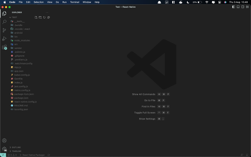
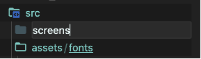
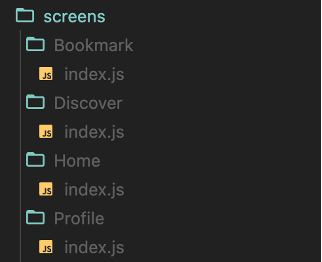
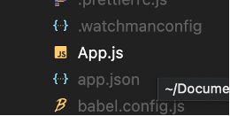
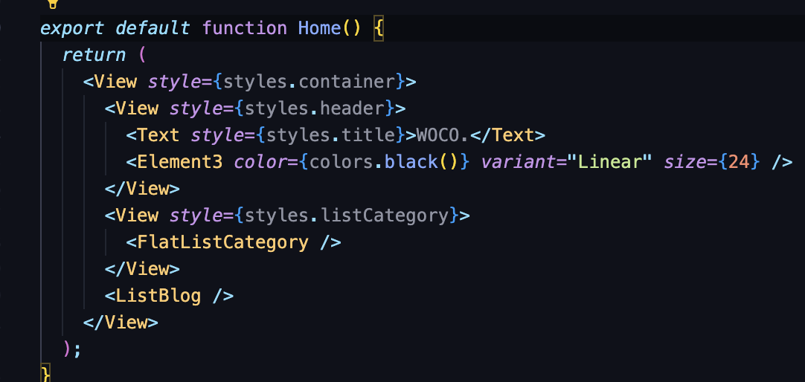
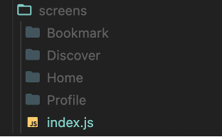
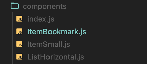
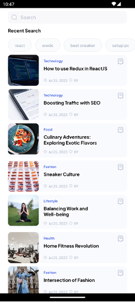
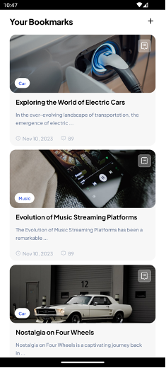
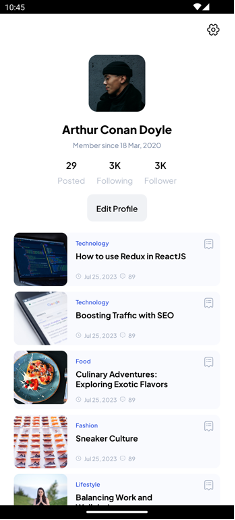

# BAB 4 - Layouts

## 4.1 Tujuan Pembelajaran

1.	Mahasiswa dapat memahami konsep dasar Flexbox dalam React Native.
2.	Mahasiswa dapat mengenal properti-properti Flexbox yang umum digunakan.
3.	Mahasiswa dapat menerapkan Flexbox pada aplikasi.

## 4.2 Software yang di butuhkan

1. Java JDK
2. Node.Js
3. Visual Studio Code
4. Chocolatey
5. Android Studio
6. Android SDK

## 4.3 Layout

_Layout_ merujuk pada tata letak visual dan penempatan elemen-elemen di dalam antarmuka (_User Interface_) pengguna sebuah aplikasi. Dalam konteks pengembangan aplikasi, layout adalah cara di mana komponen-komponen UI, seperti teks, gambar, tombol, dan bidang input, ditempatkan dan diatur dalam suatu ruang. Layout yang baik memastikan bahwa elemen-elemen ini disusun dengan cara yang logis, mudah dibaca, dan responsif terhadap berbagai ukuran layar perangkat.

Dalam pengembangan aplikasi mobile, layout sangat penting karena perangkat memiliki berbagai ukuran layar dan orientasi yang berbeda. Pengembang harus mempertimbangkan aspek-aspek seperti penataan elemen, proporsi ruang, perubahan tampilan saat perangkat digunakan secara vertikal atau horizontal, dan responsivitas terhadap perubahan ukuran layar.

Untuk mencapai tujuan ini, pengembang biasanya menggunakan konsep-konsep seperti Flexbox (untuk pengaturan yang fleksibel) dan penggunaan gaya (styles) untuk mengontrol tampilan elemen-elemen dalam layout.

## 4.4 Flexbox

Komponen dapat menentukan tata letak dari anak-anaknya menggunakan Flexbox. Flexbox adalah model tata letak yang fleksibel yang digunakan dalam pengembangan antarmuka pengguna (UI) di aplikasi mobile. Ini memungkinkan pengembang untuk merancang tata letak yang responsif dan mudah disesuaikan dengan berbagai ukuran layar dan perangkat.

Flexbox bekerja dengan cara yang sama di React Native seperti halnya di CSS di web, dengan beberapa pengecualian. Standarnya berbeda, dengan flexDirection default ke kolom bukan baris, alignContent default ke flex-start bukan stretch, flexShrink default ke 0 bukan 1, parameter flex hanya mendukung satu angka.

Kenapa Flexbox Penting : 
1.	**Responsif**: Memungkinkan tata letak yang responsif terhadap perubahan ukuran layar.
2.	**Distribusi Ruang**: Mengatur sejauh mana komponen akan meregangkan atau menyusut dalam tata letak.
3.	**Penataan**: Menyederhanakan penataan komponen secara vertikal dan horizontal.
4.	**Penempatan**: Memudahkan penempatan komponen relatif terhadap satu sama lain.

Properti-properti Flexbox umum:

### 1.	Flex 
_Flex_ akan menentukan bagaimana item akan mengisi ruang yang tersedia di sepanjang sumbu utama. Ruang akan dibagi menurut properti flex masing-masing elemen.

### 2. FlexDirection
_FlexDirection_ berguna untuk mengontrol arah di mana _children_ dari sebuah _node_ diletakkan. Ini juga disebut sebagai sumbu utama. Sumbu silang adalah sumbu yang tegak lurus dengan sumbu utama, atau sumbu tempat garis pembungkus diletakkan. 

### 3.	FlexWrap
Properti _flexWrap_ diatur pada _container_ dan mengontrol apa yang terjadi ketika _children_ melebihi ukuran _container_ di sepanjang sumbu utama (_main axis_). Secara _default_, _children_ dipaksa menjadi satu baris (yang dapat menyusutkan elemen). Jika pembungkus (_wrapping_) diperbolehkan, item dibungkus menjadi beberapa baris di sepanjang sumbu utama jika diperlukan. Saat membungkus garis, _alignContent_ dapat digunakan untuk menentukan bagaimana garis ditempatkan dalam wadah.

### 4.	JustifyContent
_JustifyContent_ menjelaskan cara menyelaraskan _children_ di dalam poros utama (_main axis_) wadah mereka. Properti ini berguna untuk memposisikan _children_ di tengah secara _horizontal_ di dalam _container_ dengan _flexDirection_ diatur ke baris (_row_) atau vertikal di dalam _container_ dengan _flexDirection_ diatur ke kolom (_column_).

### 5.	AlignItems
_AlignItems_ menjelaskan cara menyelaraskan turunan di sepanjang sumbu silang _container_. Ini sangat mirip dengan _justifyContent_ tetapi alih-alih diterapkan ke sumbu utama, _alignItems_ diterapkan ke sumbu silang (_vertical_). 

### 6.	AlignContent
_AlignContent_ mendefinisikan distribusi garis sepanjang sumbu silang. Ini hanya berpengaruh ketika item dibungkus ke beberapa baris menggunakan _flexWrap_.

Untuk mengetahui perbedaan dan hasilnya bisa mencoba kode berikut ini.
```jsx
import React, {useState} from 'react';
import {View, Text, Button, StyleSheet} from 'react-native';

const Toggle = ({label, options, value, onChange}) => {
  return (
    <View style={toggle.container}>
      <Text style={toggle.label}>{label}</Text>
      <View style={toggle.optionsContainer}>
        {options.map(option => (
          <Button
            color={option === value ? '#3B6CD4' : '#AAA'}
            onPress={() => onChange(option)}
            title={option}
            key={option}
          />
        ))}
      </View>
    </View>
  );
};

export default function App() {
  const [flexDirection, setFlexDirection] = useState('row');
  const [justifyContent, setJustifyContent] = useState('center');
  const [alignItems, setAlignItems] = useState('center');
  const layoutStyle = {flexDirection, justifyContent, alignItems};
  const primaryAxis =
    flexDirection === 'row' || flexDirection === 'row-reverse'
      ? 'Horizontal'
      : 'Vertical';
  const secondaryAxis =
    flexDirection === 'row' || flexDirection === 'row-reverse'
      ? 'Vertical'
      : 'Horizontal';
  return (
    <View style={styles.container}>
      <Toggle
        label={'Primary axis (flexDirection)'}
        value={flexDirection}
        options={flexDirectionOptions}
        onChange={option => {
          setFlexDirection(option);
        }}
      />
      <Toggle
        label={`${primaryAxis} distribution (justifyContent)`}
        value={justifyContent}
        options={justifyContentOptions}
        onChange={option => {
          setJustifyContent(option);
        }}
      />
      <Toggle
        label={`${secondaryAxis} alignment (alignItems)`}
        value={alignItems}
        options={alignItemsOptions}
        onChange={option => {
          setAlignItems(option);
        }}
      />
      <View style={[styles.layout, layoutStyle]}>
        <View style={[styles.box, {backgroundColor: 'powderblue'}]} />
        <View style={[styles.box, {backgroundColor: 'skyblue'}]} />
        <View style={[styles.box, {backgroundColor: 'steelblue'}]} />
      </View>
    </View>
  );
}
const flexDirectionOptions = ['row', 'column', 'row-reverse', 'column-reverse'];
const justifyContentOptions = [
  'flex-start',
  'center',
  'flex-end',
  'space-around',
  'space-between',
  'space-evenly'
];
const alignItemsOptions = ['flex-start', 'center', 'flex-end', 'stretch'];
const styles = StyleSheet.create({
  container: {
    flex: 1,
  },
  layout: {
    flex: 1,
    backgroundColor: 'rgba(0,0,0,0.05)',
  },
  box: {
    padding: 25,
    backgroundColor: '#3B6CD4',
    margin: 5,
  },
});
const toggle = StyleSheet.create({
  container: {
    flexDirection: 'column',
    paddingBottom: 12,
  },
  label: {
    fontSize: 14,
    padding: 4,
  },
  optionsContainer: {
    flexDirection: 'row',
    flexWrap: 'wrap',
    gap:5
  },
});
```

## 4.5 Langkah – langkah praktikum

### 1.	Buka kembali project dari bab sebelumnya pada Visual Sudio Code.



### 2. Lalu jalankan project dengan perintah berikut.

```bash
npx react-native run-android
```

### 3.	Buat folder baru dengan nama screens di dalam folder src.



### 4.	Lalu buat folder baru dengan nama Home, Discover, Bookmark, Profile didalam folder screens dan buat juga file index.js di dalam folder-folder tersebut



### 5.	Buka kembali file App.js. Lalu pindahkan semua isi pada App.js ke index.js yang berada pada folder Home.



### 6.	Jika sudah, Ubah nama komponen yang awalnya App menjadi Home, seperti gambar berikut.



### 7.	Selanjutnya ubah, directory dari import komponen yang digunakan seperti berikut.

```jsx
import {BlogList, CategoryList} from '../../../data';
import { fontType, colors } from '../../theme';
import { ListHorizontal, ItemSmall } from '../../components';
```

### 8.	Buat juga file index.js di dalam folder screens.



### 9.	Lalu isi file index.js tersebut dengan kode berikut.

```jsx
import Home from "./Home";
import Discover from "./Discover";
import Bookmark from "./Bookmark";
import Profile from "./Profile";
export {Home, Discover, Bookmark, Profile}
```

### 10.	Kemudian buat juga komponen baru dengan nama ItemBookmark pada folder components



### 11.	Lalu masukkan kode berikut pada ItemBookmark.js

```jsx
import {StyleSheet, Text, View, TouchableOpacity} from 'react-native';
import React from 'react';
import {Receipt21, Clock, Message} from 'iconsax-react-native';
import FastImage from 'react-native-fast-image';
import { fontType, colors } from '../theme';

const truncateTextByWords = (text, maxWords) => {
  const words = text.split(' ');
  if (words.length > maxWords) {
    return words.slice(0, maxWords).join(' ') + ' ...';
  }
  return text;
}

const ItemBookmark = ({item, onPress, variant}) => {
  return (
      <TouchableOpacity style={styles.cardItem} onPress={()=>{}}>
        <FastImage
          style={styles.cardImage}
          source={{
            uri: item.image,
            headers: {Authorization: 'someAuthToken'},
            priority: FastImage.priority.high,
          }}
          resizeMode={FastImage.resizeMode.cover}>
          <View style={styles.cardContent}>
            <View style={styles.cardCategory}>
              <View style={styles.categoryBadge}>
                <Text style={styles.categoryLabel}>{item.category}</Text>
              </View>
            </View>
            <View>
              <View style={styles.cardIcon}>
                <TouchableOpacity onPress={onPress}>
                  <Receipt21 color={colors.white()} variant={variant} size={20} />
                </TouchableOpacity>
              </View>
            </View>
          </View>
        </FastImage>
        <View style={{gap: 20, paddingHorizontal: 15, paddingVertical: 10}}>
          <View style={{gap: 10}}>
            <Text
              style={styles.blogTitle}>
              {item.title}
            </Text>
            <Text
              style={styles.blogContent}>
              {truncateTextByWords(item.content, 10)}
            </Text>
          </View>
          <View style={styles.cardInfo}>
            <View style={{flexDirection: 'row', alignItems: 'center', gap:5}}>
              <Clock
                size={12}
                variant="Linear"
                color={colors.grey(0.6)}
              />
              <Text style={styles.cardText}>{item.createdAt}</Text>
            </View>
            <View style={{flexDirection: 'row', alignItems: 'center', gap:5}}>
              <Message
                size={12}
                variant="Linear"
                color={colors.grey(0.6)}
              />
              <Text style={styles.cardText}>{item.totalComments}</Text>
            </View>
          </View>
        </View>
      </TouchableOpacity>
  );
};

export default ItemBookmark;

const styles = StyleSheet.create({
  cardItem: {
    backgroundColor: colors.black(0.03),
    borderRadius: 15,
  },
  cardImage: {
    width: '100%',
    height: 145,
    borderRadius: 15,
  },
  cardContent: {
    flexDirection: 'row',
    justifyContent: 'space-between',
    padding: 12,
  },
  cardInfo: {
    flexDirection: 'row',
    gap: 20,
    alignItems: 'center',
  },
  cardTitle: {
    fontFamily: fontType['Pjs-Bold'],
    fontSize: 14,
    color: colors.white(),
  },
  cardText: {
    fontSize: 12,
    fontFamily: fontType['Pjs-Medium'],
    color: colors.grey(0.6),
  },
  cardIcon: {
    backgroundColor: colors.white(0.33),
    padding: 5,
    borderColor: colors.white(),
    borderWidth: 0.5,
    borderRadius: 5,
  },
  cardCategory: {
    justifyContent: 'flex-end',
    height: '100%',
    gap: 10,
    maxWidth: '60%',
  },
  categoryBadge: {
    backgroundColor: colors.white(),
    paddingHorizontal: 10,
    paddingVertical: 5,
    borderRadius: 15,
  },
  categoryLabel: {
    fontSize: 10,
    fontFamily: fontType['Pjs-SemiBold'],
    color: colors.blue(),
  },
  blogTitle:{
    fontSize: 16,
    fontFamily: fontType['Pjs-Bold'],
    color: colors.black(),
  },
  blogContent:{
    fontSize: 12,
    lineHeight: 20,
    fontFamily: fontType['Pjs-Medium'],
    color: colors.grey(),
  }
});
```

### 12.	Selanjutnya jangan lupa untuk merubah kode pada bagian index.js di folder components.

```jsx
import ItemSmall from './ItemSmall'
import ItemBookmark from './ItemBookmark'
import ListHorizontal from './ListHorizontal'
export {ItemSmall, ItemBookmark, ListHorizontal}
```

### 13.	Buka file index.js pada folder Discover lalu masukkan kode berikut.

```jsx
import {StyleSheet, Text, View, ScrollView, FlatList} from 'react-native';
import React from 'react';
import {BlogList} from '../../../data';
import {ItemSmall} from '../../components'; 
import {SearchNormal1} from 'iconsax-react-native';
import { fontType, colors } from '../../theme';

const data = [
  {id: 1, label: 'react'},
  {id: 2, label: 'wwdc'},
  {id: 3, label: 'best sneaker'},
  {id: 4, label: 'setup pc'},
  {id: 5, label: 'car'},
];

const ItemRecent = ({item}) => {
  return (
    <View style={recent.button}>
      <Text style={recent.label}>{item.label}</Text>
    </View>
  );
};
const FlatListRecent = () => {
  const renderItem = ({item}) => {
    return <ItemRecent item={item} />;
  };
  return (
    <FlatList
      data={data}
      keyExtractor={item => item.id}
      renderItem={item => renderItem({...item})}
      ItemSeparatorComponent={() => <View style={{width: 10}} />}
      contentContainerStyle={{paddingHorizontal: 24, paddingVertical: 10}}
      horizontal
      showsHorizontalScrollIndicator={false}
    />
  );
};
const Discover = () => {
  const recentBlog = BlogList.slice(5);
  return (
    <View style={styles.container}>
      <View style={styles.header}>
        <View style={styles.bar}>
          <SearchNormal1 size={18} color={colors.grey(0.5)} variant="Linear" />
          <Text style={styles.placeholder}>Search</Text>
        </View>
      </View>
      <View>
        <Text style={recent.text}>Recent Search</Text>
        <FlatListRecent />
      </View>
      <ScrollView showsVerticalScrollIndicator={false}>
        <View style={styles.listCard}>
          {recentBlog.map((item, index) => (
            <ItemSmall item={item} key={index} />
          ))}
        </View>
      </ScrollView>
    </View>
  );
};
export default Discover;
const styles = StyleSheet.create({
  listCard: {
    paddingHorizontal: 24,
    paddingBottom: 10,
    gap: 10,
  },
  container: {
    flex: 1,
    backgroundColor: colors.white(),
  },
header: {
    paddingHorizontal: 24,
    gap: 30,
    flexDirection: 'row',
    alignItems: 'center',
    height: 52,
    elevation: 8,
    paddingTop: 8,
    paddingBottom: 4,
  },
  bar: {
    flexDirection: 'row',
    padding: 10,
    gap: 10,
    alignItems: 'center',
    backgroundColor: colors.grey(0.05),
    borderRadius: 10,
    flex: 1,
  },
  placeholder: {
    fontSize: 14,
    fontFamily: fontType['Pjs-Medium'],
    color: colors.grey(0.5),
    lineHeight: 18,
  },
});
const recent = StyleSheet.create({
  button: {
    paddingHorizontal: 20,
    paddingVertical: 10,
    borderRadius: 25,
    borderColor: colors.grey(0.15),
    borderWidth: 1,
    backgroundColor: colors.grey(0.03),
  },
  label: {
    fontSize: 12,
    fontFamily: fontType['Pjs-Medium'],
    color: colors.grey(0.65),
  },
  text: {
    fontSize: 14,
    fontFamily: fontType['Pjs-Bold'],
    color: colors.black(),
    paddingVertical: 5,
    paddingHorizontal: 24,
  },
});
```

### 14.	Untuk sementara kita bisa melihat hasilnya dengan mengganti kode pada App.js sepeti kode berikut.

```jsx
import * as React from 'react';
import {Discover} from './src/screens';
export default function App() {
  return <Discover />;
}
```

### 15.	Maka akan tampil hasil seperti berikut.



### 16.	Selanjutnya ubah BlogList pada file data.js seperti kode berikut. 

```jsx
export const BlogList = [
  {
    id: 1,
    title: 'Exploring the World of Electric Cars',
    category: 'Car',
    image:
      'https://images.unsplash.com/photo-1593941707882-a5bba14938c7?ixlib=rb-4.0.3&ixid=M3wxMjA3fDB8MHxwaG90by1wYWdlfHx8fGVufDB8fHx8fA%3D%3D&auto=format&fit=crop&w=1744&q=80',
    createdAt: 'Nov 10, 2023',
    totalComments: 89,
    totalLikes:2300,
    content: `In the ever-evolving landscape of transportation, the emergence of electric cars has sparked a revolution. Exploring the world of electric cars unveils a myriad of innovations and possibilities that are reshaping the way we perceive mobility. Electric cars, also known as electric vehicles (EVs), are automobiles powered by one or more electric motors using energy stored in rechargeable batteries. This departure from traditional internal combustion engines marks a significant shift towards sustainability and environmental consciousness. As concerns about fossil fuel depletion and climate change intensify, electric cars have emerged as a promising solution to mitigate the impact of transportation on the planet.`,
  },
  {
    id: 2,
    title: 'Evolution of Music Streaming Platforms',
    category: 'Music',
    image:
      'https://images.unsplash.com/photo-1574770118700-4ed7dae3310e?ixlib=rb-4.0.3&ixid=M3wxMjA3fDB8MHxwaG90by1wYWdlfHx8fGVufDB8fHx8fA%3D%3D&auto=format&fit=crop&w=774&q=80',
    createdAt: 'Nov 10, 2023',
    totalComments: 89,
    totalLikes:2300,
    content: `The Evolution of Music Streaming Platforms has been a remarkable journey that has transformed the way we consume and experience music. Beginning in the early 2000s, with pioneers like Pandora and Last.fm, music streaming was primarily algorithm-driven radio-style services. These platforms introduced the concept of personalized playlists and recommendations based on user preferences and listening history. However, it wasn't until the late 2000s that platforms like Spotify and Apple Music entered the scene, offering on-demand access to a vast library of songs. This shift marked a turning point, as users gained the ability to curate their own playlists and enjoy a wide range of artists and genres at their fingertips.`,
  },
  {
    id: 3,
    title: 'Nostalgia on Four Wheels',
    category: 'Car',
    image:
      'https://images.unsplash.com/photo-1591293835940-934a7c4f2d9b?ixlib=rb-4.0.3&ixid=M3wxMjA3fDB8MHxwaG90by1wYWdlfHx8fGVufDB8fHx8fA%3D%3D&auto=format&fit=crop&w=774&q=80',
    createdAt: 'Nov 10, 2023',
    totalComments: 89,
    totalLikes:2300,
    content: `Nostalgia on Four Wheels is a captivating journey back in time, a symphony of memories intertwined with mechanical marvels. This immersive experience takes enthusiasts and casual observers alike on a unique ride through history, capturing the essence of bygone eras. Classic cars, meticulously restored to their former glory, line up like a gallery of timeless art pieces. Each curve, each emblem tells a story of its own, echoing the spirit of an era long past. As the engines roar to life, the scent of aged leather and the soft purr of vintage machinery fill the air, transporting us to an era where simplicity met elegance. Nostalgia on Four Wheels is more than just a showcase of vintage automobiles; it's a celebration of craftsmanship, innovation, and the everlasting bond between man and machine.`,
  },
  {
    id: 4,
    title: 'Baking 101: Mastering the Art of Baking',
    category: 'Food',
    image:
      'https://images.unsplash.com/photo-1577048982768-5cb3e7ddfa23?ixlib=rb-4.0.3&ixid=M3wxMjA3fDB8MHxwaG90by1wYWdlfHx8fGVufDB8fHx8fA%3D%3D&auto=format&fit=crop&w=1738&q=80',
    createdAt: 'Nov 10, 2023',
    totalComments: 89,
    totalLikes:2300,
    content: `"Baking 101: Mastering the Art of Baking" is your ultimate guide to entering the delightful world of baking. Whether you're a novice or looking to refine your skills, this comprehensive resource covers the fundamentals that every aspiring baker needs to know. From understanding the science behind perfecting the flakiest pastries to mastering the precise techniques for creating soft, pillowy bread, this guide takes you on a journey through the essential principles of baking. With step-by-step instructions, expert tips, and a variety of tried-and-true recipes, you'll gain the confidence to tackle everything from buttery croissants to decadent chocolate cakes. Let "Baking 101" be your compass as you navigate the aromatic and rewarding realm of baking.`,
  },
  {
    id: 5,
    title: 'Rediscovering Vinyl: The Resurgence of Analog',
    category: 'Music',
    image:
      'https://images.unsplash.com/photo-1603048588665-791ca8aea617?ixlib=rb-4.0.3&ixid=M3wxMjA3fDB8MHxwaG90by1wYWdlfHx8fGVufDB8fHx8fA%3D%3D&auto=format&fit=crop&w=1520&q=80',
    createdAt: 'Nov 10, 2023',
    totalComments: 89,
    totalLikes:2300,
    content: `In recent years, there has been a remarkable resurgence in the popularity of vinyl records, leading to a renewed interest in analog music experiences. The unmistakable crackle as the needle meets the groove, the tangible connection to album artwork, and the intentional act of flipping a record—all these elements contribute to the unique charm of vinyl. This rekindled fascination with analog isn't just a fleeting trend; it reflects a genuine desire for a more immersive and authentic music encounter in an age dominated by digital convenience. As new generations embrace the vintage allure of vinyl, a rich appreciation for the past intertwines with modern sensibilities, making the act of rediscovering vinyl a bridge between nostalgia and contemporary culture.`,
  },
  {
    id: 6,
    title: 'How to use Redux in ReactJS',
    category: 'Technology',
    image:
      'https://images.unsplash.com/photo-1555066931-4365d14bab8c?ixlib=rb-4.0.3&ixid=M3wxMjA3fDB8MHxwaG90by1wYWdlfHx8fGVufDB8fHx8fA%3D%3D&auto=format&fit=crop&w=1770&q=80',
    createdAt: 'Jul 25, 2023',
    totalComments: 89,
    totalLikes:2300,
    content: `Redux is a powerful state management library commonly used with ReactJS applications. Integrating Redux with ReactJS provides a structured and efficient way to manage the application's state. To begin using Redux in ReactJS, you need to first install the required packages using a package manager like npm or yarn. After installation, you'll set up your Redux store, which acts as a centralized hub for your application's state. This involves defining reducers to manage specific parts of the state and creating actions to describe state changes. By connecting your React components to the Redux store using the connect function or hooks like useSelector and useDispatch, you can access and update the application state seamlessly. Overall, Redux offers a robust solution for handling complex state interactions in ReactJS applications, enhancing maintainability and scalability.`,
  },
  {
    id: 7,
    title: 'Boosting Traffic with SEO',
    category: 'Technology',
    image:
      'https://images.unsplash.com/photo-1477013743164-ffc3a5e556da?ixlib=rb-4.0.3&ixid=M3wxMjA3fDB8MHxwaG90by1wYWdlfHx8fGVufDB8fHx8fA%3D%3D&auto=format&fit=crop&w=1770&q=80',
    createdAt: 'Jul 25, 2023',
    totalComments: 89,
    totalLikes:2300,
    content: `Boosting Traffic with SEO (Search Engine Optimization) has become an indispensable strategy for online businesses and websites. In today's digital landscape, where visibility is paramount, implementing effective SEO techniques can significantly enhance a website's online presence. By optimizing content, keywords, meta tags, and ensuring a seamless user experience, websites can secure higher rankings on search engine results pages. This translates to increased organic traffic, as users are more likely to click on websites that appear at the top of their search queries. In essence, mastering the art of SEO empowers businesses to connect with their target audience more effectively and establish a strong foothold in the competitive online market. `,
  },
  {
    id: 8,
    title: 'Culinary Adventures: Exploring Exotic Flavors',
    category: 'Food',
    image:
      'https://images.unsplash.com/photo-1492683962492-deef0ec456c0?ixlib=rb-4.0.3&ixid=M3wxMjA3fDB8MHxwaG90by1wYWdlfHx8fGVufDB8fHx8fA%3D%3D&auto=format&fit=crop&w=1756&q=80',
    createdAt: 'Jul 25, 2023',
    totalComments: 89,
    totalLikes:2300,
    content: `Embark on a tantalizing journey with "Culinary Adventures: Exploring Exotic Flavors." In this gastronomic exploration, prepare to be whisked away to distant lands through your taste buds. From the vibrant streets of Bangkok to the bustling markets of Marrakech, each dish tells a story of culture, history, and innovation. Savory aromas and intricate spice blends intertwine, creating a symphony of flavors that dance on your palate. Whether you're savoring the umami-rich delicacies of Japan or indulging in the fiery curries of India, every bite is a passport to a new dimension of taste. Join us on this epicurean expedition and unlock the secrets of cuisines that have been perfected over centuries, a journey where the ordinary transforms into the extraordinary.`,
  },
  {
    id: 9,
    title: 'Sneaker Culture',
    category: 'Fashion',
    image:
      'https://images.unsplash.com/photo-1527090526205-beaac8dc3c62?ixlib=rb-4.0.3&ixid=M3wxMjA3fDB8MHxwaG90by1wYWdlfHx8fGVufDB8fHx8fA%3D%3D&auto=format&fit=crop&w=1770&q=80',
    createdAt: 'Jul 25, 2023',
    totalComments: 89,
    totalLikes:2300,
    content: `Sneaker culture, a dynamic and ever-evolving phenomenon, encapsulates the fusion of fashion, athletics, and urban lifestyle. The allure of sneakers extends beyond their utilitarian purpose; they have metamorphosed into coveted symbols of self-expression and status. From classic silhouettes that trace their roots back to the basketball courts and tracks of yesteryears, to the avant-garde designs pushing the boundaries of innovation today, sneaker culture weaves a narrative that resonates with enthusiasts worldwide. Collectors eagerly seek out limited-edition releases, collaborations with renowned designers, and vintage finds that embody the essence of nostalgia. With each new release, sneaker culture continues to redefine its identity, bridging the gap between sports, style, and cultural resonance.`,
  },
  {
    id: 10,
    title: 'Balancing Work and Well-being',
    category: 'Lifestyle',
    image:
      'https://images.unsplash.com/photo-1602192509154-0b900ee1f851?ixlib=rb-4.0.3&ixid=M3wxMjA3fDB8MHxwaG90by1wYWdlfHx8fGVufDB8fHx8fA%3D%3D&auto=format&fit=crop&w=1770&q=80',
    createdAt: 'Jul 25, 2023',
    totalComments: 89,
    totalLikes:2300,
    content: `Balancing work and well-being is a crucial aspect of modern life. In the fast-paced world we live in, finding equilibrium between our professional commitments and personal wellness has become paramount. This balance involves managing work-related tasks efficiently while also dedicating time to physical, mental, and emotional health. Companies are increasingly recognizing the importance of fostering a healthy work-life balance for their employees, as it not only enhances productivity but also reduces stress and burnout. Individuals are encouraged to set boundaries, prioritize self-care, and engage in activities that promote relaxation and personal growth. Striking the right balance between work and well-being ultimately leads to a more fulfilling and sustainable lifestyle.`,
  },
  {
    id: 11,
    title: 'Home Fitness Revolution',
    category: 'Health',
    image:
      'https://images.unsplash.com/photo-1540497077202-7c8a3999166f?ixlib=rb-4.0.3&ixid=M3wxMjA3fDB8MHxwaG90by1wYWdlfHx8fGVufDB8fHx8fA%3D%3D&auto=format&fit=crop&w=1770&q=80',
    createdAt: 'Jul 25, 2023',
    totalComments: 89,
    totalLikes:2300,
    content: `The Home Fitness Revolution is a dynamic movement that has reshaped the way we approach our health and wellness routines. With the fast-paced nature of modern life, people are increasingly turning to the convenience of home-based fitness solutions. This revolution has spurred the development of innovative workout programs, virtual fitness classes, and smart exercise equipment that cater to diverse fitness goals and preferences, all within the comfort of one's own home. As the world witnessed unprecedented changes in the wake of recent events, the Home Fitness Revolution gained even more momentum, emphasizing the importance of staying active and prioritizing well-being irrespective of external circumstances.`,
  },
  {
    id: 12,
    title: 'Intersection of Fashion',
    category: 'Fashion',
    image:
      'https://images.unsplash.com/photo-1539109136881-3be0616acf4b?ixlib=rb-4.0.3&ixid=M3wxMjA3fDB8MHxwaG90by1wYWdlfHx8fGVufDB8fHx8fA%3D%3D&auto=format&fit=crop&w=774&q=80',
    createdAt: 'Jul 25, 2023',
    totalComments: 89,
    totalLikes:2300,
    content: `The Intersection of Fashion stands as a dynamic crossroads where artistry and self-expression converge. It's a realm where textiles, colors, and silhouettes blend to create a symphony of style, reflecting the ever-evolving tastes of society. The interplay of high-end couture and streetwear creates a visual tapestry that speaks volumes about cultural shifts and individual identity. The Intersection of Fashion isn't merely about garments; it's a canvas on which designers and wearers alike paint narratives of heritage, rebellion, and aspiration. It's where innovation finds its muse in tradition, where tradition finds a voice in innovation, resulting in a rich blend that redefines aesthetics with every stitch and thread.`,
  },
];
```

### 17.	Buka file index.js pada folder Bookmark lalu masukkan kode berikut.

```jsx
import {StyleSheet, Text, View, ScrollView} from 'react-native';
import React from 'react';
import {Add} from 'iconsax-react-native';
import {BlogList} from '../../../data';
import { ItemBookmark } from '../../components';
import { fontType, colors } from '../../theme';
const Bookmark = () => {
  return (
    <View style={styles.container}>
      <View style={styles.header}>
        <Text style={styles.title}>Your Bookmarks</Text>
        <Add color={colors.black()} variant="Linear" size={24} />
      </View>
      <ScrollView showsVerticalScrollIndicator={false}>
        <View style={{paddingHorizontal:24, gap:10, paddingVertical:10}}>
        {BlogList.map((item, index) => (
          <ItemBookmark item={item} key={index} />
        ))}
        </View>
      </ScrollView>
    </View>
  );
};
export default Bookmark;
const styles = StyleSheet.create({
  container: {
    flex: 1,
    backgroundColor: colors.white(),
  },
  header: {
    paddingHorizontal: 24,
    gap: 30,
    justifyContent: 'space-between',
    flexDirection: 'row',
    alignItems: 'center',
    height: 52,
    elevation: 8,
    paddingTop: 8,
    paddingBottom: 4,
  },
  title: {
    fontSize: 20,
    fontFamily: fontType['Pjs-ExtraBold'],
    color: colors.black(),
    letterSpacing: -0.3,
  },
});
```

### 18.	Untuk sementara kita bisa melihat hasilnya dengan mengganti kode pada App.js sepeti kode berikut.

```jsx
import * as React from 'react';
import {Bookmark} from './src/screens';
export default function App() {
  return <Bookmark />;
}
```

### 19.	Maka akan tampil hasil seperti berikut.



### 19.	Selanjutnya, tambahkan ProfileData pada data.js seperti kode berikut.
```jsx
export const ProfileData = {
  profilePict:
    'https://images.unsplash.com/photo-1543610892-0b1f7e6d8ac1?ixlib=rb-4.0.3&ixid=M3wxMjA3fDB8MHxwaG90by1wYWdlfHx8fGVufDB8fHx8fA%3D%3D&auto=format&fit=crop&w=774&q=80',
  name: 'Arthur Conan Doyle',
  createdAt: '18 Mar, 2020',
  blogPosted: 29,
  following: 3000,
  follower: 3000,
};
```

### 20.	Buka file index.js pada folder Profile lalu masukkan kode berikut.
```jsx
import {ScrollView, StyleSheet, Text, View, TouchableOpacity} from 'react-native';
import {Setting2} from 'iconsax-react-native';
import React from 'react';
import FastImage from 'react-native-fast-image';
import {ProfileData, BlogList} from '../../../data';
import {ItemSmall} from '../../components';
import { fontType, colors } from '../../theme';

const formatNumber = number => {
  if (number >= 1000000000) {
    return (number / 1000000000).toFixed(1).replace(/\.0$/, '') + 'B';
  }
  if (number >= 1000000) {
    return (number / 1000000).toFixed(1).replace(/\.0$/, '') + 'M';
  }
  if (number >= 1000) {
    return (number / 1000).toFixed(1).replace(/\.0$/, '') + 'K';
  }
  return number.toString();
};

const data = BlogList.slice(5);
const Profile = () => {
  return (
    <View style={styles.container}>
      <View style={styles.header}>
        <Setting2 color={colors.black()} variant="Linear" size={24} />
      </View>
      <ScrollView
        showsVerticalScrollIndicator={false}
        contentContainerStyle={{
          paddingHorizontal: 24,
          gap: 10,
          paddingVertical: 20,
        }}>
        <View style={{gap: 15, alignItems: 'center'}}>
          <FastImage
            style={profile.pic}
            source={{
              uri: ProfileData.profilePict,
              headers: {Authorization: 'someAuthToken'},
              priority: FastImage.priority.high,
            }}
            resizeMode={FastImage.resizeMode.cover}
          />
          <View style={{gap: 5, alignItems: 'center'}}>
            <Text style={profile.name}>{ProfileData.name}</Text>
            <Text style={profile.info}>
              Member since {ProfileData.createdAt}
            </Text>
          </View>
          <View style={{flexDirection: 'row', gap: 20}}>
            <View style={{alignItems: 'center', gap: 5}}>
              <Text style={profile.sum}>{ProfileData.blogPosted}</Text>
              <Text style={profile.tag}>Posted</Text>
            </View>
            <View style={{alignItems: 'center', gap: 5}}>
              <Text style={profile.sum}>
                {formatNumber(ProfileData.following)}
              </Text>
              <Text style={profile.tag}>Following</Text>
            </View>
            <View style={{alignItems: 'center', gap: 5}}>
              <Text style={profile.sum}>
                {formatNumber(ProfileData.follower)}
              </Text>
              <Text style={profile.tag}>Follower</Text>
            </View>
          </View>
          <TouchableOpacity style={profile.buttonEdit}>
            <Text style={profile.buttonText}>Edit Profile</Text>
          </TouchableOpacity>
        </View>
        <View style={{paddingVertical: 10, gap:10}}>
          {data.map((item, index) => (
            <ItemSmall item={item} key={index} />
          ))}
        </View>
      </ScrollView>
    </View>
  );
};

export default Profile;
const styles = StyleSheet.create({
  container: {
    flex: 1,
    backgroundColor: colors.white(),
  },
  header: {
    paddingHorizontal: 24,
    justifyContent: 'flex-end',
    flexDirection: 'row',
    alignItems: 'center',
    height: 52,
    elevation: 8,
    paddingTop: 8,
    paddingBottom: 4,
  },
  title: {
    fontSize: 20,
    fontFamily: fontType['Pjs-ExtraBold'],
    color: colors.black(),
  },
});
const profile = StyleSheet.create({
  pic: {width: 100, height: 100, borderRadius: 15},
  name: {
    color: colors.black(),
    fontSize: 20,
    fontFamily: fontType['Pjs-Bold'],
    textTransform:'capitalize'
  },
  info: {
    fontSize: 12,
    fontFamily: fontType['Pjs-Regular'],
    color: colors.grey(),
  },
  sum: {
    fontSize: 16,
    fontFamily: fontType['Pjs-SemiBold'],
    color: colors.black(),
  },
  tag: {
    fontSize: 14,
    fontFamily: fontType['Pjs-Regular'],
    color: colors.grey(0.5),
  },
  buttonEdit: {
    paddingHorizontal: 16,
    paddingVertical: 14,
    backgroundColor: colors.grey(0.1),
    borderRadius: 10,
  },
  buttonText: {
    fontSize: 14,
    fontFamily: fontType['Pjs-SemiBold'],
    color: colors.black(),
  },
});
```

### 21.	Untuk sementara kita bisa melihat hasilnya dengan mengganti kode pada App.js sepeti kode berikut.

```jsx
import * as React from 'react';
import {Profile} from './src/screens';
export default function App() {
  return <Profile />;
}
```
### 22.	Maka akan tampil hasil seperti berikut.



## 4.6 Tugas Praktikum
Silahkan buat screen atau halaman beserta komponen di dalamnya pada project masing masing sesuai tema yang sudah ditentukan! Minimal menambahkan 2 screen! Dan upload tugas tersebut ke github!