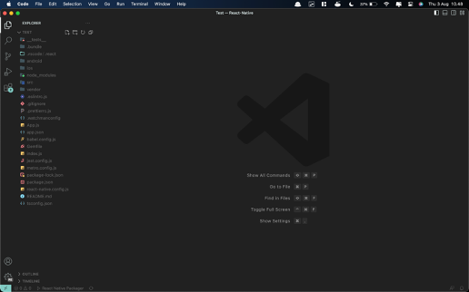
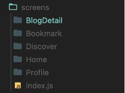
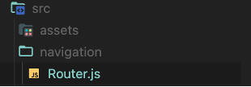
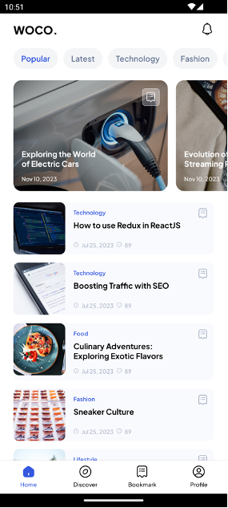

# BAB 5 - Navigation

## 5.1 Tujuan Pembelajaran

1.	Mahasiswa dapat memahami konsep navigation dan route
2.	Mahasiswa dapat mengimplementasikan navigation
3.	Mahasiswa dapat menggunakan komponen React Navigation

## 5.2 Software yang di butuhkan

1. Java JDK
2. Node.Js
3. Visual Studio Code
4. Chocolatey
5. Android Studio
6. Android SDK

## 5.3 Pengertian Navigation Dan Route

### 1. Navigation

Navigasi (_Navigation_) dalam pengembangan aplikasi mobile merujuk pada cara pengguna berpindah dari satu layar ke layar lainnya dalam aplikasi. Saat pengguna berinteraksi dengan aplikasi, mereka akan mengakses berbagai konten, fitur, dan fungsionalitas yang tersebar di berbagai halaman atau tampilan. Navigasi yang baik adalah kunci untuk memberikan pengalaman pengguna yang lancar dan intuitif. Dalam konteks pengembangan, navigasi melibatkan pengaturan struktur tampilan dan interaksi antara layar-layar tersebut.

### 2. Route

_Route_ atau rute merujuk pada definisi atau konfigurasi yang menghubungkan suatu URL atau alamat dengan komponen tampilan tertentu dalam aplikasi. Dalam konteks aplikasi mobile, rute menghubungkan suatu tindakan atau tautan dengan layar yang sesuai. Misalnya, ketika pengguna menekan tombol "Beranda," ada rute yang mengarahkan mereka ke tampilan halaman beranda. Rute mengatur bagaimana aplikasi merespons permintaan navigasi dari pengguna.

## 5.4 React Navigation

_React Navigation_ adalah _package_ populer untuk perutean dan navigasi di aplikasi _React Native_. _React Navigation_ digunakan untuk mengelola presentasi, dan bertransisi di antara banyak layar. Ada tiga jenis _navigator_ yaitu _Stack Navigator_, _Tab Navigator_, dan _Drawer Navigator_. 


Untuk melakukan navigation kita perlu melakukan 3 hal yaitu : 

1.	Menyiapkan  dari @react-navigation/native
2.	Membuat Navigator : 
    - Untuk membuat Stack : createStackNavigator dari @react-navigation/stack
    - Untuk membuat Bottom Tab : createBottomTabNavigator dari @react-navigation/bottom-tabs
    - Untuk membuat Drawer : createDrawerNavigator dari @react-navigation/drawer

3.	Tentukan layar tujuan navigasi.

## 5.5 Langkah – langkah praktikum

### 1. Buka kembali project dari bab sebelumnya pada Visual Sudio Code.



### 2. Lalu _install_ package _ReactNavigation_. Salin perintah dibawah ini lalu _paste_ dan enter di terminal.
```bash
npm install @react-navigation/native
```

### 3. _Install_ juga dependensi yang dibutuhkan.
```bash
npm install react-native-screens react-native-safe-area-context @react-navigation/stack
```

### 4. Kemudian, _install_ dan konfigurasi _library_ yang diperlukan oleh _stack navigator_.
```bash
npm install react-native-gesture-handler
```

### 5. _Install_ juga _package_ untuk membuat _bottom tab navigation_.
```bash
npm install @react-navigation/bottom-tabs
```
### 6. Setelah itu jalankan project dengan perintah berikut.
```bash
npx react-native run-android
```

### 7. Lalu buat folder baru dengan nama BlogDetail di dalam folder _screens_ dan buat juga file index.js di dalam folder tersebut.



### 8.	Masukkan kode berikut pada file index.js di folder BlogDetail.
```jsx
import {StyleSheet, Text, View, ScrollView, TouchableOpacity} from 'react-native';
import React, {useState} from 'react';
import {ArrowLeft, Like1, Receipt21, Message, Share, More} from 'iconsax-react-native';
import {useNavigation} from '@react-navigation/native';
import {BlogList} from '../../../data';
import FastImage from 'react-native-fast-image';
import { fontType, colors } from '../../theme';
const formatNumber = number => {
  if (number >= 1000000000) {
    return (number / 1000000000).toFixed(1).replace(/\.0$/, '') + 'B';
  }
  if (number >= 1000000) {
    return (number / 1000000).toFixed(1).replace(/\.0$/, '') + 'M';
  }
  if (number >= 1000) {
    return (number / 1000).toFixed(1).replace(/\.0$/, '') + 'K';
  }
  return number.toString();
};
const BlogDetail = ({route}) => {
  const {blogId} = route.params;
  const [iconStates, setIconStates] = useState({
    liked: {variant: 'Linear', color: colors.grey(0.6)},
    bookmarked: {variant: 'Linear', color: colors.grey(0.6)},
  });
  const selectedBlog = BlogList.find(blog => blog.id === blogId);
  const navigation = useNavigation();
  const toggleIcon = iconName => {
    setIconStates(prevStates => ({
      ...prevStates,
      [iconName]: {
        variant: prevStates[iconName].variant === 'Linear' ? 'Bold' : 'Linear',
        color:
          prevStates[iconName].variant === 'Linear'
            ? colors.blue()
            : colors.grey(0.6),
      },
    }));
  };
  return (
    <View style={styles.container}>
      <View style={styles.header}>
        <TouchableOpacity onPress={() => navigation.goBack()}>
          <ArrowLeft
            color={colors.grey(0.6)}
            variant="Linear"
            size={24}
          />
        </TouchableOpacity>
        <View style={{flexDirection: 'row', justifyContent: 'center', gap: 20}}>
          <Share color={colors.grey(0.6)} variant="Linear" size={24} />
          <More
            color={colors.grey(0.6)}
            variant="Linear"
            style={{transform: [{rotate: '90deg'}]}}
          />
        </View>
      </View>
      <ScrollView
        showsVerticalScrollIndicator={false}
        contentContainerStyle={{
          paddingHorizontal: 24,
          paddingTop: 62,
          paddingBottom: 54,
        }}>
        <FastImage
          style={styles.image}
          source={{
            uri: selectedBlog.image,
            headers: {Authorization: 'someAuthToken'},
            priority: FastImage.priority.high,
          }}
          resizeMode={FastImage.resizeMode.cover}>
        </FastImage>
        <View
          style={{
            flexDirection: 'row',
            justifyContent: 'space-between',
            marginTop: 15,
          }}>
          <Text style={styles.category}>{selectedBlog.category}</Text>
          <Text style={styles.date}>{selectedBlog.createdAt}</Text>
        </View>
        <Text style={styles.title}>{selectedBlog.title}</Text>
        <Text style={styles.content}>{selectedBlog.content}</Text>
      </ScrollView>
      <View style={styles.bottomBar}>
        <View style={{flexDirection:'row', gap:5, alignItems:'center'}}>
          <TouchableOpacity onPress={() => toggleIcon('liked')}>
            <Like1
              color={iconStates.liked.color}
              variant={iconStates.liked.variant}
              size={24}
            />
          </TouchableOpacity>
          <Text style={styles.info}>
            {formatNumber(selectedBlog.totalLikes)}
          </Text>
        </View>
        <View style={{flexDirection:'row', gap:5, alignItems:'center'}}>
        <Message color={colors.grey(0.6)} variant="Linear" size={24} />
        <Text style={styles.info}>
          {formatNumber(selectedBlog.totalComments)}
        </Text>
        </View>
        <TouchableOpacity onPress={() => toggleIcon('bookmarked')}>
          <Receipt21
            color={iconStates.bookmarked.color}
            variant={iconStates.bookmarked.variant}
            size={24}
          />
        </TouchableOpacity>
      </View>
    </View>
  );
};
export default BlogDetail;
const styles = StyleSheet.create({
  container: {
    flex: 1,
    backgroundColor: colors.white(),
  },
  header: {
    paddingHorizontal: 24,
    justifyContent: 'space-between',
    flexDirection: 'row',
    alignItems: 'center',
    height: 52,
    paddingTop: 8,
    paddingBottom: 4,
    position: 'absolute',
    zIndex: 1000,
    top: 0,
    right: 0,
    left: 0,
    backgroundColor: colors.white(),
  },
  bottomBar: {
    position: 'absolute',
    zIndex: 1000,
    backgroundColor: colors.white(),
    paddingVertical: 14,
    paddingHorizontal: 60,
    bottom: 0,
    left: 0,
    right: 0,
    flexDirection: 'row',
    justifyContent: 'space-between',
  },
  image: {
    height: 200,
    width: 'auto',
    borderRadius: 15,
  },
  info: {
    color: colors.grey(0.6),
    fontFamily: fontType['Pjs-SemiBold'],
    fontSize: 12,
  },
  category: {
    color: colors.blue(),
    fontFamily: fontType['Pjs-SemiBold'],
    fontSize: 12,
  },
  date: {
    color: colors.grey(0.6),
    fontFamily: fontType['Pjs-Medium'],
    fontSize: 10,
  },
  title: {
    fontSize: 16,
    fontFamily: fontType['Pjs-Bold'],
    color: colors.black(),
    marginTop: 10,
  },
  content: {
    color: colors.grey(),
    fontFamily: fontType['Pjs-Medium'],
    fontSize: 10,
    lineHeight: 20,
    marginTop: 15,
  },
});
```

### 9.	Jangan lupa untuk merubah index.js yang berguna untuk mengekspor komponen menjadi seperti kode berikut.
```jsx
import Home from "./Home";
import BlogDetail from "./BlogDetail";
import Discover from "./Discover";
import Bookmark from "./Bookmark";
import Profile from "./Profile";
export {Home, BlogDetail, Discover, Bookmark, Profile}
```

### 10.	Buat folder baru dengan nama navigation di dalam folder src, dan tambah juga file baru dengan nama Router.js



### 11.	Lalu masukkan kode berikut pada file Router.js
```jsx
import React from 'react';
import {createStackNavigator, TransitionPresets} from '@react-navigation/stack';
import {createBottomTabNavigator} from '@react-navigation/bottom-tabs';
import {Home, Discover, Bookmark, Profile, BlogDetail} from '../screens';
import {Home2, LocationDiscover, Receipt21, ProfileCircle} from 'iconsax-react-native'; 
import { fontType, colors } from '../theme';

const Tab = createBottomTabNavigator();
const Stack = createStackNavigator();
function MainApp() {
  return (
    <Tab.Navigator
      screenOptions={{
        tabBarHideOnKeyboard: true,
        tabBarActiveTintColor: colors.blue(),
        tabBarInactiveTintColor: colors.black(),
        tabBarStyle: {
          paddingBottom: 10,
          paddingTop: 10,
          height: 60,
        },
        tabBarLabelStyle: {
          marginTop: 5,
          fontSize: 10,
          fontFamily: fontType['Pjs-Medium'],
        },
      }}>
      <Tab.Screen
        name="Home"
        component={Home}
        options={{
          tabBarLabel: 'Home',
          tabBarIcon: ({focused, color}) => (
            <Home2
              color={color}
              variant={focused ? 'Bold' : 'Linear'}
              size={24}
            />
          ),
          headerShown: false,
        }}
      />
      <Tab.Screen
        name="Discover"
        component={Discover}
        options={{
          tabBarLabel: 'Discover',
          tabBarIcon: ({focused, color}) => (
            <LocationDiscover
              color={color}
              variant={focused ? 'Bold' : 'Linear'}
              size={24}
            />
          ),
          headerShown: false,
        }}
      />
      <Tab.Screen
        name="Bookmark"
        component={Bookmark}
        options={{
          tabBarLabel: 'Bookmark',
          tabBarIcon: ({focused, color}) => (
            <Receipt21
              color={color}
              variant={focused ? 'Bold' : 'Linear'}
              size={24}
            />
          ),
          headerShown: false,
        }}
      />
      <Tab.Screen
        name="Profile"
        component={Profile}
        options={{
          tabBarLabel: 'Profile',
          tabBarIcon: ({focused, color}) => (
            <ProfileCircle
              color={color}
              variant={focused ? 'Bold' : 'Linear'}
              size={24}
            />
          ),
          headerShown: false,
        }}
      />
    </Tab.Navigator>
  );
}
const Router = () => {
  return (
    <Stack.Navigator>
      <Stack.Screen
        name="MainApp"
        component={MainApp}
        options={{headerShown: false}}
      />
      <Stack.Screen
        name="BlogDetail"
        component={BlogDetail}
        options={{
          headerShown: false, 
          animationEnabled: true,
          animationTypeForReplace: 'pop',
          gestureEnabled: true,
          gestureDirection : 'horizontal',
          ...TransitionPresets.SlideFromRightIOS,
        }}
      />
    </Stack.Navigator>
  );
};
export default Router;
```

### 12. Tambahkan _NavigationContainer_ pada bagian _import package_. Dan juga bungkus App dengan _NavigationContainer_.
```bash
import * as React from 'react';
import { NavigationContainer } from '@react-navigation/native';
import Router from './src/navigation/Router';
export default function App() {
  return (
    <NavigationContainer>
     <Router/>
    </NavigationContainer>
  );
}
```

### 13.	Selanjutnya buka komponen ItemSmall tambahkan _import_ seperti kode berikut
```jsx
import {useNavigation} from '@react-navigation/native';
```

### 14.	Ubah juga komponen _View_ terluar pada ItemSmall menjadi _TouchableOpacity_ seperti berikut.
```jsx
const ItemSmall = ({item}) => {
  return (
    <TouchableOpacity style={styles.cardItem}>
      {/* Isi komponen tetap seperti sebelumnya */}
    </TouchableOpacity>
  );
};
```

### 15. Tambahkan variable dengan nama navigation untuk menggunakan navigation dari _React Navigation_ di dalam komponen ItemSmall seperti kode berikut.
```jsx
const navigation = useNavigation();
```

### 16. Tambahkan fungsi onPress pada _TouchableOpacity_ yang baru saja diubah seperti kode berikut.
```jsx
<TouchableOpacity style={styles.cardItem} onPress={() => navigation.navigate('BlogDetail', {blogId: item.id})}>
```

### 17.	Buka juga komponen ListHorizontal tambahkan juga _import_ berikut.
```jsx
import {useNavigation} from '@react-navigation/native';
```

### 18.	Sama seperti sebelumnya ubah juga _View_ terluar pada ItemHorizontal seperti berikut.
```jsx
const ItemHorizontal = ({item, variant, onPress}) => {
return (
    <TouchableOpacity style={itemHorizontal.cardItem}>
      {/* Isi komponen tetap seperti sebelumnya */}
    </TouchableOpacity>
  );
};
```

### 19. Tambahkan variable dengan nama navigation untuk menggunakan navigation dari _React Navigation_ di dalam komponen ItemHorizontal seperti kode berikut.
```jsx
const navigation = useNavigation();
```

### 20. Tambahkan fungsi onPress pada _TouchableOpacity_ yang baru saja diubah seperti kode berikut.
```jsx
<TouchableOpacity style={styles.cardItem} onPress={() => navigation.navigate('BlogDetail', {blogId: item.id})}>
```

### 21.	Buka juga komponen ItemBookmark tambahkan juga import berikut.
```jsx
import {useNavigation} from '@react-navigation/native';
```

### 22. Tambahkan variable dengan nama navigation untuk menggunakan navigation dari _React Navigation_ di dalam komponen ItemBookmark seperti kode berikut.
```jsx
const navigation = useNavigation();
```

### 23.	Sama seperti sebelumnya ubah juga View terluar pada ItemBoookmark menjadi _TouchableOpacity_ dan tambahkan variable navigation agar dapat menggunakan _Navigation_ seperti berikut.
```jsx
<TouchableOpacity style={styles.cardItem} onPress={()=>navigation.navigate('BlogDetail', {blogId: item.id})}>
```

### 24.	Jika sudah hasilnya seperti gambar berikut




## 5.6	Tugas Praktikum

Silahkan buat navigation bar dan menerapkan stack pada project masing masing sesuai tema yang sudah ditentukan!