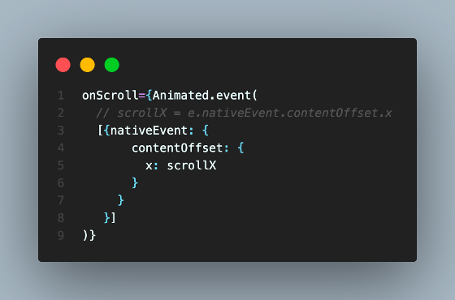
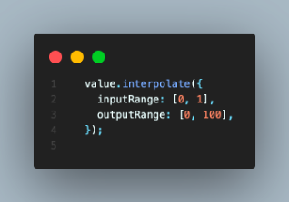
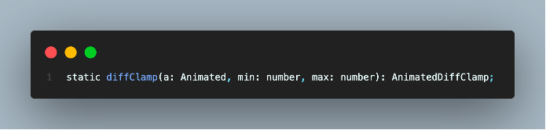
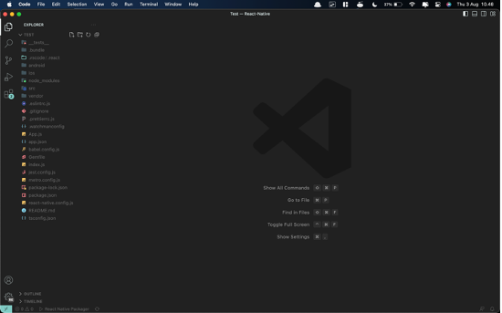
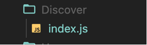
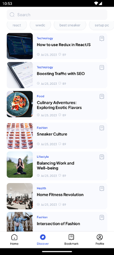
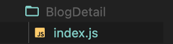
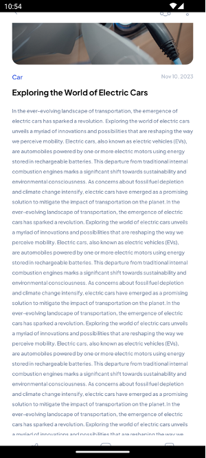

# BAB 6 - Animation

## 6.1 Tujuan Pembelajaran

1.	Mahasiswa dapat memahami konsep dasar animasi di React Native
2.	Mahasiswa dapat menerapkan animasi pada antarmuka pengguna
3.	Mahasiswa dapat menggunakan komponen Animated

## 6.2 Software yang di butuhkan

1. Java JDK
2. Node.Js
3. Visual Studio Code
4. Chocolatey
5. Android Studio
6. Android SDK

## 6.3 Animasi

Animasi adalah cara efektif untuk meningkatkan interaktivitas dan daya tarik dari aplikasi. Beberapa alasan mengapa harus mempertimbangkan penggunaan animasi dalam aplikasi React Native adalah:
1.	Meningkatkan Pengalaman Pengguna : Animasi dapat membuat aplikasi terasa lebih hidup dan responsif, meningkatkan kesan positif pada pengguna.
2.	Mengkomunikasikan Informasi : Animasi dapat digunakan untuk menyoroti perubahan status atau perpindahan antar elemen di dalam aplikasi.
3.	Mempercantik Tampilan : Animasi dapat digunakan untuk membuat tampilan aplikasi Anda lebih menarik dan menawan.

## 6.4 Animated

Animated adalah modul yang disediakan oleh React Native untuk mengelola dan membuat animasi dalam aplikasi. Ini memungkinkan Anda untuk menganimasikan komponen dan properti elemen dengan mengubah nilai-nilai interpolasi seiring waktu. Animasi yang dihasilkan dengan menggunakan Animated berjalan secara efisien dan halus karena menggunakan "native driver" yang memanfaatkan GPU perangkat. Native driver mengacu pada metode yang digunakan untuk menjalankan animasi dengan memindahkan sebagian besar komputasi animasi ke GPU perangkat, daripada mengandalkan JavaScript Thread. Penggunaan Native Driver merupakan salah satu cara untuk meningkatkan kinerja animasi dalam aplikasi React Native. 

Animated mengekspor enam jenis komponen yang dapat dianimasikan: View, Text, Image, ScrollView, FlatList, dan SectionList, namun juga dapat membuat sendiri menggunakan Animated.createAnimatedComponent(). Alur kerja inti untuk membuat animasi adalah membuat Animated.Value, menghubungkannya ke satu atau beberapa atribut gaya komponen animasi. 

Dalam membuat animasi menggunakan React Native Animated, kita seringkali perlu mengakses dan memanipulasi nilai animasi. Untuk melakukan ini, kita menggunakan hook useRef. useRef memungkinkan kita untuk membuat referensi ke suatu nilai atau elemen di dalam komponen React, sehingga kita dapat mengaksesnya dan memanipulasinya.

Berikut contoh penerapan dari Animated : 
```jsx
import React, {useRef} from 'react';
import {
  Animated,
  Text,
  View,
  StyleSheet,
  Button,
  SafeAreaView,
} from 'react-native';

const App = () => {
  // fadeAnim will be used as the value for opacity. Initial Value: 0
  const fadeAnim = useRef(new Animated.Value(0)).current;

  const fadeIn = () => {
    // Will change fadeAnim value to 1 in 5 seconds
    Animated.timing(fadeAnim, {
      toValue: 1,
      duration: 5000,
      useNativeDriver: true,
    }).start();
  };

  const fadeOut = () => {
    // Will change fadeAnim value to 0 in 3 seconds
    Animated.timing(fadeAnim, {
      toValue: 0,
      duration: 3000,
      useNativeDriver: true,
    }).start();
  };

  return (
    <SafeAreaView style={styles.container}>
      <Animated.View
        style={[
          styles.fadingContainer,
          {
            // Bind opacity to animated value
            opacity: fadeAnim,
          },
        ]}>
        <Text style={styles.fadingText}>Fading View!</Text>
      </Animated.View>
      <View style={styles.buttonRow}>
        <Button title="Fade In View" onPress={fadeIn} />
        <Button title="Fade Out View" onPress={fadeOut} />
      </View>
    </SafeAreaView>
  );
};

const styles = StyleSheet.create({
  container: {
    flex: 1,
    alignItems: 'center',
    justifyContent: 'center',
  },
  fadingContainer: {
    padding: 20,
    backgroundColor: 'powderblue',
  },
  fadingText: {
    fontSize: 28,
  },
  buttonRow: {
    flexBasis: 100,
    justifyContent: 'space-evenly',
    marginVertical: 16,
  },
});

export default App;
```
#### Penjelasan penggunaan useRef : #####
Pada kode di atas, kita menggunakan useRef untuk membuat variabel fadeAnim. Ini dilakukan karena kita ingin mengakses dan memanipulasi nilai animasi opacity (fadeAnim) dari komponen Animated.View. new Animated.Value(0) digunakan sebagai nilai awal dari animasi opacity, yang kita tentukan sebagai 0. Dengan fadeAnim, kita dapat mengendalikan bagaimana komponen Animated.View berubah opasitasnya selama animasi berlangsung.
Dengan demikian, useRef digunakan sebagai cara untuk menginisialisasi dan mengakses nilai awal animasi, yang pada contoh ini adalah opacity dari Animated.View. Inilah mengapa kita menggunakan useRef dalam kode tersebut.

## 6.5 Handling gesture and other events

Gestures, seperti panning atau scrolling, dan peristiwa lainnya dapat langsung dipetakan ke dalam nilai-nilai animasi menggunakan Animated.event(). Ini dilakukan dengan sintaksis pemetaan terstruktur sehingga nilai-nilai dapat diekstraksi dari objek peristiwa yang kompleks. Tingkat pertama adalah array untuk memungkinkan pemetaan melintasi beberapa argumen, dan array tersebut berisi objek-objek bersarang.
Contoh, saat bekerja dengan gesture horizontal scrolling, Anda akan melakukan hal berikut untuk memetakan event.nativeEvent.contentOffset.x ke scrollX (sebuah Animated.Value):



## 6.6 Interpolation

Setiap properti dapat dijalankan melalui interpolasi terlebih dahulu. Interpolasi memetakan rentang masukan (input range) ke rentang keluaran (output range), biasanya menggunakan interpolasi linier tetapi juga mendukung fungsi easing. Secara default, ini akan mengekstrapolasi kurva di luar rentang yang diberikan, namun Anda juga dapat mengaturnya untuk menjepit nilai output. Pemetaan dasar untuk mengubah rentang 0-1 menjadi rentang 0-100 adalah:



inputRange adalah kumpulan nilai yang digunakan sebagai referensi untuk menentukan bagaimana interpolasi akan berperilaku tergantung pada nilai masukan (input). Dalam kode diatas, inputRange adalah [0, 1], yang berarti bahwa nilai masukan (value) akan berada dalam rentang antara 0 dan 1.

outputRange adalah kumpulan nilai yang akan digunakan sebagai hasil interpolasi berdasarkan nilai masukan (input). Dalam kode diatas, outputRange adalah [0, 100], yang berarti bahwa nilai keluaran (output) akan dihasilkan dalam rentang antara 0 dan 100.

Jadi, jika nilai masukan (input) yang berada dalam rentang antara 0 hingga 1, fungsi interpolate akan menghasilkan nilai keluaran (output) yang berada dalam rentang antara 0 hingga 100. Ini berarti jika nilai input 0, nilai output akan 0, dan jika Anda memberikan nilai input 1, nilai output akan 100. Jika Anda memberikan nilai input di antara 0 dan 1, nilai output akan dihitung secara proporsional berdasarkan interpolasi linier antara rentang inputRange dan outputRange.

## 6.7 DiffClamp

DiffClamp adalah fungsi yang memungkinkan Anda membatasi perubahan nilai ke dalam rentang tertentu, sambil mempertahankan perbedaan antara nilai saat ini dan nilai sebelumnya (differensiasi). Fungsi ini biasanya digunakan dalam konteks animasi atau pemrosesan data untuk mengendalikan perubahan nilai dengan cara yang lebih terkontrol. DiffClamp sering digunakan untuk memastikan bahwa nilai tertentu tidak keluar dari batas yang ditentukan. Ini berguna dalam berbagai situasi, seperti mengontrol posisi objek dalam animasi sehingga tidak melampaui batas tertentu.

Dengan mempertahankan perbedaan antara nilai saat ini dan nilai sebelumnya, diffClamp membantu mencegah "loncatan" nilai yang tiba-tiba, yang dapat membuat animasi terlihat lebih halus. Ini menggunakan selisih antara nilai terakhir, sehingga bahkan jika nilai berada jauh dari batas, nilai akan mulai berubah ketika nilai mendekati batas tersebut lagi (nilai = clamp(nilai + selisih, min, max)).



Dalam banyak kasus, diffClamp dapat digabungkan dengan fungsi animasi lainnya, seperti interpolate, untuk mengontrol perubahan nilai dengan lebih tepat sesuai kebutuhan. Ini berguna dalam konteks peristiwa pengguliran (scroll events), contohnya, untuk menampilkan navigation bar saat pengguna menggulir ke atas dan menyembunyikannya saat pengguna menggulir ke bawah.

## 6.8 Langkah – langkah praktikum

### 1. Buka kembali project dari bab sebelumnya pada Visual Sudio Code.



### 2.	Setelah itu jalankan project dengan perintah berikut.
```bash
npx react-native run-android
```

### 3.	Lalu buka kembali file index.js pada folder Discover



### 4.	Ubah bagian dari import menjadi seperti kode berikut.
```jsx
import {StyleSheet, Text, View, ScrollView, FlatList, Animated} from 'react-native';
import React, {useRef} from 'react';
```

### 5.	Buat nilai awal dari animated dengan menggunakan useRef hooks yang disimpan pada variable scrollY. Masukkan kode berikut pada komponen Discover.
```jsx
const scrollY = useRef(new Animated.Value(0)).current;
```

### 6.	Selanjutnya rubah komponen View yang membungkus komponen recent search menjadi seperti kode berikut.
```jsx
<Animated.View style={[recent.container, {transform: [{translateY: recentY}]}]}>
    <Text style={recent.text}>Recent Search</Text>
    <FlatListRecent />
</Animated.View>
```

### 7.	Ubah juga komponen ScrollView menjadi seperti kode berikut.
```jsx
<Animated.ScrollView
        showsVerticalScrollIndicator={false}
        onScroll={Animated.event(
          [{nativeEvent: {contentOffset: {y: scrollY}}}],
          {useNativeDriver: true},
        )}
        contentContainerStyle={{paddingTop: 142}}>
    <View style={styles.listCard}>
        {recentBlog.map((item, index) => (
            <ItemSmall item={item} key={index} />
        ))}
    </View>
</Animated.ScrollView>
```

### 8.	Setelah itu tambahkan kode berikut untuk menjalankan animasi, letakkan kode berikut dibawah variable scrollY yang sudah dibuat.
```jsx
const diffClampY = Animated.diffClamp(scrollY, 0, 142);
const recentY = diffClampY.interpolate({
    inputRange: [0, 142],
    outputRange: [0, -142],
    extrapolate: 'clamp',
  });
```

### 9.	Lalu tambahkan stylesheet pada variable recent seperti kode berikut.
```jsx
container:{
    position: 'absolute',
    backgroundColor: colors.white(),
    zIndex: 999,
    top: 52,
    left: 0,
    right: 0,
    elevation: 1000,
  },
```

### 10.	Ubah juga stylesheet dari style header menjadi seperti berikut.

```jsx
header: {
    paddingHorizontal: 24,
    flexDirection: 'row',
    alignItems: 'center',
    height: 52,
    paddingTop: 8,
    paddingBottom: 4,
    position: 'absolute',
    top: 0,
    zIndex: 1000,
    right: 0,
    left: 0,
    backgroundColor: colors.white(),
  },
```

### 11.	Jika sudah maka tampilan animasi recent search akan perlahan akan bergeser ke atas saat ScrollView digerakkan.



### 12.	Selanjutnya buka juga kembali file index.js pada folder BlogDetail.



### 13.	Pastikan mengubah bagian dari import menjadi seperti kode berikut
```jsx
import {StyleSheet, Text, View, ScrollView, TouchableOpacity, Animated} from 'react-native';
import React, {useState, useRef} from 'react';
```

### 14.	Sama seperti pada komponen Discover, kita perlu membuat nilai awal dari Animated menggunakan useRef seperti kode berikut.
```jsx
const scrollY = useRef(new Animated.Value(0)).current;
```

### 15.	Kemudian ubah View pada bagian header menjadi Animated.View, biarkan isi dari View tersebut tetap seperti sebelumnya.
```jsx
<Animated.View style={[styles.header, {transform:[{translateY:headerY}]}]}>
{/* isi komponen tetap */}
</Animated.View>
```

### 16.	Ubah juga komponen ScrollView, biarkan isi dari ScrollView tersebut tetap seperti sebelumnya.
```jsx
<Animated.ScrollView
        showsVerticalScrollIndicator={false}
        onScroll={Animated.event(
          [{nativeEvent: {contentOffset: {y: scrollY}}}],
          {useNativeDriver: true},
        )}
        contentContainerStyle={{
          paddingHorizontal: 24,
          paddingTop: 62,
          paddingBottom: 54,
        }}>
{/* isi komponen tetap */}
</Animated.ScrollView>
```

### 17.	Kemudian ubah View pada bagian bottomBar menjadi Animated.View, biarkan isi dari View tersebut tetap seperti sebelumnya.
```jsx
<Animated.View style={[styles.bottomBar, {transform:[{translateY:bottomBarY}]}]}>
{/* isi komponen tetap */}
</Animated.View>
```

### 18.	Setelah itu tambahkan kode berikut untuk menjalankan animasi, letakkan kode berikut dibawah variable scrollY yang sudah dibuat.
```jsx
const diffClampY = Animated.diffClamp(scrollY, 0, 52);
  const headerY = diffClampY.interpolate({
    inputRange: [0, 52],
    outputRange: [0, -52],
  });
  const bottomBarY = diffClampY.interpolate({
    inputRange: [0, 52],
    outputRange: [0, 52],
  });
```

### 19.	Jika sudah maka tampilan animasi header dan bottomBarakan perlahan akan bergeser saat ScrollView digerakkan.



## 6.9 Tugas Praktikum
Silahkan menerapkan animated pada project masing masing sesuai tema yang sudah ditentukan!