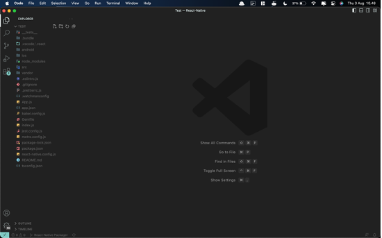
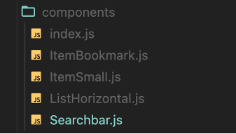
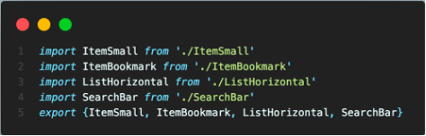
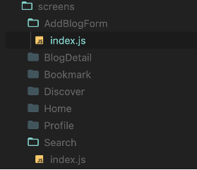
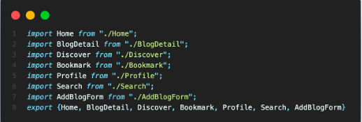
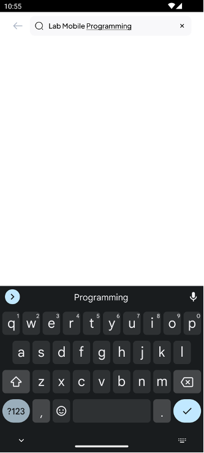
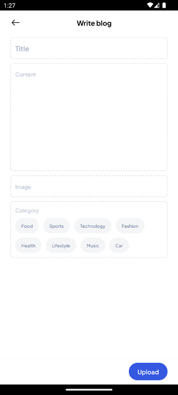

# BAB 7 - Handling Text Input

## 7.1 Tujuan Pembelajaran

1. Mahasiswa dapat memahami konsep dasar TextInput di React Native
2. Mahasiswa dapat menggunakan komponen TextInput
3. Mahasiswa dapat mengontrol dan memproses TextInput

## 7.2 Software yang di butuhkan

1. Java JDK
2. Node.Js
3. Visual Studio Code
4. Chocolatey
5. Android Studio
6. Android SDK

## 7.3 Text Input

TextInput adalah komponen yang memungkinkan pengguna untuk memasukkan teks ke dalam aplikasi. Ini merupakan elemen penting dalam berinteraksi dengan pengguna. Dalam React Native TextInput adalah komponen bawaan yang digunakan untuk memasukkan teks ke dalam aplikasi melalui keyboard. Props konfigurasi juga disediakan untuk beberapa fitur, seperti koreksi otomatis, kapitalisasi otomatis, teks placeholder, dan jenis keyboard berbeda, seperti keypad numerik.

### A. Penggunaan TextInput

Untuk menggunakan TextInput pastikan mengimport komponen TextInput. Lalu yang dibutuhkan selanjutnya adalah state, pastikan juga useState juga sudah ter-import. State berguna untuk memproses dan menyimpan value dari inputan. Getter dari state dimasukkan ke dalam properti value. Ketika pengguna mengubah input, maka perlu ditangani melalui fungsi callback seperti onChangeText. Property onChangeText akan menggunakan setter state untuk memperbarui state aplikasi sesuai dengan nilai input yang baru. Dengan demikian, pengguna akan melihat perubahan yang terjadi pada tampilan sesuai dengan setiap karakter yang mereka ketik, menciptakan pengalaman yang lebih reaktif. Penggunaan TextInput seperti kode berikut:

```jsx
import React, { useState } from "react";
import { View, Text, TextInput, Button } from "react-native";

export default function App() {
  const [name, setName] = useState("");
  const [greeting, setGreeting] = useState("");
  const handleGreet = () => {
    if (name !== "") {
      const greeting = `Halo, ${name}! Selamat datang.`;
      setGreeting(greeting);
    }
  };
  return (
    <View style={{ flex: 1, justifyContent: "center", alignItems: "center" }}>
      <Text>Masukkan Nama Anda:</Text>
      <TextInput
        style={{
          width: 200,
          height: 40,
          borderColor: "gray",
          borderWidth: 1,
          marginBottom: 10,
        }}
        onChangeText={setName}
        value={name}
      />
      <Button title="Sapa" onPress={() => handleGreet()} />
      <Text style={{ marginTop: 10 }}>{greeting}</Text>
    </View>
  );
}
```

### B. Props dan method pada TextInput

Ada beberapa properti yang sering digunakan pada komponen TextInput. Properti ini memungkinkan untuk mengontrol perilaku dan penampilan Input Teks:

1. placeholder: Menambahkan teks petunjuk ke dalam TextInput.
2. secureTextEntry: Mengubah input menjadi format sandi (untuk kata sandi).
3. keyboardType: Mengatur jenis keyboard yang sesuai dengan jenis input.
4. maxLength: Membatasi panjang TextInput.
5. blurOnSubmit : Menghilangkan fokus dari TextInput setelah submit.
6. Multiline : Membuat TextInput bisa beberapa baris

Selain properti, ada juga beberapa metode yang berguna ketika berurusan dengan TextInput:

1. focus(): Mengatur fokus ke TextInput.
2. blur(): Menghilangkan fokus dari TextInput.

## 7.4 Langkah – langkah praktikum

### 1. Buka kembali project dari bab sebelumnya pada Visual Sudio Code.



### 2. Setelah itu jalankan project dengan perintah berikut.

```bash
npx react-native run-android
```

### 3. Buka file index.js pada folder screens/Discover dan tambahkan import dari navigation

```jsx
import { useNavigation } from "@react-navigation/native";
```

### 4. Jangan lupa untuk memanggil useNavigation di dalam komponen Discover agar bisa melakukan navigasi

```jsx
const navigation = useNavigation();
```

### 5. Kemudian tambahkan kode berikut untuk membungkus View header. Pastikan juga komponen TouchableWithoutFeedback sudah diimport

```jsx
<TouchableWithoutFeedback onPress={() => navigation.navigate("SearchPage")}>
  {/* header */}
</TouchableWithoutFeedback>
```

### 6. Tambahkan file baru dengan nama SearchBar.js pada folder components.



### 7. Masukkan kode berikut ke dalam file SearchBar.js

```jsx
import {
  StyleSheet,
  View,
  TextInput,
  Animated,
  TouchableOpacity,
} from "react-native";
import React, { useState, useRef, useEffect } from "react";
import { SearchNormal1, ArrowLeft, Add } from "iconsax-react-native";
import { fontType, colors } from "../theme";
import { useNavigation } from "@react-navigation/native";

const SearchBar = ({ searchPhrase, setSearchPhrase }) => {
  const navigation = useNavigation();
  const animation = useRef(new Animated.Value(0)).current;
  useEffect(() => {
    Animated.timing(animation, {
      toValue: 1,
      duration: 400,
      useNativeDriver: false,
    }).start();
  }, []);
  return (
    <Animated.View
      style={[
        styles.container,
        {
          gap: animation.interpolate({
            inputRange: [0, 1],
            outputRange: [0, 12],
          }),
        },
      ]}
    >
      <Animated.View
        style={{
          transform: [
            {
              scale: animation.interpolate({
                inputRange: [0, 0.8, 1],
                outputRange: [0, 1.2, 1],
              }),
            },
          ],
        }}
      >
        <TouchableOpacity onPress={() => navigation.goBack()}>
          <ArrowLeft color={colors.grey(0.6)} variant="Linear" size={24} />
        </TouchableOpacity>
      </Animated.View>
      <View style={styles.bar}>
        <SearchNormal1
          size={18}
          color={searchPhrase ? colors.black() : colors.grey(0.5)}
          variant="Linear"
        />
        <TextInput
          style={styles.textinput}
          placeholder="Search"
          placeholderTextColor={colors.grey(0.5)}
          value={searchPhrase}
          onChangeText={setSearchPhrase}
          borderWidth={0}
          underlineColorAndroid="transparent"
          autoCorrect={false}
          autoFocus={true}
        />
        {searchPhrase && (
          <TouchableOpacity onPress={() => setSearchPhrase("")}>
            <Add
              size={18}
              color={colors.black()}
              variant="Linear"
              style={{ transform: [{ rotate: "45deg" }] }}
            />
          </TouchableOpacity>
        )}
      </View>
    </Animated.View>
  );
};

export default SearchBar;

const styles = StyleSheet.create({
  container: {
    flexDirection: "row",
    justifyContent: "flex-start",
    alignItems: "center",
  },
  bar: {
    flexDirection: "row",
    padding: 10,
    gap: 10,
    alignItems: "center",
    backgroundColor: colors.grey(0.05),
    borderRadius: 10,
    flex: 1,
  },
  textinput: {
    fontSize: 14,
    fontFamily: fontType["Pjs-Medium"],
    color: colors.black(),
    lineHeight: 18,
    padding: 0,
    flex: 1,
  },
});
```

### 8. Buka file index.js pada folder components dan export import komponen SearchBar



### 9. Buat folder baru di dalam folder screen dengan nama Search dan AddBlogForm. dan buat juga file index.js di dalam tersebut.



### 10. Selanjutnya buka file index.js pada folder Search dan masukkan kode berikut

```jsx
import { StyleSheet, View } from "react-native";
import React, { useState } from "react";
import { SearchBar } from "../../components";
import { fontType, colors } from "../../theme";
const Search = () => {
  const [searchPhrase, setSearchPhrase] = useState("");
  return (
    <View style={styles.container}>
      <View style={styles.header}>
        <SearchBar
          searchPhrase={searchPhrase}
          setSearchPhrase={setSearchPhrase}
        />
      </View>
    </View>
  );
};
export default Search;
const styles = StyleSheet.create({
  container: {
    flex: 1,
    backgroundColor: colors.white(),
  },
  header: {
    paddingHorizontal: 24,
    alignItems: "center",
    height: 52,
    paddingTop: 8,
    paddingBottom: 4,
    position: "absolute",
    top: 0,
    zIndex: 1000,
    right: 0,
    left: 0,
    backgroundColor: colors.white(),
  },
});
```

### 11. Masukkan kode berikut ke dalam index.js yang berada pada folder AddBlogForm

```jsx
import React, { useState } from "react";
import {
  View,
  Text,
  TextInput,
  TouchableOpacity,
  StyleSheet,
  ScrollView,
} from "react-native";
import { ArrowLeft } from "iconsax-react-native";
import { useNavigation } from "@react-navigation/native";
import { fontType, colors } from "../../theme";

const AddBlogForm = () => {
  const dataCategory = [
    { id: 1, name: "Food" },
    { id: 2, name: "Sports" },
    { id: 3, name: "Technology" },
    { id: 4, name: "Fashion" },
    { id: 5, name: "Health" },
    { id: 6, name: "Lifestyle" },
    { id: 7, name: "Music" },
    { id: 8, name: "Car" },
  ];
  const [blogData, setBlogData] = useState({
    title: "",
    content: "",
    category: {},
    totalLikes: 0,
    totalComments: 0,
  });
  const handleChange = (key, value) => {
    setBlogData({
      ...blogData,
      [key]: value,
    });
  };
  const [image, setImage] = useState(null);
  const navigation = useNavigation();
  return (
    <View style={styles.container}>
      <View style={styles.header}>
        <TouchableOpacity onPress={() => navigation.goBack()}>
          <ArrowLeft color={colors.black()} variant="Linear" size={24} />
        </TouchableOpacity>
        <View style={{ flex: 1, alignItems: "center" }}>
          <Text style={styles.title}>Write blog</Text>
        </View>
      </View>
      <ScrollView
        contentContainerStyle={{
          paddingHorizontal: 24,
          paddingVertical: 10,
          gap: 10,
        }}
      >
        <View style={textInput.borderDashed}>
          <TextInput
            placeholder="Title"
            value={blogData.title}
            onChangeText={(text) => handleChange("title", text)}
            placeholderTextColor={colors.grey(0.6)}
            multiline
            style={textInput.title}
          />
        </View>
        <View style={[textInput.borderDashed, { minHeight: 250 }]}>
          <TextInput
            placeholder="Content"
            value={blogData.content}
            onChangeText={(text) => handleChange("content", text)}
            placeholderTextColor={colors.grey(0.6)}
            multiline
            style={textInput.content}
          />
        </View>
        <View style={[textInput.borderDashed]}>
          <TextInput
            placeholder="Image"
            value={image}
            onChangeText={(text) => setImage(text)}
            placeholderTextColor={colors.grey(0.6)}
            style={textInput.content}
          />
        </View>
        <View style={[textInput.borderDashed]}>
          <Text
            style={{
              fontSize: 12,
              fontFamily: fontType["Pjs-Regular"],
              color: colors.grey(0.6),
            }}
          >
            Category
          </Text>
          <View style={category.container}>
            {dataCategory.map((item, index) => {
              const bgColor =
                item.id === blogData.category.id
                  ? colors.black()
                  : colors.grey(0.08);
              const color =
                item.id === blogData.category.id
                  ? colors.white()
                  : colors.grey();
              return (
                <TouchableOpacity
                  key={index}
                  onPress={() =>
                    handleChange("category", { id: item.id, name: item.name })
                  }
                  style={[category.item, { backgroundColor: bgColor }]}
                >
                  <Text style={[category.name, { color: color }]}>
                    {item.name}
                  </Text>
                </TouchableOpacity>
              );
            })}
          </View>
        </View>
      </ScrollView>
      <View style={styles.bottomBar}>
        <TouchableOpacity style={styles.button} onPress={() => {}}>
          <Text style={styles.buttonLabel}>Upload</Text>
        </TouchableOpacity>
      </View>
    </View>
  );
};

export default AddBlogForm;

const styles = StyleSheet.create({
  container: {
    flex: 1,
    backgroundColor: colors.white(),
  },
  header: {
    paddingHorizontal: 24,
    flexDirection: "row",
    alignItems: "center",
    height: 52,
    elevation: 8,
    paddingTop: 8,
    paddingBottom: 4,
  },
  title: {
    fontFamily: fontType["Pjs-Bold"],
    fontSize: 16,
    color: colors.black(),
  },
  bottomBar: {
    backgroundColor: colors.white(),
    alignItems: "flex-end",
    paddingHorizontal: 24,
    paddingVertical: 10,
    shadowColor: colors.black(),
    shadowOffset: {
      width: 0,
      height: 2,
    },
    shadowOpacity: 0.25,
    shadowRadius: 3.84,

    elevation: 5,
  },
  button: {
    paddingHorizontal: 20,
    paddingVertical: 10,
    backgroundColor: colors.blue(),
    borderRadius: 20,
    justifyContent: "center",
    alignItems: "center",
  },
  buttonLabel: {
    fontSize: 14,
    fontFamily: fontType["Pjs-SemiBold"],
    color: colors.white(),
  },
});
const textInput = StyleSheet.create({
  borderDashed: {
    borderStyle: "dashed",
    borderWidth: 1,
    borderRadius: 5,
    padding: 10,
    borderColor: colors.grey(0.4),
  },
  title: {
    fontSize: 16,
    fontFamily: fontType["Pjs-SemiBold"],
    color: colors.black(),
    padding: 0,
  },
  content: {
    fontSize: 12,
    fontFamily: fontType["Pjs-Regular"],
    color: colors.black(),
    padding: 0,
  },
});
const category = StyleSheet.create({
  title: {
    fontSize: 12,
    fontFamily: fontType["Pjs-Regular"],
    color: colors.grey(0.6),
  },
  container: {
    flexWrap: "wrap",
    flexDirection: "row",
    gap: 10,
    marginTop: 10,
  },
  item: {
    paddingHorizontal: 14,
    paddingVertical: 10,
    borderRadius: 25,
  },
  name: {
    fontSize: 10,
    fontFamily: fontType["Pjs-Medium"],
  },
});
```

### 12. Buka file index.js pada folder screen dan export import file index dari folder Search dan AddBlogForm



### 13. Lalu buka folder Profile, ubah import icon pada file index.js dan tambahkan import dari navigation

```jsx
import { Setting2, Edit } from "iconsax-react-native";
import { useNavigation } from "@react-navigation/native";
```

### 14. Jangan lupa untuk memanggil useNavigation di dalam komponen Profile agar bisa melakukan navigasi

```jsx
const navigation = useNavigation();
```

### 15. Tambahkan juga kode berikut, di bawah komponen ScrollView

```jsx
<TouchableOpacity
  style={styles.floatingButton}
  onPress={() => navigation.navigate("AddBlog")}
>
  <Edit color={colors.white()} variant="Linear" size={20} />
</TouchableOpacity>
```

### 16. Tambahkan juga stylesheet pada styles seperti kode berikut

```jsx
floatingButton: {
    backgroundColor: colors.blue(),
    padding: 15,
    position: 'absolute',
    bottom: 24,
    right: 24,
    borderRadius: 10,
    shadowColor: colors.blue(),
    shadowOffset: {
      width: 0,
      height: 4,
    },
    shadowOpacity: 0.3,
    shadowRadius: 4.65,

    elevation: 8,
  },
```

### 17. Buka kembali file Router.js pada folder navigation dan tambahkan Stack.Screen baru yang memanggil screen Search dan AddBlogForm, pastikan screen sudah ter import.

```jsx
<Stack.Screen
        name="SearchPage"
        component={Search}
        options={{
          headerShown: false,
          presentation: 'transparentModal',
        }}
      />
<Stack.Screen
        name="AddBlog"
        component={AddBlogForm}
        options={{
          headerShown: false,
          animationEnabled: true,
          animationTypeForReplace: 'pop',
          gestureEnabled: true,
          gestureDirection : 'horizontal',
          ...TransitionPresets.SlideFromRightIOS,
        }}
      />
```

### 18.	Berikut adalah hasil dari halaman Search



### 19.	Berikut adalah hasil tampilan dari AddBlogForm



## 7.5	Tugas Praktikum
Silahkan menerapkan TextInput dan buat form pada project masing masing sesuai tema yang sudah ditentukan!