# BAB 8 - REST API

## 8.1 Tujuan Pembelajaran

1.	Mahasiswa dapat mengerti apa itu REST API
2.	Mahasiswa dapat memahami konsep REST API 
3.	Mahasiswa dapat menerapkan REST API pada aplikasi

## 8.2 Software yang di butuhkan

1. Java JDK
2. Node.Js
3. Visual Studio Code
4. Chocolatey
5. Android Studio
6. Android SDK

## 8.3 API
API (Application Programming Interface) adalah kumpulan aturan, protokol, dan alat yang memungkinkan berbagai perangkat lunak atau aplikasi berkomunikasi satu sama lain. API memungkinkan pengembang untuk mengintegrasikan fungsionalitas atau layanan dari satu program atau aplikasi ke dalam aplikasi yang lain. 

API berfungsi sebagai perantara antara aplikasi, memungkinkan mereka untuk berkomunikasi dan berbagi informasi dengan cara yang terstruktur. Penggunaan API dapat mencakup berbagai tindakan, seperti mengambil data dari server eksternal, mengirim data ke server eksternal, mengontrol perangkat keras atau perangkat lunak tertentu, dan banyak lagi. API dapat digunakan dalam berbagai konteks, termasuk pengembangan perangkat lunak, pembuatan situs web, pengembangan aplikasi seluler, dan banyak lagi. 

Penerapan API : 
1. Bahasa Pemrograman
2. Library atau Framework
3. Sistem Operasi
4. Web API/Web Services

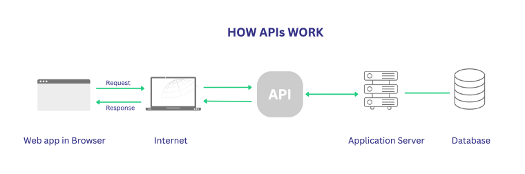

## 8.4 REST
REST (Representational State Transfer) jenis API yang mengikuti prinsip-prinsip desain REST. Jadi REST adalah gaya perancangan (Architectural Style) perangkat lunak yang di dalamnya mendefinisikan aturan-aturan untuk membuat web service. Ini adalah cara yang sangat umum digunakan dalam pengembangan web dan mobile. 

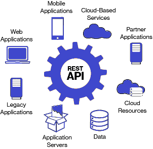

REST API berfokus pada sumber daya (resources) yang diidentifikasi melalui URL (Uniform Resource Locator). Jadi API adalah penghubung, sedangkan REST API adalah aturannya, terdapat request dan response, lalu data yang dikirim/diterima biasanya berupa JSON. Sedangkan RESTful API adalah cara menggunakan REST yang benar, yaitu dengan cara : 

1.	Menggunakan HTTP method yang benar sesuai dengan fungsinya yaitu:

        GET : Mengambil data
        POST : Menambah data
        PUT : Mengubah data
        DELETE : Menghapus data
2.	Endpoints-nya berupa kata benda, bukan kata kerja
3.	Stateless yaitu aplikasi server tidak diperbolehkan menyimpan data apa pun yang terkait dengan permintaan klien.

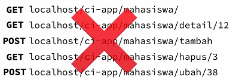
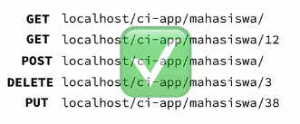

Cara Kerja REST API : 

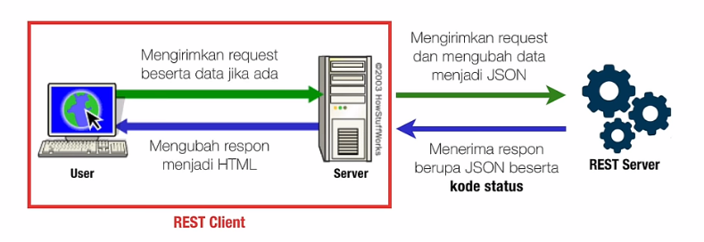

Kode Status (Status Code) adalah status yang dikirimkan dari server API ke REST Client, kode yang sering ditemui yaitu:
1.	200 – Success (Berhasil)
2.	404 – Not Found (Tidak ditemukan)
3.	500 – Server Error

## 8.5 JSON
JSON (JavaScript Object Notation) Ini adalah format data yang digunakan untuk pertukaran data antara server dan klien atau antar program dalam bentuk yang mudah dimengerti oleh manusia dan dapat diurai oleh komputer. JSON berfungsi sebagai cara standar untuk merepresentasikan data struktur terstruktur dalam bentuk teks.
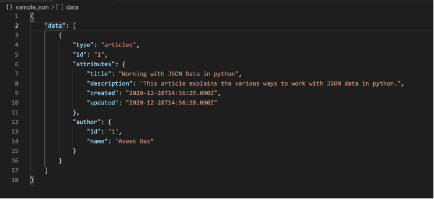

## 8.6	Interaksi dengan API
Dalam pengembangan aplikasi web dan mobile, berinteraksi dengan API (Application Programming Interface) adalah hal yang umum. Salah satu cara berninteraksi dengan API yaitu menggunakan Axios. Axios adalah sebuah library JavaScript yang digunakan untuk membuat permintaan HTTP (HTTP requests) dari aplikasi web atau aplikasi yang berjalan di lingkungan JavaScript. Ini adalah alat yang populer dan sering digunakan untuk berkomunikasi dengan server dan mengambil atau mengirim data melalui berbagai jenis permintaan HTTP seperti GET, POST, PUT, DELETE, dan sebagainya. Selain itu, React menyediakan hook seperti useEffect dan useCallback yang membantu dalam mengelola interaksi dengan API secara efisien dan responsif. 

useEffect digunakan untuk mengelola efek samping (side effects) dalam komponen React, seperti pemanggilan API, perubahan state, atau interaksi dengan DOM. Ini dapat digunakan untuk menjalankan kode setelah render pertama komponen, atau untuk merespons perubahan dalam state atau prop tertentu. Contoh Penulisan useEffect : 

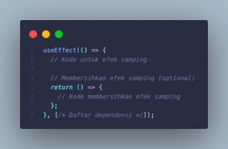

useCallback adalah salah satu cara untuk mencegah re-render yang tidak perlu dalam konteks penggunaan fungsi dengan menyimpan referensi dari fungsi tersebut dengan hanya mengubah referensi tersebut ketika dependensi yang ditentukan berubah. Ketika membuat sebuah fungsi dalam komponen React, fungsi tersebut memiliki referensi yang berubah setiap kali komponen dirender ulang. Ini dapat menyebabkan komponen anak yang menerima fungsi ini sebagai prop untuk juga merender ulang, bahkan jika prop lainnya tidak berubah.
Jika dependensi tidak berubah, maka referensi fungsi akan tetap sama, yang berarti komponen anak yang menerima prop ini tidak akan dirender ulang. Ini membantu dalam mengoptimalkan performa dengan memastikan referensi fungsi tetap konsisten selama siklus hidup komponen.

## 8.7	Langkah – langkah praktikum

### 1.	Buka browser masing masing, lalu masuk ke halaman  https://mockapi.io/projects, lalu klik Get Started dan buat akun pada web mockapi.

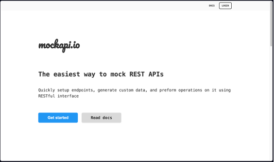

### 2.	Lalu tambahkan project baru dengan klik tombol plus

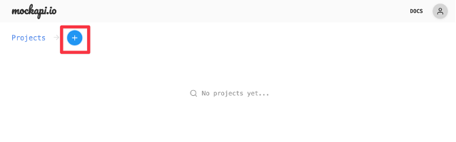

### 3.	Masukkan nama project dan juga API Prefix seperti berikut, lalu klik create

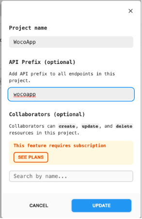

### 4.	Buka project tersebut lalu tambahkan new resource.

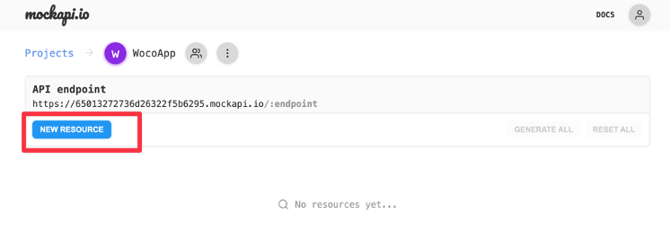

### 5.	Masukkan resource name dan schema seperti berikut, lalu klik create.

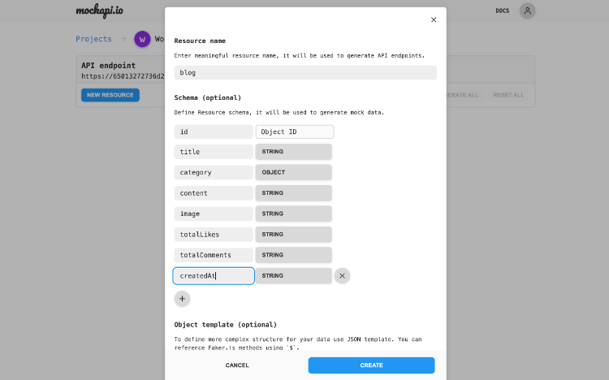

### 6.	Buka project sebelumnya lalu install package yang dibutuhkan seperti kode berikut
```bash
npm i axios @shopify/flash-list react-native-actions-sheet
```

### 7.	Setelah itu jalankan project dengan perintah berikut pada terminal.
```bash
npx react-native run-android
```

### 8.	Lalu buka file index.js pada folder screens/AddBlogForm

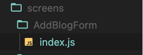

### 9.	Lalu ubah kode pada bagian import menjadi seperti berikut
```jsx
import React, {useState} from 'react';
import {View, Text, TextInput, TouchableOpacity, StyleSheet, ScrollView, ActivityIndicator} from 'react-native';
import {ArrowLeft} from 'iconsax-react-native';
import {useNavigation} from '@react-navigation/native';
import {fontType, colors} from '../../theme';
import axios from 'axios';
```

### 10.	Tambahkan juga state untuk loading seperti berikut.
```jsx
const [loading, setLoading] = useState(false);
```

### 11.	Buat fungsi untuk melakukan upload atau POST ke endpoint dari API dan masukkan link endpoint dari API.
```jsx
const handleUpload = async () => {
    setLoading(true);
    try {
      await axios.post('link endpoint API', {
          title: blogData.title,
          category: blogData.category,
          image,
          content: blogData.content,
          totalComments: blogData.totalComments,
          totalLikes: blogData.totalLikes,
          createdAt: new Date(),
        })
        .then(function (response) {
          console.log(response);
        })
        .catch(function (error) {
          console.log(error);
        });
      setLoading(false);
      navigation.navigate('Profile');
    } catch (e) {
      console.log(e);
    }
  };
```

### 12.	Ubah onPress pada bagian upload untuk memanggil fungsi handleUpload
```jsx
<TouchableOpacity style={styles.button} onPress={handleUpload}>
          <Text style={styles.buttonLabel}>Upload</Text>
</TouchableOpacity>
```

### 13.	Tambahkan kode berikut untuk animasi loading letakkan di bagian bawah bottomBar
```jsx
{loading && (
        <View style={styles.loadingOverlay}>
          <ActivityIndicator size="large" color={colors.blue()} />
        </View>
      )}
```

### 14.	Tambahkan juga stylesheet untuk animasi loading letakkan pada bagian stylesheet styles
```jsx
loadingOverlay: {
    position: 'absolute',
    top: 0,
    left: 0,
    right: 0,
    bottom: 0,
    backgroundColor: colors.black(0.4),
    justifyContent: 'center',
    alignItems: 'center',
  },
```

### 15.	Buat folder baru dengan nama utils di dalam folder src, lalu tambahkan file formatDate.js di dalam folder utils.

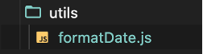

### 16.	Selanjutnya masukkan kode berikut ke dalam file formatDate.js
```jsx
export const formatDate = createdAt => {
  if (createdAt) {
    const createdAtDate = new Date(createdAt);
    const months = [
      'Jan',
      'Feb',
      'Mar',
      'Apr',
      'May',
      'Jun',
      'Jul',
      'Aug',
      'Sep',
      'Oct',
      'Nov',
      'Dec',
    ];
    const year = createdAtDate.getFullYear();
    const month = months[createdAtDate.getMonth()];
    const day = createdAtDate.getDate();
    return `${month} ${day}, ${year}`;
  } else {
    return '';
  }
};
```

### 17.	Ubah isi dari file ItemSmall yang berada pada folder components menjadi seperti berikut
```jsx
import {StyleSheet, Text, View, TouchableOpacity} from 'react-native';
import FastImage from 'react-native-fast-image';
import {Receipt21, Clock, Message} from 'iconsax-react-native';
import React from 'react';
import {useNavigation} from '@react-navigation/native';
import {fontType, colors} from '../theme';
import {formatDate} from '../utils/formatDate';

const ItemSmall = ({item}) => {
  const navigation = useNavigation();
  return (
    <TouchableOpacity
      style={styles.cardItem}
      onPress={() => navigation.navigate('BlogDetail', {blogId: item.id})}>
      <FastImage
        style={styles.cardImage}
        source={{
          uri: item?.image,
          headers: {Authorization: 'someAuthToken'},
          priority: FastImage.priority.high,
        }}
        resizeMode={FastImage.resizeMode.cover}
      />
      <View style={styles.cardContent}>
        <View
          style={{
            flexDirection: 'row',
            gap: 30,
          }}>
          <View style={{gap: 5, flex: 1}}>
            <Text style={styles.cardCategory}>{item.category?.name}</Text>
            <Text style={styles.cardTitle}>{item?.title}</Text>
          </View>
          <Receipt21 color={colors.grey(0.6)} variant="Linear" size={20} />
        </View>
        <View style={styles.cardInfo}>
          <Clock size={10} variant="Linear" color={colors.grey(0.6)} />
          <Text style={styles.cardText}>{formatDate(item?.createdAt)}</Text>
          <Message size={10} variant="Linear" color={colors.grey(0.6)} />
          <Text style={styles.cardText}>{item?.totalComments}</Text>
        </View>
      </View>
    </TouchableOpacity>
  );
};

export default ItemSmall;

const styles = StyleSheet.create({
  listCard: {
    paddingHorizontal: 24,
    paddingVertical: 10,
    gap: 15,
  },
  cardItem: {
    backgroundColor: colors.blue(0.03),
    flexDirection: 'row',
    borderRadius: 10,
  },
  cardCategory: {
    color: colors.blue(),
    fontSize: 10,
    fontFamily: fontType['Pjs-SemiBold'],
  },
  cardTitle: {
    fontSize: 14,
    fontFamily: fontType['Pjs-Bold'],
    color: colors.black(),
  },
  cardText: {
    fontSize: 10,
    fontFamily: fontType['Pjs-Medium'],
    color: colors.grey(0.6),
  },
  cardImage: {
    width: 94,
    height: 94,
    borderRadius: 10,
    resizeMode: 'cover',
  },
  cardInfo: {
    flexDirection: 'row',
    gap: 5,
    alignItems: 'center',
  },
  cardContent: {
    gap: 10,
    justifyContent: 'space-between',
    paddingRight: 10,
    paddingLeft: 15,
    flex: 1,
    paddingVertical: 10,
  },
});
```

### 18.	Buat lagi file baru di dalam folder utils, dengan nama formatNumber.js, lalu masukkan kode berikut
```jsx
export const formatNumber = number => {
    if (number >= 1000000000) {
      return (number / 1000000000).toFixed(1).replace(/\.0$/, '') + 'B';
    }
    if (number >= 1000000) {
      return (number / 1000000).toFixed(1).replace(/\.0$/, '') + 'M';
    }
    if (number >= 1000) {
      return (number / 1000).toFixed(1).replace(/\.0$/, '') + 'K';
    }
    return number;
  };
```

### 19.	Ubah kode file index.js pada folder screens/Profile menjadi seperti berikut dan masukkan link endpoint dari API
```jsx
import {ScrollView, StyleSheet, Text, View, TouchableOpacity, ActivityIndicator, RefreshControl} from 'react-native';
import {Edit, Setting2} from 'iconsax-react-native';
import React, { useState, useCallback} from 'react';
import FastImage from 'react-native-fast-image';
import {ProfileData} from '../../../data';
import {ItemSmall} from '../../components';
import {useNavigation, useFocusEffect} from '@react-navigation/native';
import {fontType, colors} from '../../theme';
import {formatNumber} from '../../utils/formatNumber';
import axios from 'axios';

const Profile = () => {
  const navigation = useNavigation();
  const [loading, setLoading] = useState(true);
  const [blogData, setBlogData] = useState([]);
  const [refreshing, setRefreshing] = useState(false);
  const getDataBlog = async () => {
    try {
      const response = await axios.get(
        'link endpoint API',
      );
      setBlogData(response.data);
      setLoading(false)
    } catch (error) {
        console.error(error);
    }
  };

  const onRefresh = useCallback(() => {
    setRefreshing(true);
    setTimeout(() => {
      getDataBlog()
      setRefreshing(false);
    }, 1500);
  }, []);

  useFocusEffect(
    useCallback(() => {
      getDataBlog();
    }, [])
  );

  return (
    <View style={styles.container}>
      <View style={styles.header}>
        <TouchableOpacity>
          <Setting2 color={colors.black()} variant="Linear" size={24} />
        </TouchableOpacity>
      </View>
      <ScrollView
        showsVerticalScrollIndicator={false}
        contentContainerStyle={{
          paddingHorizontal: 24,
          gap: 10,
          paddingVertical: 20,
        }} refreshControl={
          <RefreshControl refreshing={refreshing} onRefresh={onRefresh} />
        }>
        <View style={{gap: 15, alignItems: 'center'}}>
          <FastImage
            style={profile.pic}
            source={{
              uri: ProfileData.profilePict,
              headers: {Authorization: 'someAuthToken'},
              priority: FastImage.priority.high,
            }}
            resizeMode={FastImage.resizeMode.cover}
          />
          <View style={{gap: 5, alignItems: 'center'}}>
            <Text style={profile.name}>{ProfileData.name}</Text>
            <Text style={profile.info}>
              Member since {ProfileData.createdAt}
            </Text>
          </View>
          <View style={{flexDirection: 'row', gap: 20}}>
            <View style={{alignItems: 'center', gap: 5}}>
              <Text style={profile.sum}>{ProfileData.blogPosted}</Text>
              <Text style={profile.tag}>Posted</Text>
            </View>
            <View style={{alignItems: 'center', gap: 5}}>
              <Text style={profile.sum}>
                {formatNumber(ProfileData.following)}
              </Text>
              <Text style={profile.tag}>Following</Text>
            </View>
            <View style={{alignItems: 'center', gap: 5}}>
              <Text style={profile.sum}>
                {formatNumber(ProfileData.follower)}
              </Text>
              <Text style={profile.tag}>Follower</Text>
            </View>
          </View>
          <TouchableOpacity style={profile.buttonEdit}>
            <Text style={profile.buttonText}>Edit Profile</Text>
          </TouchableOpacity>
        </View>
        <View style={{paddingVertical: 10, gap: 10}}>
          {loading ? (
            <ActivityIndicator size={'large'} color={colors.blue()} />
          ) : (
            blogData.map((item, index) => <ItemSmall item={item} key={index} />)
          )}
        </View>
      </ScrollView>
      <TouchableOpacity
        style={styles.floatingButton}
        onPress={() => navigation.navigate('AddBlog')}>
        <Edit color={colors.white()} variant="Linear" size={20} />
      </TouchableOpacity>
    </View>
  );
};

export default Profile;

const styles = StyleSheet.create({
  container: {
    flex: 1,
    backgroundColor: colors.white(),
    position: 'absolute',
    top: 0,
    left: 0,
    right: 0,
    bottom: 0,
  },
  header: {
    paddingHorizontal: 24,
    justifyContent: 'flex-end',
    flexDirection: 'row',
    alignItems: 'center',
    height: 52,
    elevation: 8,
    paddingTop: 8,
    paddingBottom: 4,
  },
  title: {
    fontSize: 20,
    fontFamily: fontType['Pjs-ExtraBold'],
    color: colors.black(),
  },
  floatingButton: {
    backgroundColor: colors.blue(),
    padding: 15,
    position: 'absolute',
    bottom: 24,
    right: 24,
    borderRadius: 10,
    shadowColor: colors.blue(),
    shadowOffset: {
      width: 0,
      height: 4,
    },
    shadowOpacity: 0.3,
    shadowRadius: 4.65,

    elevation: 8,
  },
});
const profile = StyleSheet.create({
  pic: {width: 100, height: 100, borderRadius: 15},
  name: {
    color: colors.black(),
    fontSize: 20,
    fontFamily: fontType['Pjs-ExtraBold'],
  },
  info: {
    fontSize: 12,
    fontFamily: fontType['Pjs-Regular'],
    color: colors.grey(),
  },
  sum: {
    fontSize: 16,
    fontFamily: fontType['Pjs-SemiBold'],
    color: colors.black(),
  },
  tag: {
    fontSize: 14,
    fontFamily: fontType['Pjs-Regular'],
    color: colors.grey(0.5),
  },
  buttonEdit: {
    paddingHorizontal: 16,
    paddingVertical: 14,
    backgroundColor: colors.grey(0.1),
    borderRadius: 10,
  },
  buttonText: {
    fontSize: 14,
    fontFamily: fontType['Pjs-SemiBold'],
    color: colors.black(),
  },
});
```

### 20.	Buat folder baru dengan nama EditBlogForm pada folder screens, buat juga file index.js di dalamnya.

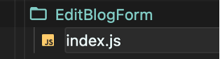

### 21.	Masukkan kode berikut ke dalam index.js pada screens/EditBlogForm
```jsx
import React, {useEffect, useState} from 'react';
import {View, Text, TextInput, TouchableOpacity, StyleSheet, ScrollView, ActivityIndicator} from 'react-native';
import {ArrowLeft} from 'iconsax-react-native';
import {useNavigation} from '@react-navigation/native';
import {fontType, colors} from '../../theme';
import axios from 'axios';

const EditBlogForm = ({route}) => {
const {blogId} = route.params;
  const dataCategory = [
    {id: 1, name: 'Food'},
    {id: 2, name: 'Sports'},
    {id: 3, name: 'Technology'},
    {id: 4, name: 'Fashion'},
    {id: 5, name: 'Health'},
    {id: 6, name: 'Lifestyle'},
    {id: 7, name: 'Music'},
    {id: 8, name: 'Car'},
  ];
  const [blogData, setBlogData] = useState({
    title: '',
    content: '',
    category: {},
    totalLikes: 0,
    totalComments: 0,
  });
  const handleChange = (key, value) => {
    setBlogData({
      ...blogData,
      [key]: value,
    });
  };
  const [image, setImage] = useState(null);
  const navigation = useNavigation();
  const [loading, setLoading] = useState(true);
  useEffect(() => {
    getBlogById();
  }, [blogId]);

  const getBlogById = async () => {
    try {
      const response = await axios.get(
        `link endpoint API/${blogId}`,
      );
      setBlogData({
        title : response.data.title,
        content : response.data.content,
        category : {
            id : response.data.category.id,
            name : response.data.category.name
        }
      })
    setImage(response.data.image)
      setLoading(false);
    } catch (error) {
      console.error(error);
    }
  };
  const handleUpdate = async () => {
    setLoading(true);
    try {
      await axios
        .put(`link endpoint API/${blogId}`, {
          title: blogData.title,
          category: blogData.category,
          image,
          content: blogData.content,
          totalComments: blogData.totalComments,
          totalLikes: blogData.totalLikes,
        })
        .then(function (response) {
          console.log(response);
        })
        .catch(function (error) {
          console.log(error);
        });
      setLoading(false);
      navigation.navigate('Profile');
    } catch (e) {
      console.log(e);
    }
  };

  return (
    <View style={styles.container}>
      <View style={styles.header}>
        <TouchableOpacity onPress={() => navigation.goBack()}>
          <ArrowLeft color={colors.black()} variant="Linear" size={24} />
        </TouchableOpacity>
        <View style={{flex: 1, alignItems: 'center'}}>
          <Text style={styles.title}>Edit blog</Text>
        </View>
      </View>
      <ScrollView
        contentContainerStyle={{
          paddingHorizontal: 24,
          paddingVertical: 10,
          gap: 10,
        }}>
        <View style={textInput.borderDashed}>
          <TextInput
            placeholder="Title"
            value={blogData.title}
            onChangeText={text => handleChange('title', text)}
            placeholderTextColor={colors.grey(0.6)}
            multiline
            style={textInput.title}
          />
        </View>
        <View style={[textInput.borderDashed, {minHeight: 250}]}>
          <TextInput
            placeholder="Content"
            value={blogData.content}
            onChangeText={text => handleChange('content', text)}
            placeholderTextColor={colors.grey(0.6)}
            multiline
            style={textInput.content}
          />
        </View>
        <View style={[textInput.borderDashed]}>
          <TextInput
            placeholder="Image"
            value={image}
            onChangeText={text => setImage(text)}
            placeholderTextColor={colors.grey(0.6)}
            style={textInput.content}
          />
        </View>
        <View style={[textInput.borderDashed]}>
          <Text
            style={{
              fontSize: 12,
              fontFamily: fontType['Pjs-Regular'],
              color: colors.grey(0.6),
            }}>
            Category
          </Text>
          <View style={category.container}>
            {dataCategory.map((item, index) => {
              const bgColor =
                item.id === blogData.category.id
                  ? colors.black()
                  : colors.grey(0.08);
              const color =
                item.id === blogData.category.id
                  ? colors.white()
                  : colors.grey();
              return (
                <TouchableOpacity
                  key={index}
                  onPress={() =>
                    handleChange('category', {id: item.id, name: item.name})
                  }
                  style={[category.item, {backgroundColor: bgColor}]}>
                  <Text style={[category.name, {color: color}]}>
                    {item.name}
                  </Text>
                </TouchableOpacity>
              );
            })}
          </View>
        </View>
      </ScrollView>
      <View style={styles.bottomBar}>
        <TouchableOpacity style={styles.button} onPress={handleUpdate}>
          <Text style={styles.buttonLabel}>Update</Text>
        </TouchableOpacity>
      </View>
      {loading && (
        <View style={styles.loadingOverlay}>
          <ActivityIndicator size="large" color={colors.blue()} />
        </View>
      )}
    </View>
  );
};

export default EditBlogForm;

const styles = StyleSheet.create({
  container: {
    flex: 1,
    backgroundColor: colors.white(),
  },
  header: {
    paddingHorizontal: 24,
    flexDirection: 'row',
    alignItems: 'center',
    height: 52,
    elevation: 8,
    paddingTop: 8,
    paddingBottom: 4,
  },
  title: {
    fontFamily: fontType['Pjs-Bold'],
    fontSize: 16,
    color: colors.black(),
  },
  bottomBar: {
    backgroundColor: colors.white(),
    alignItems: 'flex-end',
    paddingHorizontal: 24,
    paddingVertical: 10,
    shadowColor: colors.black(),
    shadowOffset: {
      width: 0,
      height: 2,
    },
    shadowOpacity: 0.25,
    shadowRadius: 3.84,

    elevation: 5,
  },
  button: {
    paddingHorizontal: 20,
    paddingVertical: 10,
    backgroundColor: colors.blue(),
    borderRadius: 20,
    justifyContent: 'center',
    alignItems: 'center',
  },
  buttonLabel: {
    fontSize: 14,
    fontFamily: fontType['Pjs-SemiBold'],
    color: colors.white(),
  },
  loadingOverlay: {
    position: 'absolute',
    top: 0,
    left: 0,
    right: 0,
    bottom: 0,
    backgroundColor: colors.black(0.4),
    justifyContent: 'center',
    alignItems: 'center',
  },
});
const textInput = StyleSheet.create({
  borderDashed: {
    borderStyle: 'dashed',
    borderWidth: 1,
    borderRadius: 5,
    padding: 10,
    borderColor: colors.grey(0.4),
  },
  title: {
    fontSize: 16,
    fontFamily: fontType['Pjs-SemiBold'],
    color: colors.black(),
    padding: 0,
  },
  content: {
    fontSize: 12,
    fontFamily: fontType['Pjs-Regular'],
    color: colors.black(),
    padding: 0,
  },
});
const category = StyleSheet.create({
  title: {
    fontSize: 12,
    fontFamily: fontType['Pjs-Regular'],
    color: colors.grey(0.6),
  },
  container: {
    flexWrap: 'wrap',
    flexDirection: 'row',
    gap: 10,
    marginTop: 10,
  },
  item: {
    paddingHorizontal: 14,
    paddingVertical: 10,
    borderRadius: 25,
  },
  name: {
    fontSize: 10,
    fontFamily: fontType['Pjs-Medium'],
  },
});
```

### 22.	Jangan lupa untuk melakukan export import pada file index.js pada folder screens
```jsx
import Home from "./Home";
import BlogDetail from "./BlogDetail";
import Discover from "./Discover";
import Bookmark from "./Bookmark";
import Profile from "./Profile";
import Search from "./Search";
import AddBlogForm from "./AddBlogForm";
import EditBlogForm from "./EditBlogForm";
export {Home, BlogDetail, Discover, Bookmark, Profile, Search, AddBlogForm, EditBlogForm}
```

### 23.	Tambahkan Stack Screen baru pada Router.js pada folder navigation seperti kode berikut, pastikan screen sudah ter import
```jsx
<Stack.Screen
        name="EditBlog"
        component={EditBlogForm}
        options={{
          headerShown: false,
          animationEnabled: true,
          animationTypeForReplace: 'pop',
          gestureEnabled: true,
          gestureDirection: 'horizontal',
          ...TransitionPresets.SlideFromRightIOS,
        }}
      />
```

### 24.	Lalu buka file index.js yang berada di dalam folder screens/BlogDetail, ubah kodenya menjadi seperti berikut dan masukkan link endpoint dari API
```jsx
import {StyleSheet, Text, View, ScrollView, TouchableOpacity, Animated, ActivityIndicator} from 'react-native';
import React, {useState, useRef, useEffect} from 'react';
import {ArrowLeft, Like1, Receipt21, Message, Share, More} from 'iconsax-react-native';
import {useNavigation} from '@react-navigation/native';
import FastImage from 'react-native-fast-image';
import {fontType, colors} from '../../theme';
import {formatNumber} from '../../utils/formatNumber';
import {formatDate} from '../../utils/formatDate';
import axios from 'axios';
import ActionSheet from 'react-native-actions-sheet';

const BlogDetail = ({route}) => {
  const {blogId} = route.params;
  const [iconStates, setIconStates] = useState({
    liked: {variant: 'Linear', color: colors.grey(0.6)},
    bookmarked: {variant: 'Linear', color: colors.grey(0.6)},
  });
  const [selectedBlog, setSelectedBlog] = useState(null);
  const [loading, setLoading] = useState(true);

  const actionSheetRef = useRef(null);

  const openActionSheet = () => {
    actionSheetRef.current?.show();
  };

  const closeActionSheet = () => {
    actionSheetRef.current?.hide();
  };

  useEffect(() => {
    getBlogById();
  }, [blogId]);

  const getBlogById = async () => {
    try {
      const response = await axios.get(
        `link endpoint API/${blogId}`,
      );
      setSelectedBlog(response.data);
      setLoading(false);
    } catch (error) {
      console.error(error);
    }
  };

  const navigateEdit = () => {
    closeActionSheet()
    navigation.navigate('EditBlog', {blogId})
  }
  const handleDelete = async () => {
   await axios.delete(`link endpoint API/${blogId}`)
      .then(() => {
        closeActionSheet()
        navigation.navigate('Profile');
      })
      .catch((error) => {
        console.error(error);
      });
  }

  const navigation = useNavigation();
  const scrollY = useRef(new Animated.Value(0)).current;
  const diffClampY = Animated.diffClamp(scrollY, 0, 52);
  const headerY = diffClampY.interpolate({
    inputRange: [0, 52],
    outputRange: [0, -52],
  });
  const bottomBarY = diffClampY.interpolate({
    inputRange: [0, 52],
    outputRange: [0, 52],
  });

  const toggleIcon = iconName => {
    setIconStates(prevStates => ({
      ...prevStates,
      [iconName]: {
        variant: prevStates[iconName].variant === 'Linear' ? 'Bold' : 'Linear',
        color:
          prevStates[iconName].variant === 'Linear'
            ? colors.blue()
            : colors.grey(0.6),
      },
    }));
  };
  return (
    <View style={styles.container}>
      <Animated.View
        style={[styles.header, {transform: [{translateY: headerY}]}]}>
        <TouchableOpacity onPress={() => navigation.goBack()}>
          <ArrowLeft color={colors.grey(0.6)} variant="Linear" size={24} />
        </TouchableOpacity>
        <View style={{flexDirection: 'row', justifyContent: 'center', gap: 20}}>
          <Share color={colors.grey(0.6)} variant="Linear" size={24} />
          <TouchableOpacity onPress={openActionSheet}>
            <More
              color={colors.grey(0.6)}
              variant="Linear"
              style={{transform: [{rotate: '90deg'}]}}
            />
          </TouchableOpacity>
        </View>
      </Animated.View>
      {loading ? (
        <View style={{justifyContent: 'center', alignItems: 'center', flex: 1}}>
          <ActivityIndicator size={'large'} color={colors.blue()} />
        </View>
      ) : (
        <Animated.ScrollView
          showsVerticalScrollIndicator={false}
          onScroll={Animated.event(
            [{nativeEvent: {contentOffset: {y: scrollY}}}],
            {useNativeDriver: true},
          )}
          contentContainerStyle={{
            paddingHorizontal: 24,
            paddingTop: 62,
            paddingBottom: 54,
          }}>
          <FastImage
            style={styles.image}
            source={{
              uri: selectedBlog?.image,
              headers: {Authorization: 'someAuthToken'},
              priority: FastImage.priority.high,
            }}
            resizeMode={FastImage.resizeMode.cover}></FastImage>
          <View
            style={{
              flexDirection: 'row',
              justifyContent: 'space-between',
              marginTop: 15,
            }}>
            <Text style={styles.category}>{selectedBlog?.category.name}</Text>
            <Text style={styles.date}>
              {formatDate(selectedBlog?.createdAt)}
            </Text>
          </View>
          <Text style={styles.title}>{selectedBlog?.title}</Text>
          <Text style={styles.content}>{selectedBlog?.content}</Text>
        </Animated.ScrollView>
      )}
      <Animated.View
        style={[styles.bottomBar, {transform: [{translateY: bottomBarY}]}]}>
        <View style={{flexDirection: 'row', gap: 5, alignItems: 'center'}}>
          <TouchableOpacity onPress={() => toggleIcon('liked')}>
            <Like1
              color={iconStates.liked.color}
              variant={iconStates.liked.variant}
              size={24}
            />
          </TouchableOpacity>
          <Text style={styles.info}>
            {formatNumber(selectedBlog?.totalLikes)}
          </Text>
        </View>
        <View style={{flexDirection: 'row', gap: 5, alignItems: 'center'}}>
          <Message color={colors.grey(0.6)} variant="Linear" size={24} />
          <Text style={styles.info}>
            {formatNumber(selectedBlog?.totalComments)}
          </Text>
        </View>
        <TouchableOpacity onPress={() => toggleIcon('bookmarked')}>
          <Receipt21
            color={iconStates.bookmarked.color}
            variant={iconStates.bookmarked.variant}
            size={24}
          />
        </TouchableOpacity>
      </Animated.View>
      <ActionSheet
        ref={actionSheetRef}
        containerStyle={{
          borderTopLeftRadius: 25,
          borderTopRightRadius: 25,
        }}
        indicatorStyle={{
          width: 100,
        }}
        gestureEnabled={true}
        defaultOverlayOpacity={0.3}>
        <TouchableOpacity
          style={{
            justifyContent: 'center',
            alignItems: 'center',
            paddingVertical: 15,
          }}
          onPress={navigateEdit}
          >
          <Text
            style={{
              fontFamily: fontType['Pjs-Medium'],
              color: colors.black(),
              fontSize: 18,
            }}>
            Edit
          </Text>
        </TouchableOpacity>
        <TouchableOpacity
          style={{
            justifyContent: 'center',
            alignItems: 'center',
            paddingVertical: 15,
          }}
          onPress={handleDelete}>
          <Text
            style={{
              fontFamily: fontType['Pjs-Medium'],
              color: colors.black(),
              fontSize: 18,
            }}>
            Delete
          </Text>
        </TouchableOpacity>
        <TouchableOpacity
          style={{
            justifyContent: 'center',
            alignItems: 'center',
            paddingVertical: 15,
          }}
          onPress={closeActionSheet}>
          <Text
            style={{
              fontFamily: fontType['Pjs-Medium'],
              color: 'red',
              fontSize: 18,
            }}>
            Cancel
          </Text>
        </TouchableOpacity>
      </ActionSheet>
    </View>
  );
};

export default BlogDetail;

const styles = StyleSheet.create({
  container: {
    flex: 1,
    backgroundColor: colors.white(),
  },
  header: {
    paddingHorizontal: 24,
    justifyContent: 'space-between',
    flexDirection: 'row',
    alignItems: 'center',
    height: 52,
    paddingTop: 8,
    paddingBottom: 4,
    position: 'absolute',
    zIndex: 1000,
    top: 0,
    right: 0,
    left: 0,
    backgroundColor: colors.white(),
  },
  bottomBar: {
    position: 'absolute',
    zIndex: 1000,
    backgroundColor: colors.white(),
    paddingVertical: 14,
    paddingHorizontal: 60,
    bottom: 0,
    left: 0,
    right: 0,
    flexDirection: 'row',
    justifyContent: 'space-between',
  },
  image: {
    height: 200,
    width: 'auto',
    borderRadius: 15,
  },
  info: {
    color: colors.grey(0.6),
    fontFamily: fontType['Pjs-SemiBold'],
    fontSize: 12,
  },
  category: {
    color: colors.blue(),
    fontFamily: fontType['Pjs-SemiBold'],
    fontSize: 12,
  },
  date: {
    color: colors.grey(0.6),
    fontFamily: fontType['Pjs-Medium'],
    fontSize: 10,
  },
  title: {
    fontSize: 16,
    fontFamily: fontType['Pjs-Bold'],
    color: colors.black(),
    marginTop: 10,
  },
  content: {
    color: colors.grey(),
    fontFamily: fontType['Pjs-Medium'],
    fontSize: 10,
    lineHeight: 20,
    marginTop: 15,
  },
});
```

### 25.	Jika sudah hasilnya seperti gambar berikut

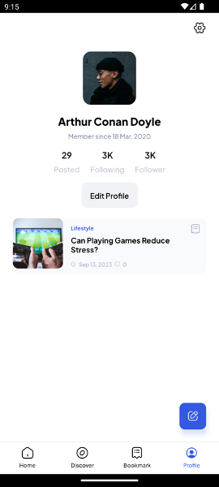
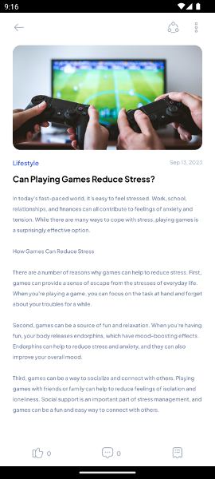

## 8.8	Tugas Praktikum
Silahkan buat menerapkan REST API (GET, POST, PUT, DELETE) pada project masing masing sesuai tema yang sudah ditentukan!