# BAB 9 - Firebase

## 9.1 Tujuan Pembelajaran

1.	Mahasiswa dapat memahami konsep dari Firebase
2.	Mahasiswa dapat menggunakan Firebase Store untuk menyimpan data
3.	Mahasiswa dapat menggunakan Firebase Storage untuk menyimpan berkas

## 9.2 Software yang di butuhkan

1. Java JDK
2. Node.Js
3. Visual Studio Code
4. Chocolatey
5. Android Studio
6. Android SDK

## 9.3	Firebase

Firebase adalah platform pengembangan aplikasi mobile yang disediakan oleh Google. Ini adalah platform yang kuat yang menyediakan berbagai layanan yang memudahkan pengembangan dan manajemen aplikasi, tanpa perlu memikirkan infrastruktur server. Firebase menyediakan berbagai layanan termasuk otentikasi pengguna, basis data realtime, penyimpanan berkas, analitik, dan banyak lainnya.

Firebase berfungsi sebagai Backend-as-a-Service (BaaS) yang memungkinkan pengembang aplikasi untuk fokus pada pengembangan frontend tanpa harus khawatir tentang mengelola infrastruktur server. Firebase menyediakan API yang mudah digunakan untuk berbagai layanan, dan infrastruktur server dikelola sepenuhnya oleh Firebase. Firebase akan menyimpan data, berkas, dan informasi lainnya di server mereka dan mengirimkannya kembali ke aplikasi sesuai dengan permintaan.

## 9.4	Firestore

Firebase Firestore adalah layanan database cloud yang dapat digunakan untuk menyimpan, mengambil, dan mengelola data secara realtime. Firestore adalah database NoSQL yang memungkinkan untuk menyimpan data dalam bentuk dokumen. Dokumen-dokumen ini dapat diorganisasi dalam koleksi yang mirip dengan tabel dalam database relasional.

Firestore mendukung fitur-fitur seperti query yang kuat, realtime synchronization, dan keamanan data yang dapat dikustomisasi. Ini sangat berguna dalam pengembangan aplikasi yang membutuhkan penyimpanan data yang skalabel dan mendukung aplikasi yang membutuhkan fitur kolaborasi secara realtime.


## 9.5	FirebaseStorage

Firebase Storage adalah layanan yang memungkinkan untuk menyimpan berkas seperti gambar, video, audio, dan berkas lainnya di cloud Firebase. Ini berguna ketika ingin menyimpan konten media yang akan diakses oleh aplikasi mobile.

Firebase Storage memungkinkan untuk mengunggah, mengambil, dan mengelola berkas-berkas ini dengan mudah melalui SDK Firebase. Ini berguna untu menyimpan gambar profil pengguna, video, file konfigurasi, atau berkas lain yang dibutuhkan oleh aplikasi.

Dengan menggunakan Firebase Storage, pengembang dapat menghindari mengelola server atau infrastruktur penyimpanan sendiri, sehingga fokus bisa lebih terarah pada pengembangan fitur dan fungsionalitas dari aplikasi.

## 9.6	Langkah – langkah praktikum

### 1.	Buka project sebelumnya lalu install package yang dibutuhkan untuk menggunakan firebase seperti kode berikut

```bash
npm i @react-native-firebase/app @react-native-firebase/storage @react-native-firebase/firestore
```

### 2.	Lalu buka website firebase https://console.firebase.google.com/ pada browser dan buat akun firebase, lalu buat juga projek baru.

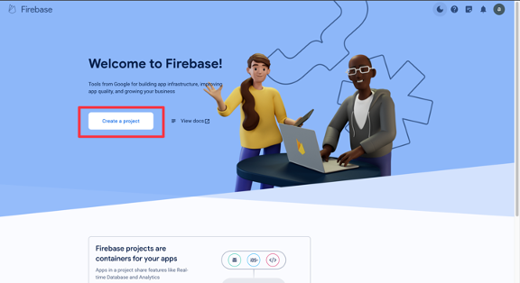

### 3.	Masukkan nama project seperti berikut

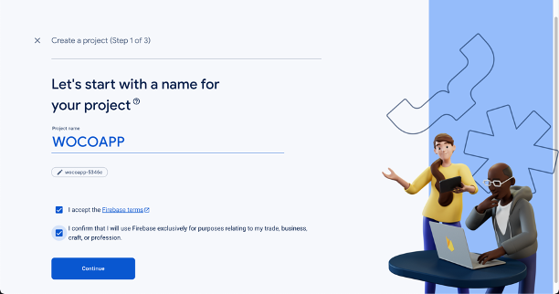

### 4.	Selanjutnya langsung klik continue saja


### 5.	Selanjutnya klik pada accept pada google analytic terms. Lalu klik create project dan tunggu prosesnya sampai selesai

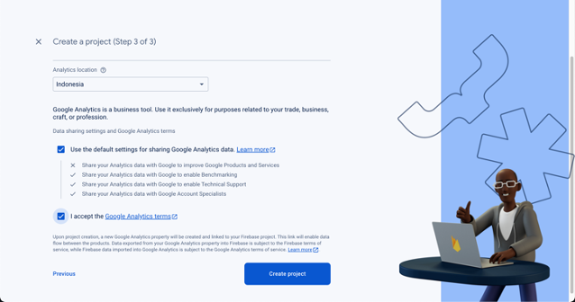

### 6.	Untuk menambahkan App klik logo android seperti berikut.

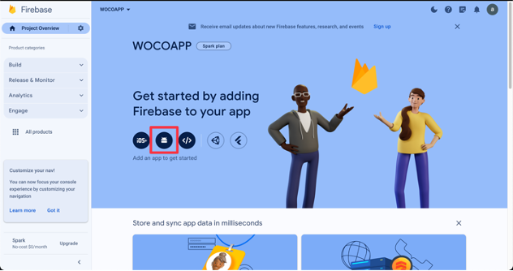

### 7.	Maka website firebase akan tampil seperti ini.

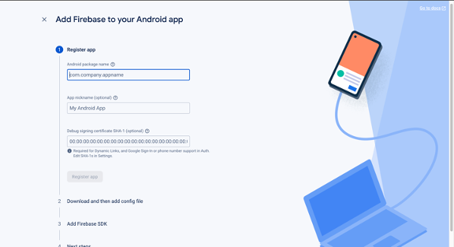

### 8.	Lalu buka file build.gradle pada folder android/app. Lalu copy pada bagian namespace dan masukkan ke Android Package Name di website firebase.

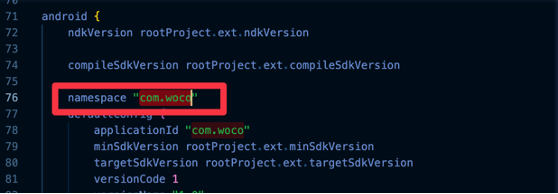

### 9.	Selanjutnya bisa langsung klik Register App.

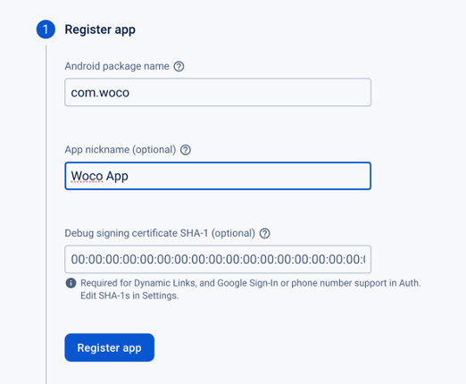

### 10.	Download google-services.json 

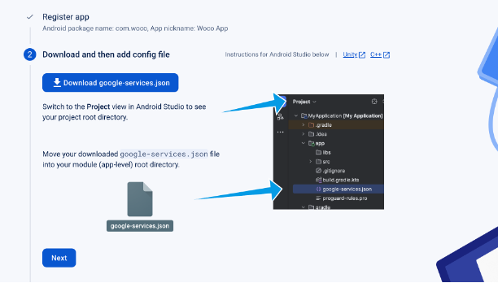

### 11. Lalu masukkan ke dalam folder android/app

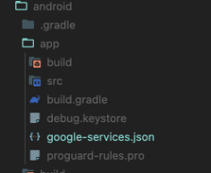

### 12.	Masuk ke dalam folder android dan buka file build.gradle

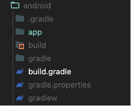

Lalu masukkan kode berikut pada bagian dependencies 

```bash
classpath 'com.google.gms:google-services:4.4.0'
```

### 13.	Selanjutnya buka file build.gradle yang berada pada folder android/app dan masukkan kode berikut di bagian paling bawah.

```bash
apply plugin: 'com.google.gms.google-services'
```

### 14.	Lalu klik next saja sampai continue to console.

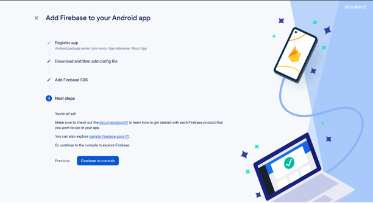

### 15.	Buka pada bagian Build lalu pilih Firestore Database, lalu klik Create Database.

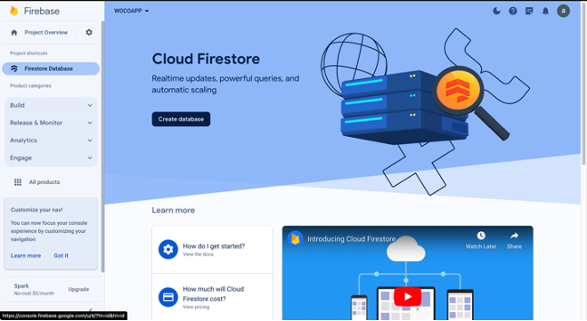

### 16.	Selanjutnya pilih lokasi cloud dari firestore yaitu yang asia-southeast2(Jakarta), lalu klik Next

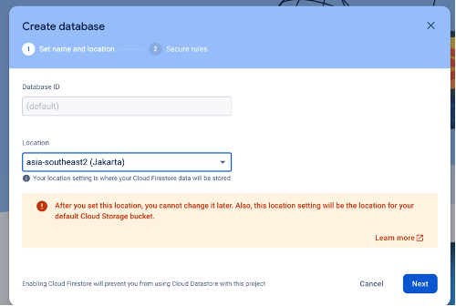

### 17.	Selanjutnya pilih Start in test mode lalu klik Enable

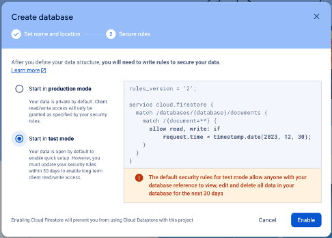

### 18.	Jika sudah akan tampil halaman seperti berikut.

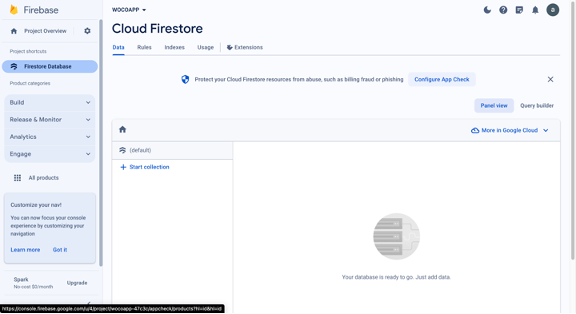

### 19.	Lalu klik pada bagian Tab Rules

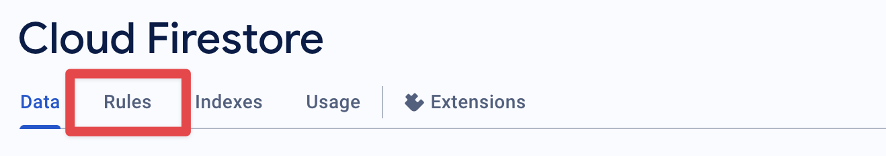

### 20.	Ubah perizinan menjadi true, lalu klik Publish

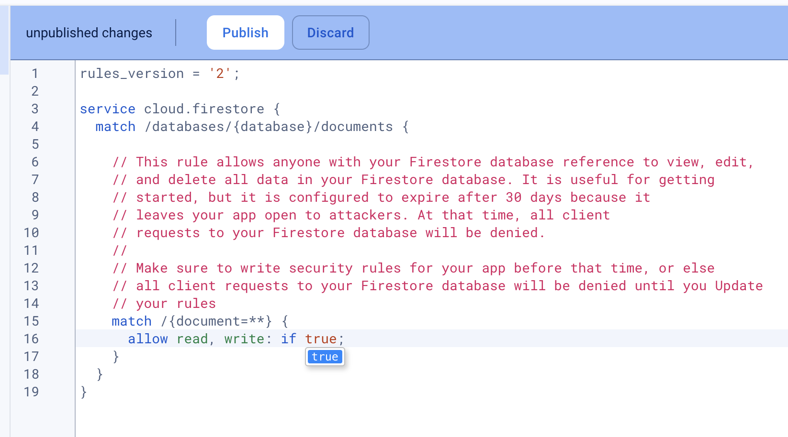

### 21.	Buka pada bagian Build lalu pilih Storage, lalu klik Get Started.

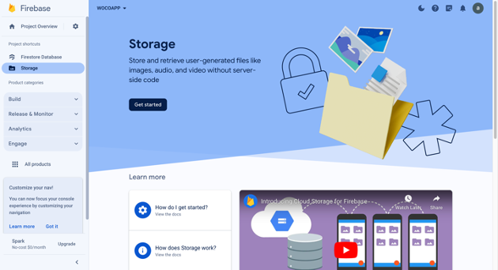

### 22.	Pilih yang Start in Test Mode

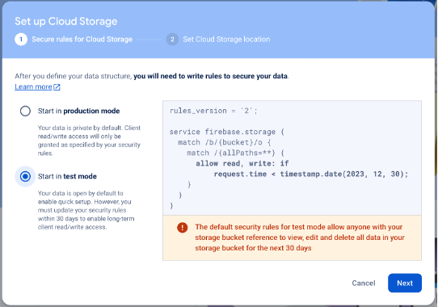

### 23.	Selanjutnya langsung klik Done

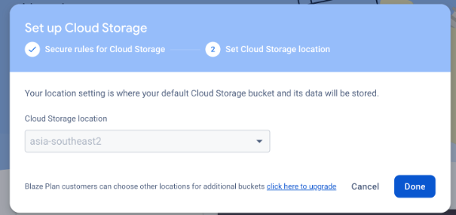

### 24.	Lalu klik pada Rules bagian Tab 

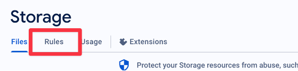

### 25.	Ubah perizinan dari yang awalnya false menjadi true, lalu klik Publish

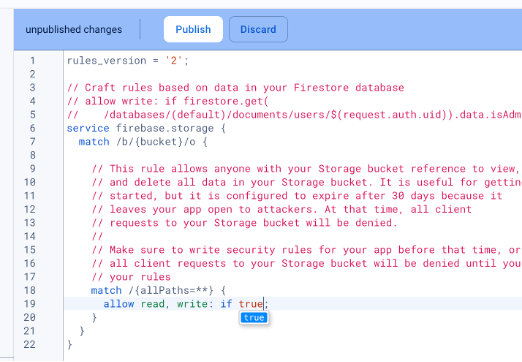

### 26.	Install juga package berikut agar bisa memilih gambar.

```bash
npm install react-native-image-crop-picker -–save
```

### 27.	Buka file build.gradle yang berada pada folder android, letakkan pada bagian repositories.

```jsx
// ADD THIS
maven { url 'https://maven.google.com' }
// ADD THIS
maven { url "https://www.jitpack.io" }
```

### 28.	Buka file build.gradle yang berada pada folder android/app, letakkan pada bagian defaultConfig

```jsx
vectorDrawables.useSupportLibrary = true
targetSdkVersion 27
```

### 29.	Setelah itu jalankan project dengan perintah berikut

```bash
npx react-native run-android
```

### 30.	Lalu buka kembali file index.js pada folder AddBlogForm

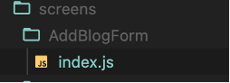

### 31.	Lalu ubah kode pada bagian import menjadi seperti berikut

```jsx
import React, {useState} from 'react';
import {View, Text, TextInput, TouchableOpacity, StyleSheet, ScrollView, ActivityIndicator} from 'react-native';
import FastImage from 'react-native-fast-image';
import {ArrowLeft, AddSquare, Add} from 'iconsax-react-native';
import {useNavigation} from '@react-navigation/native';
import {fontType, colors} from '../../theme';
import ImagePicker from 'react-native-image-crop-picker';
import storage from '@react-native-firebase/storage';
import firestore from '@react-native-firebase/firestore';
```

### 32.	Buat fungsi dengan nama handleImagePick untuk menangani fungsi pemilihan gambar ke file storage, seperti kode berikut

```jsx
  const handleImagePick = async () => {
    ImagePicker.openPicker({
      width: 1920,
      height: 1080,
      cropping: true,
    })
      .then(image => {
        console.log(image);
        setImage(image.path);
      })
      .catch(error => {
        console.log(error);
      });
  };
```

### 33.	Lalu ubah fungsi handleUpload menjadi seperti berikut.

```jsx
const handleUpload = async () => {
    let filename = image.substring(image.lastIndexOf('/') + 1);
    const extension = filename.split('.').pop();
    const name = filename.split('.').slice(0, -1).join('.');
    filename = name + Date.now() + '.' + extension;
    const reference = storage().ref(`blogimages/${filename}`);

    setLoading(true);
    try {
      await reference.putFile(image);
      const url = await reference.getDownloadURL();
      await firestore().collection('blog').add({
        title: blogData.title,
        category: blogData.category,
        image: url,
        content: blogData.content,
        totalComments: blogData.totalComments,
        totalLikes: blogData.totalLikes,
        createdAt: new Date(),
      });
      setLoading(false);
      console.log('Blog added!');
      navigation.navigate('Profile');
    } catch (error) {
      console.log(error);
    }
  };
```

### 34.	Ubah return komponen dari AddBlogForm menjadi seperti berikut

```jsx
<View style={styles.container}>
      <View style={styles.header}>
        <TouchableOpacity onPress={() => navigation.goBack()}>
          <ArrowLeft color={colors.black()} variant="Linear" size={24} />
        </TouchableOpacity>
        <View style={{flex: 1, alignItems: 'center'}}>
          <Text style={styles.title}>Write blog</Text>
        </View>
      </View>
      <ScrollView
        contentContainerStyle={{
          paddingHorizontal: 24,
          paddingVertical: 10,
          gap: 10,
        }}>
        <View style={textInput.borderDashed}>
          <TextInput
            placeholder="Title"
            value={blogData.title}
            onChangeText={text => handleChange('title', text)}
            placeholderTextColor={colors.grey(0.6)}
            multiline
            style={textInput.title}
          />
        </View>
        <View style={[textInput.borderDashed, {minHeight: 250}]}>
          <TextInput
            placeholder="Content"
            value={blogData.content}
            onChangeText={text => handleChange('content', text)}
            placeholderTextColor={colors.grey(0.6)}
            multiline
            style={textInput.content}
          />
        </View>
        <View style={[textInput.borderDashed]}>
          <Text style={category.title}>Category</Text>
          <View style={category.container}>
            {dataCategory.map((item, index) => {
              const bgColor =
                item.id === blogData.category.id
                  ? colors.black()
                  : colors.grey(0.08);
              const color =
                item.id === blogData.category.id
                  ? colors.white()
                  : colors.grey();
              return (
                <TouchableOpacity
                  key={index}
                  onPress={() =>
                    handleChange('category', {id: item.id, name: item.name})
                  }
                  style={[category.item, {backgroundColor: bgColor}]}>
                  <Text style={[category.name, {color: color}]}>
                    {item.name}
                  </Text>
                </TouchableOpacity>
              );
            })}
          </View>
        </View>
        {image ? (
          <View style={{position: 'relative'}}>
            <FastImage
              style={{width: '100%', height: 127, borderRadius: 5}}
              source={{
                uri: image,
                headers: {Authorization: 'someAuthToken'},
                priority: FastImage.priority.high,
              }}
              resizeMode={FastImage.resizeMode.cover}
            />
            <TouchableOpacity
              style={{
                position: 'absolute',
                top: -5,
                right: -5,
                backgroundColor: colors.blue(),
                borderRadius: 25,
              }}
              onPress={() => setImage(null)}>
              <Add
                size={20}
                variant="Linear"
                color={colors.white()}
                style={{transform: [{rotate: '45deg'}]}}
              />
            </TouchableOpacity>
          </View>
        ) : (
          <TouchableOpacity onPress={handleImagePick}>
            <View
              style={[
                textInput.borderDashed,
                {
                  gap: 10,
                  paddingVertical: 30,
                  justifyContent: 'center',
                  alignItems: 'center',
                },
              ]}>
              <AddSquare color={colors.grey(0.6)} variant="Linear" size={42} />
              <Text
                style={{
                  fontFamily: fontType['Pjs-Regular'],
                  fontSize: 12,
                  color: colors.grey(0.6),
                }}>
                Upload Thumbnail
              </Text>
            </View>
          </TouchableOpacity>
        )}
      </ScrollView>
      <View style={styles.bottomBar}>
        <TouchableOpacity style={styles.button} onPress={handleUpload}>
          <Text style={styles.buttonLabel}>Upload</Text>
        </TouchableOpacity>
      </View>
      {loading && (
        <View style={styles.loadingOverlay}>
          <ActivityIndicator size="large" color={colors.blue()} />
        </View>
      )}
    </View>
```

### 35.	Jika sudah hasil tampilan akan seperti berikut.

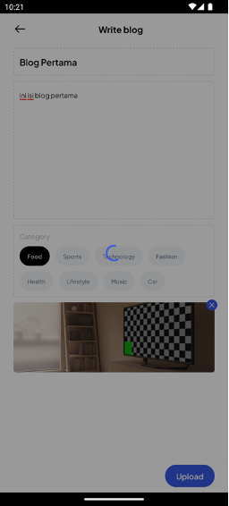

### 36.	Selanjutnya buka file formatDate.js pada folder src/utils, ubah variable createdAtDate menjadi seperti berikut

```jsx
const createdAtDate = new Date(createdAt.seconds * 1000 + createdAt.nanoseconds / 1000000);
```

### 37.	Ubah kode file index.js pada folder screens/Profile menjadi seperti berikut

```jsx
import {ScrollView, StyleSheet, Text, View, TouchableOpacity, ActivityIndicator, RefreshControl} from 'react-native';
import {Edit, Setting2} from 'iconsax-react-native';
import React, {useEffect, useState, useCallback} from 'react';
import FastImage from 'react-native-fast-image';
import {ProfileData} from '../../../data';
import {ItemSmall} from '../../components';
import {useNavigation} from '@react-navigation/native';
import {fontType, colors} from '../../theme';
import firestore from '@react-native-firebase/firestore';
import {formatNumber} from '../../utils/formatNumber';

const Profile = () => {
  const navigation = useNavigation();
  const [loading, setLoading] = useState(true);
  const [blogData, setBlogData] = useState([]);
  const [refreshing, setRefreshing] = useState(false);
  useEffect(() => {
    const subscriber = firestore()
      .collection('blog')
      .onSnapshot(querySnapshot => {
        const blogs = [];
        querySnapshot.forEach(documentSnapshot => {
          blogs.push({
            ...documentSnapshot.data(),
            id: documentSnapshot.id,
          });
        });
        setBlogData(blogs);
        setLoading(false);
      });
    return () => subscriber();
  }, []);

  const onRefresh = useCallback(() => {
    setRefreshing(true);
    setTimeout(() => {
      firestore()
        .collection('blog')
        .onSnapshot(querySnapshot => {
          const blogs = [];
          querySnapshot.forEach(documentSnapshot => {
            blogs.push({
              ...documentSnapshot.data(),
              id: documentSnapshot.id,
            });
          });
          setBlogData(blogs);
        });
      setRefreshing(false);
    }, 1500);
  }, []);
  return (
    <View style={styles.container}>
      <View style={styles.header}>
        <TouchableOpacity>
          <Setting2 color={colors.black()} variant="Linear" size={24} />
        </TouchableOpacity>
      </View>
      <ScrollView
        showsVerticalScrollIndicator={false}
        contentContainerStyle={{
          paddingHorizontal: 24,
          gap: 10,
          paddingVertical: 20,
        }}
        refreshControl={
          <RefreshControl refreshing={refreshing} onRefresh={onRefresh} />
        }>
        <View style={{gap: 15, alignItems: 'center'}}>
          <FastImage
            style={profile.pic}
            source={{
              uri: ProfileData.profilePict,
              headers: {Authorization: 'someAuthToken'},
              priority: FastImage.priority.high,
            }}
            resizeMode={FastImage.resizeMode.cover}
          />
          <View style={{gap: 5, alignItems: 'center'}}>
            <Text style={profile.name}>{ProfileData.name}</Text>
            <Text style={profile.info}>
              Member since {ProfileData.createdAt}
            </Text>
          </View>
          <View style={{flexDirection: 'row', gap: 20}}>
            <View style={{alignItems: 'center', gap: 5}}>
              <Text style={profile.sum}>{ProfileData.blogPosted}</Text>
              <Text style={profile.tag}>Posted</Text>
            </View>
            <View style={{alignItems: 'center', gap: 5}}>
              <Text style={profile.sum}>
                {formatNumber(ProfileData.following)}
              </Text>
              <Text style={profile.tag}>Following</Text>
            </View>
            <View style={{alignItems: 'center', gap: 5}}>
              <Text style={profile.sum}>
                {formatNumber(ProfileData.follower)}
              </Text>
              <Text style={profile.tag}>Follower</Text>
            </View>
          </View>
          <TouchableOpacity style={profile.buttonEdit}>
            <Text style={profile.buttonText}>Edit Profile</Text>
          </TouchableOpacity>
        </View>
        <View style={{paddingVertical: 10, gap: 10}}>
          {loading ? (
            <ActivityIndicator size={'large'} color={colors.blue()} />
          ) : (
            blogData.map((item, index) => <ItemSmall item={item} key={index} />)
          )}
        </View>
      </ScrollView>
      <TouchableOpacity
        style={styles.floatingButton}
        onPress={() => navigation.navigate('AddBlog')}>
        <Edit color={colors.white()} variant="Linear" size={20} />
      </TouchableOpacity>
    </View>
  );
};

export default Profile;

const styles = StyleSheet.create({
  container: {
    flex: 1,
    backgroundColor: colors.white(),
    position: 'absolute',
    top: 0,
    left: 0,
    right: 0,
    bottom: 0,
  },
  header: {
    paddingHorizontal: 24,
    justifyContent: 'flex-end',
    flexDirection: 'row',
    alignItems: 'center',
    height: 52,
    elevation: 8,
    paddingTop: 8,
    paddingBottom: 4,
  },
  title: {
    fontSize: 20,
    fontFamily: fontType['Pjs-ExtraBold'],
    color: colors.black(),
  },
  floatingButton: {
    backgroundColor: colors.blue(),
    padding: 15,
    position: 'absolute',
    bottom: 24,
    right: 24,
    borderRadius: 10,
    shadowColor: colors.blue(),
    shadowOffset: {
      width: 0,
      height: 4,
    },
    shadowOpacity: 0.3,
    shadowRadius: 4.65,

    elevation: 8,
  },
});
const profile = StyleSheet.create({
  pic: {width: 100, height: 100, borderRadius: 15},
  name: {
    color: colors.black(),
    fontSize: 20,
    fontFamily: fontType['Pjs-ExtraBold'],
  },
  info: {
    fontSize: 12,
    fontFamily: fontType['Pjs-Regular'],
    color: colors.grey(),
  },
  sum: {
    fontSize: 16,
    fontFamily: fontType['Pjs-SemiBold'],
    color: colors.black(),
  },
  tag: {
    fontSize: 14,
    fontFamily: fontType['Pjs-Regular'],
    color: colors.grey(0.5),
  },
  buttonEdit: {
    paddingHorizontal: 16,
    paddingVertical: 14,
    backgroundColor: colors.grey(0.1),
    borderRadius: 10,
  },
  buttonText: {
    fontSize: 14,
    fontFamily: fontType['Pjs-SemiBold'],
    color: colors.black(),
  },
});
```

### 38.	Lalu buka file index.js yang berada di dalam folder screens/BlogDetail, dan ubah menjadi seperti berikut

```jsx
import {StyleSheet, Text, View, ScrollView, TouchableOpacity, Animated, ActivityIndicator} from 'react-native';
import React, {useState, useRef, useEffect} from 'react';
import {ArrowLeft, Like1, Receipt21, Message, Share, More} from 'iconsax-react-native';
import {useNavigation} from '@react-navigation/native';
import FastImage from 'react-native-fast-image';
import {fontType, colors} from '../../theme';
import firestore from '@react-native-firebase/firestore';
import storage from '@react-native-firebase/storage';
import {formatNumber} from '../../utils/formatNumber';
import {formatDate} from '../../utils/formatDate';
import ActionSheet from 'react-native-actions-sheet';

const BlogDetail = ({route}) => {
  const {blogId} = route.params;
  const navigation = useNavigation();
  const [iconStates, setIconStates] = useState({
    liked: {variant: 'Linear', color: colors.grey(0.6)},
    bookmarked: {variant: 'Linear', color: colors.grey(0.6)},
  });
  const [loading, setLoading] = useState(true);
  const [selectedBlog, setSelectedBlog] = useState(null);
  const actionSheetRef = useRef(null);
  const openActionSheet = () => {
    actionSheetRef.current?.show();
  };
  const closeActionSheet = () => {
    actionSheetRef.current?.hide();
  };
  useEffect(() => {
    const subscriber = firestore()
      .collection('blog')
      .doc(blogId)
      .onSnapshot(documentSnapshot => {
        const blogData = documentSnapshot.data();
        if (blogData) {
          console.log('Blog data: ', blogData);
          setSelectedBlog(blogData);
        } else {
          console.log(`Blog with ID ${blogId} not found.`);
        }
      });
    setLoading(false);
    return () => subscriber();
  }, [blogId]);
  const navigateEdit = () => {
    closeActionSheet();
    navigation.navigate('EditBlog', {blogId});
  };
  const handleDelete = async () => {
    setLoading(true);
    try {
      await firestore()
        .collection('blog')
        .doc(blogId)
        .delete()
        .then(() => {
          console.log('Blog deleted!');
        });
      if (selectedBlog?.image) {
        const imageRef = storage().refFromURL(selectedBlog?.image);
        await imageRef.delete();
      }
      console.log('Blog deleted!');
      closeActionSheet();
      setSelectedBlog(null);
      setLoading(false)
      navigation.navigate('Profile');
    } catch (error) {
      console.error(error);
    }
  };
  const scrollY = useRef(new Animated.Value(0)).current;
  const diffClampY = Animated.diffClamp(scrollY, 0, 52);
  const headerY = diffClampY.interpolate({
    inputRange: [0, 52],
    outputRange: [0, -52],
  });
  const bottomBarY = diffClampY.interpolate({
    inputRange: [0, 52],
    outputRange: [0, 52],
  });

  const toggleIcon = iconName => {
    setIconStates(prevStates => ({
      ...prevStates,
      [iconName]: {
        variant: prevStates[iconName].variant === 'Linear' ? 'Bold' : 'Linear',
        color:
          prevStates[iconName].variant === 'Linear'
            ? colors.blue()
            : colors.grey(0.6),
      },
    }));
  };
  return (
    <View style={styles.container}>
      <Animated.View
        style={[styles.header, {transform: [{translateY: headerY}]}]}>
        <TouchableOpacity onPress={() => navigation.goBack()}>
          <ArrowLeft color={colors.grey(0.6)} variant="Linear" size={24} />
        </TouchableOpacity>
        <View style={{flexDirection: 'row', justifyContent: 'center', gap: 20}}>
          <Share color={colors.grey(0.6)} variant="Linear" size={24} />
          <TouchableOpacity onPress={openActionSheet}>
            <More
              color={colors.grey(0.6)}
              variant="Linear"
              style={{transform: [{rotate: '90deg'}]}}
            />
          </TouchableOpacity>
        </View>
      </Animated.View>
      {loading ? (
        <View style={{justifyContent: 'center', alignItems: 'center', flex: 1}}>
          <ActivityIndicator size={'large'} color={colors.blue()} />
        </View>
      ) : (
        <Animated.ScrollView
          showsVerticalScrollIndicator={false}
          onScroll={Animated.event(
            [{nativeEvent: {contentOffset: {y: scrollY}}}],
            {useNativeDriver: true},
          )}
          contentContainerStyle={{
            paddingHorizontal: 24,
            paddingTop: 62,
            paddingBottom: 54,
          }}>
          <FastImage
            style={styles.image}
            source={{
              uri: selectedBlog?.image,
              headers: {Authorization: 'someAuthToken'},
              priority: FastImage.priority.high,
            }}
            resizeMode={FastImage.resizeMode.cover}></FastImage>
          <View
            style={{
              flexDirection: 'row',
              justifyContent: 'space-between',
              marginTop: 15,
            }}>
            <Text style={styles.category}>{selectedBlog?.category.name}</Text>
            <Text style={styles.date}>
              {formatDate(selectedBlog?.createdAt)}
            </Text>
          </View>
          <Text style={styles.title}>{selectedBlog?.title}</Text>
          <Text style={styles.content}>{selectedBlog?.content}</Text>
        </Animated.ScrollView>
      )}
      <Animated.View
        style={[styles.bottomBar, {transform: [{translateY: bottomBarY}]}]}>
        <View style={{flexDirection: 'row', gap: 5, alignItems: 'center'}}>
          <TouchableOpacity onPress={() => toggleIcon('liked')}>
            <Like1
              color={iconStates.liked.color}
              variant={iconStates.liked.variant}
              size={24}
            />
          </TouchableOpacity>
          <Text style={styles.info}>
            {formatNumber(selectedBlog?.totalLikes)}
          </Text>
        </View>
        <View style={{flexDirection: 'row', gap: 5, alignItems: 'center'}}>
          <Message color={colors.grey(0.6)} variant="Linear" size={24} />
          <Text style={styles.info}>
            {formatNumber(selectedBlog?.totalComments)}
          </Text>
        </View>
        <TouchableOpacity onPress={() => toggleIcon('bookmarked')}>
          <Receipt21
            color={iconStates.bookmarked.color}
            variant={iconStates.bookmarked.variant}
            size={24}
          />
        </TouchableOpacity>
      </Animated.View>
      <ActionSheet
        ref={actionSheetRef}
        containerStyle={{
          borderTopLeftRadius: 25,
          borderTopRightRadius: 25,
        }}
        indicatorStyle={{
          width: 100,
        }}
        gestureEnabled={true}
        defaultOverlayOpacity={0.3}>
        <TouchableOpacity
          style={{
            justifyContent: 'center',
            alignItems: 'center',
            paddingVertical: 15,
          }}
          onPress={navigateEdit}>
          <Text
            style={{
              fontFamily: fontType['Pjs-Medium'],
              color: colors.black(),
              fontSize: 18,
            }}>
            Edit
          </Text>
        </TouchableOpacity>
        <TouchableOpacity
          style={{
            justifyContent: 'center',
            alignItems: 'center',
            paddingVertical: 15,
          }}
          onPress={handleDelete}>
          <Text
            style={{
              fontFamily: fontType['Pjs-Medium'],
              color: colors.black(),
              fontSize: 18,
            }}>
            Delete
          </Text>
        </TouchableOpacity>
        <TouchableOpacity
          style={{
            justifyContent: 'center',
            alignItems: 'center',
            paddingVertical: 15,
          }}
          onPress={closeActionSheet}>
          <Text
            style={{
              fontFamily: fontType['Pjs-Medium'],
              color: 'red',
              fontSize: 18,
            }}>
            Cancel
          </Text>
        </TouchableOpacity>
      </ActionSheet>
    </View>
  );
};

export default BlogDetail;

const styles = StyleSheet.create({
  container: {
    flex: 1,
    backgroundColor: colors.white(),
  },
  header: {
    paddingHorizontal: 24,
    justifyContent: 'space-between',
    flexDirection: 'row',
    alignItems: 'center',
    height: 52,
    paddingTop: 8,
    paddingBottom: 4,
    position: 'absolute',
    zIndex: 1000,
    top: 0,
    right: 0,
    left: 0,
    backgroundColor: colors.white(),
  },
  bottomBar: {
    position: 'absolute',
    zIndex: 1000,
    backgroundColor: colors.white(),
    paddingVertical: 14,
    paddingHorizontal: 60,
    bottom: 0,
    left: 0,
    right: 0,
    flexDirection: 'row',
    justifyContent: 'space-between',
  },
  image: {
    height: 200,
    width: 'auto',
    borderRadius: 15,
  },
  info: {
    color: colors.grey(0.6),
    fontFamily: fontType['Pjs-SemiBold'],
    fontSize: 12,
  },
  category: {
    color: colors.blue(),
    fontFamily: fontType['Pjs-SemiBold'],
    fontSize: 12,
  },
  date: {
    color: colors.grey(0.6),
    fontFamily: fontType['Pjs-Medium'],
    fontSize: 10,
  },
  title: {
    fontSize: 16,
    fontFamily: fontType['Pjs-Bold'],
    color: colors.black(),
    marginTop: 10,
  },
  content: {
    color: colors.grey(),
    fontFamily: fontType['Pjs-Medium'],
    fontSize: 10,
    lineHeight: 20,
    marginTop: 15,
  },
});
```

### 39.	Ubah juga file index.js yang berada pada folder screens/EditBlogForm menjadi seperti berikut
```jsx
import React, {useEffect, useState} from 'react';
import {View, Text, TextInput, TouchableOpacity, StyleSheet, ScrollView, ActivityIndicator} from 'react-native';
import FastImage from 'react-native-fast-image';
import {ArrowLeft, AddSquare, Add} from 'iconsax-react-native';
import {useNavigation} from '@react-navigation/native';
import {fontType, colors} from '../../theme';
import ImagePicker from 'react-native-image-crop-picker';
import storage from '@react-native-firebase/storage';
import firestore from '@react-native-firebase/firestore';

const EditBlogForm = ({route}) => {
  const {blogId} = route.params;
  const dataCategory = [
    {id: 1, name: 'Food'},
    {id: 2, name: 'Sports'},
    {id: 3, name: 'Technology'},
    {id: 4, name: 'Fashion'},
    {id: 5, name: 'Health'},
    {id: 6, name: 'Lifestyle'},
    {id: 7, name: 'Music'},
    {id: 8, name: 'Car'},
  ];
  const [blogData, setBlogData] = useState({
    title: '',
    content: '',
    category: {},
    totalLikes: 0,
    totalComments: 0,
  });
  const handleChange = (key, value) => {
    setBlogData({
      ...blogData,
      [key]: value,
    });
  };
  const [image, setImage] = useState(null);
  const [oldImage, setOldImage] = useState(null);
  const navigation = useNavigation();
  const [loading, setLoading] = useState(true);
  useEffect(() => {
    const subscriber = firestore()
      .collection('blog')
      .doc(blogId)
      .onSnapshot(documentSnapshot => {
        const blogData = documentSnapshot.data();
        if (blogData) {
          console.log('Blog data: ', blogData);
          setBlogData({
            title: blogData.title,
            content: blogData.content,
            category: {
              id: blogData.category.id,
              name: blogData.category.name,
            },
          });
          setOldImage(blogData.image);
          setImage(blogData.image);
          setLoading(false);
        } else {
          console.log(`Blog with ID ${blogId} not found.`);
        }
      });
    setLoading(false);
    return () => subscriber();
  }, [blogId]);

  const handleImagePick = async () => {
    ImagePicker.openPicker({
      width: 1920,
      height: 1080,
      cropping: true,
    })
      .then(image => {
        console.log(image);
        setImage(image.path);
      })
      .catch(error => {
        console.log(error);
      });
  };

  const handleUpdate = async () => {
    setLoading(true);
    let filename = image.substring(image.lastIndexOf('/') + 1);
    const extension = filename.split('.').pop();
    const name = filename.split('.').slice(0, -1).join('.');
    filename = name + Date.now() + '.' + extension;
    const reference = storage().ref(`blogimages/${filename}`);
    try {
      if (image !== oldImage && oldImage) {
        const oldImageRef = storage().refFromURL(oldImage);
        await oldImageRef.delete();
      }
      if (image !== oldImage) {
        await reference.putFile(image);
      }
      const url =
        image !== oldImage ? await reference.getDownloadURL() : oldImage;
      await firestore().collection('blog').doc(blogId).update({
        title: blogData.title,
        category: blogData.category,
        image: url,
        content: blogData.content,
      });
      setLoading(false);
      console.log('Blog Updated!');
      navigation.navigate('BlogDetail', {blogId});
    } catch (error) {
      console.log(error);
    }
  };

  return (
    <View style={styles.container}>
      <View style={styles.header}>
        <TouchableOpacity onPress={() => navigation.goBack()}>
          <ArrowLeft color={colors.black()} variant="Linear" size={24} />
        </TouchableOpacity>
        <View style={{flex: 1, alignItems: 'center'}}>
          <Text style={styles.title}>Edit blog</Text>
        </View>
      </View>
      <ScrollView
        contentContainerStyle={{
          paddingHorizontal: 24,
          paddingVertical: 10,
          gap: 10,
        }}>
        <View style={textInput.borderDashed}>
          <TextInput
            placeholder="Title"
            value={blogData.title}
            onChangeText={text => handleChange('title', text)}
            placeholderTextColor={colors.grey(0.6)}
            multiline
            style={textInput.title}
          />
        </View>
        <View style={[textInput.borderDashed, {minHeight: 250}]}>
          <TextInput
            placeholder="Content"
            value={blogData.content}
            onChangeText={text => handleChange('content', text)}
            placeholderTextColor={colors.grey(0.6)}
            multiline
            style={textInput.content}
          />
        </View>
        <View style={[textInput.borderDashed]}>
          <Text
            style={{
              fontSize: 12,
              fontFamily: fontType['Pjs-Regular'],
              color: colors.grey(0.6),
            }}>
            Category
          </Text>
          <View style={category.container}>
            {dataCategory.map((item, index) => {
              const bgColor =
                item.id === blogData.category.id
                  ? colors.black()
                  : colors.grey(0.08);
              const color =
                item.id === blogData.category.id
                  ? colors.white()
                  : colors.grey();
              return (
                <TouchableOpacity
                  key={index}
                  onPress={() =>
                    handleChange('category', {id: item.id, name: item.name})
                  }
                  style={[category.item, {backgroundColor: bgColor}]}>
                  <Text style={[category.name, {color: color}]}>
                    {item.name}
                  </Text>
                </TouchableOpacity>
              );
            })}
          </View>
        </View>
        {image ? (
          <View style={{position: 'relative'}}>
            <FastImage
              style={{width: '100%', height: 127, borderRadius: 5}}
              source={{
                uri: image,
                headers: {Authorization: 'someAuthToken'},
                priority: FastImage.priority.high,
              }}
              resizeMode={FastImage.resizeMode.cover}
            />
            <TouchableOpacity
              style={{
                position: 'absolute',
                top: -5,
                right: -5,
                backgroundColor: colors.blue(),
                borderRadius: 25,
              }}
              onPress={() => setImage(null)}>
              <Add
                size={20}
                variant="Linear"
                color={colors.white()}
                style={{transform: [{rotate: '45deg'}]}}
              />
            </TouchableOpacity>
          </View>
        ) : (
          <TouchableOpacity onPress={handleImagePick}>
            <View
              style={[
                textInput.borderDashed,
                {
                  gap: 10,
                  paddingVertical: 30,
                  justifyContent: 'center',
                  alignItems: 'center',
                },
              ]}>
              <AddSquare color={colors.grey(0.6)} variant="Linear" size={42} />
              <Text
                style={{
                  fontFamily: fontType['Pjs-Regular'],
                  fontSize: 12,
                  color: colors.grey(0.6),
                }}>
                Upload Thumbnail
              </Text>
            </View>
          </TouchableOpacity>
        )}
      </ScrollView>
      <View style={styles.bottomBar}>
        <TouchableOpacity style={styles.button} onPress={handleUpdate}>
          <Text style={styles.buttonLabel}>Update</Text>
        </TouchableOpacity>
      </View>
      {loading && (
        <View style={styles.loadingOverlay}>
          <ActivityIndicator size="large" color={colors.blue()} />
        </View>
      )}
    </View>
  );
};

export default EditBlogForm;

const styles = StyleSheet.create({
  container: {
    flex: 1,
    backgroundColor: colors.white(),
  },
  header: {
    paddingHorizontal: 24,
    flexDirection: 'row',
    alignItems: 'center',
    height: 52,
    elevation: 8,
    paddingTop: 8,
    paddingBottom: 4,
  },
  title: {
    fontFamily: fontType['Pjs-Bold'],
    fontSize: 16,
    color: colors.black(),
  },
  bottomBar: {
    backgroundColor: colors.white(),
    alignItems: 'flex-end',
    paddingHorizontal: 24,
    paddingVertical: 10,
    shadowColor: colors.black(),
    shadowOffset: {
      width: 0,
      height: 2,
    },
    shadowOpacity: 0.25,
    shadowRadius: 3.84,

    elevation: 5,
  },
  button: {
    paddingHorizontal: 20,
    paddingVertical: 10,
    backgroundColor: colors.blue(),
    borderRadius: 20,
    justifyContent: 'center',
    alignItems: 'center',
  },
  buttonLabel: {
    fontSize: 14,
    fontFamily: fontType['Pjs-SemiBold'],
    color: colors.white(),
  },
  loadingOverlay: {
    position: 'absolute',
    top: 0,
    left: 0,
    right: 0,
    bottom: 0,
    backgroundColor: colors.black(0.4),
    justifyContent: 'center',
    alignItems: 'center',
  },
});
const textInput = StyleSheet.create({
  borderDashed: {
    borderStyle: 'dashed',
    borderWidth: 1,
    borderRadius: 5,
    padding: 10,
    borderColor: colors.grey(0.4),
  },
  title: {
    fontSize: 16,
    fontFamily: fontType['Pjs-SemiBold'],
    color: colors.black(),
    padding: 0,
  },
  content: {
    fontSize: 12,
    fontFamily: fontType['Pjs-Regular'],
    color: colors.black(),
    padding: 0,
  },
});
const category = StyleSheet.create({
  title: {
    fontSize: 12,
    fontFamily: fontType['Pjs-Regular'],
    color: colors.grey(0.6),
  },
  container: {
    flexWrap: 'wrap',
    flexDirection: 'row',
    gap: 10,
    marginTop: 10,
  },
  item: {
    paddingHorizontal: 14,
    paddingVertical: 10,
    borderRadius: 25,
  },
  name: {
    fontSize: 10,
    fontFamily: fontType['Pjs-Medium'],
  },
});
```

### 40.	Berikut hasil tampilannya

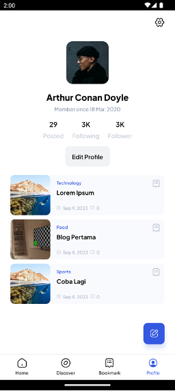
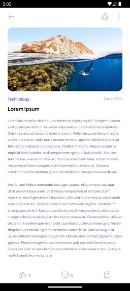

## 9.7	Tugas Praktikum
Silahkan menerapkan firebase pada project masing masing sesuai tema yang sudah ditentukan!